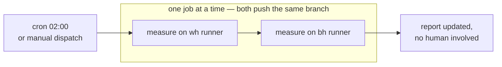
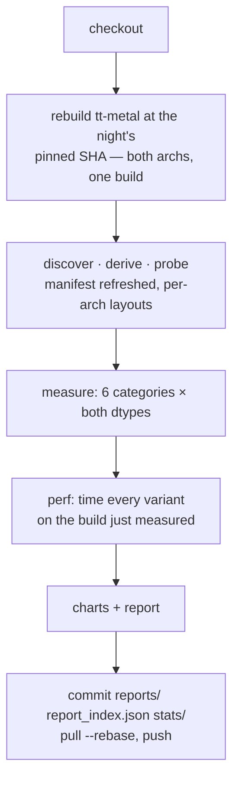
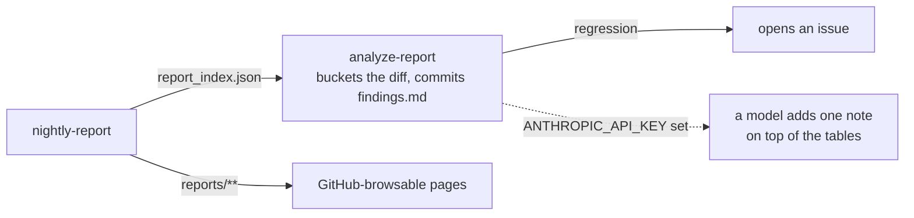

# Workflows

| Workflow | Trigger | Device | Publishes |
|---|---|---|---|
| [nightly-report.yml](nightly-report.yml) | cron 02:00, dispatch | `wh` + `bh` | commits `reports/`, `report_index.json`, `stats/` |
| [analyze-report.yml](analyze-report.yml) | after a nightly | none | commits `analyze-report/findings.md`, opens an issue on a regression |
| [perf-report.yml](perf-report.yml) | dispatch | one arch | artifact only — timings for one commit, or the diff between two |
| [custom-report.yml](custom-report.yml) | dispatch | one arch | artifact only — a report at parameters you name |

Only the nightly writes to the repository, so no other run can overwrite a baseline.
Runners labelled `wh` and `bh` are registered; the cron is live.

## One night

## One job

| Property | Choice |
|---|---|
| trigger | nightly cron + `workflow_dispatch` |
| runners | `[self-hosted, wh]` / `[self-hosted, bh]`, matrix `max-parallel: 1` |
| tt-metal version | `main`'s SHA resolved once per night, both archs build it — recorded in `stats/runs/` |
| gate | none — regenerate and publish; `compare` exists as a manual tool |
| runner provides | `TT_METAL_HOME` (built checkout), `PYTHON_ENV`, `DATA_DIR` |
| timeout | 12 h per arch |

## After it lands

Produced by rules, not by a model: `compare`'s buckets are the classification. The model
is optional and adds one note.
