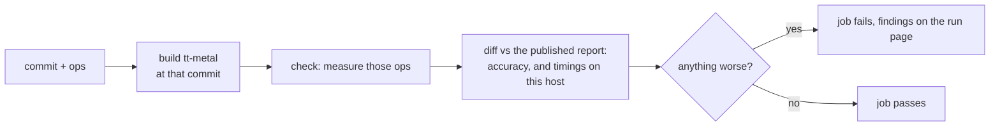
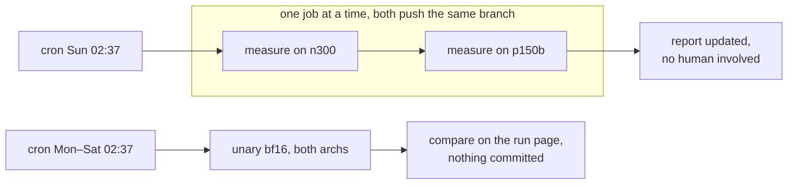
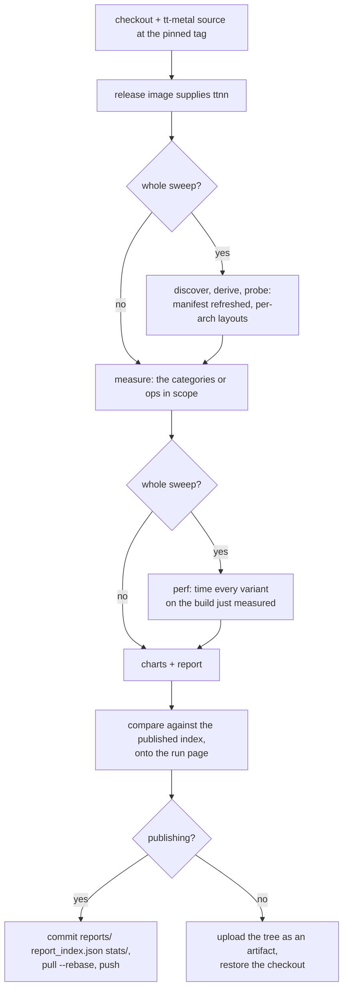
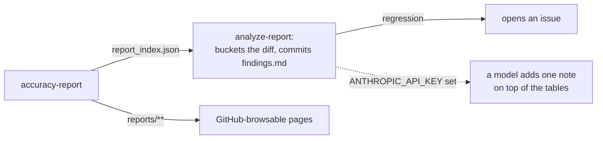

# Workflows

| Workflow | Trigger | Device | Publishes |
|---|---|---|---|
| [accuracy-report.yml](accuracy-report.yml) | cron Sun 02:37 and Mon–Sat 02:37, dispatch | wh and bh | commits `reports/`, `report_index.json`, `stats/` — but only from a whole sweep |
| [analyze-report.yml](analyze-report.yml) | after an accuracy-report | none | commits `analyze-report/findings.md`, opens an issue on a regression |
| [validate-kernel.yml](validate-kernel.yml) | dispatch | one arch | artifact only. Builds a commit you name, checks the ops it touches, fails on a finding |
| [perf-report.yml](perf-report.yml) | dispatch | one arch | artifact only. Timings for one commit, or the diff between two |

Only a complete `accuracy-report` sweep writes to the repository, so no other run can
overwrite a baseline. Every device job takes `concurrency: device-<arch>`, so the three
workflows that touch a card queue behind each other rather than fighting over it.

## accuracy-report, the only one that measures

One workflow covers what used to be `nightly-report` and `custom-report`, because they
differed only in how much they measured. Publishing is derived from that, never asked for:

| Use | How it starts | Scope | Output |
|---|---|---|---|
| the weekly report | cron `37 2 * * 0` | 6 categories × both dtypes × wh and bh | commits |
| the early warning | cron `37 2 * * 1-6` | unary, bf16 | `compare` on the run page |
| a question | dispatch with `ops` and `params` | what you name | run page, report artifact, and an `llk-csv` artifact for the SFPU dashboard |
| a dry run | dispatch with `publish: false` | everything | artifact |

| Input | Default | Meaning |
|---|---|---|
| `arch` | `both` | feeds the matrix, so one arch and two read the same |
| `categories` | `all` | the six, or a comma-separated subset |
| `ops` | empty | measure these ops instead of whole categories |
| `params` | empty | scalars the published report does not carry, e.g. `relu_max=6` |
| `dtype` | `both` | |
| `publish` | `true` | can only *withhold* publication, never force it |

A run publishes only when `ops` and `params` are empty, `dtype` is `both` and `categories`
is all six. That is not caution for its own sake: `charts` merges into the published index,
so a partial run would leave it half at one tt-metal commit and half at another, and every
page's provenance line would then be a claim about a build that measured only some of it.
For the same reason `discover`/`derive`/`probe` and `perf` run only for a whole sweep.

## Runner and image

Every device job runs on the shared org pool in a tt-metal container image, so nothing is
assumed about the machine. Two shapes:

| | Image | Runner | Why |
|---|---|---|---|
| accuracy-report | `tt-metalium-ubuntu-22.04-release-amd64:<tag>` | `tt-ubuntu-2204-n300-stable`, `-p150b-stable` | it needs *a* tt-metal, so a released one serves and no build is needed |
| perf-report, validate-kernel | `tt-metalium/ubuntu-22.04-ci-build-amd64` | same | building the commit you name is the feature, and a release image only answers for commits already released |

Each container needs **both** of these, or the device is unusable:

```yaml
options: --device /dev/tenstorrent
volumes:
  - /dev/hugepages-1G:/dev/hugepages-1G
```

Hugepages are how the card gets system memory. Without the mount, UMD opens the device and
then dies on `Broadcasts not available without system memory`.

## The shared setup

[tt-metal-env](../actions/tt-metal-env/action.yml) provisions every device job, so the four
workflows cannot drift apart.

| Step | What and why |
|---|---|
| tt-metal checkout | `models` holds tt-metal's own ULP, which this report imports rather than reimplements. Shallow, unless the job builds |
| `safe.directory` | the workspace belongs to the runner user and the container runs as root |
| paths | `TT_METAL_HOME`, `TT_METAL_CACHE`, `DATA_DIR`, `PYTHONPATH` |
| dependencies | `torch` pinned to tt-metal's version, the project itself, plus `pytest` and `typing_extensions`, which `models/common/utility_functions.py` imports |
| preflight | imports every stage module and opens the device |

Its one input, `builds`, is true for the two workflows that compile tt-metal. It selects
full history and submodules, and skips the ttnn half of the preflight, because the
ci-build image has no compiled ttnn yet.

### Three things that are easy to get wrong

| Trap | Rule |
|---|---|
| `${{ github.workspace }}` and `${{ runner.temp }}` are **host** paths | inside a container job use the shell variables `$GITHUB_WORKSPACE` and `$RUNNER_TEMP`. `${{ env.RUNNER_TEMP }}` is not a substitute: it expands to nothing, and an artifact path built from it silently uploads zero files. Where an action input needs a path, write the file into the workspace and name it relatively. A step-level `env:` also outranks `GITHUB_ENV`, so a wrong value there wins silently |
| the release image's `/opt/venv` has no pip | it is built by `uv venv`, so a bare `pip` is a different interpreter installing where `python3` cannot see it. Use `uv pip install --python "$(command -v python3)"` |
| the CLI exit code is a **count**, not an error | `measure`, `perf` and `check` return how many variants produced no data or how many findings there were. Under `set -e` a bare call kills the step, so always `|| status=$?`. A status of 128 or more is a signal. Tolerating the count is not the same as tolerating zero results: a job that produced nothing must still fail |
| a built tt-metal is not importable from `PYTHONPATH` alone | `$TT_METAL_HOME/ttnn` is the C++ source directory with no `__init__.py`, so `import ttnn` becomes a namespace package whose `__file__` is `None`; the real package is `ttnn/ttnn`, `tracy` is `tools/tracy`, and nine dependencies (`graphviz`, `networkx`, `seaborn` and the rest) are declared in tt-metal's `pyproject.toml`. Adding paths cannot supply those, so a building job runs `uv pip install -e "$TT_METAL_HOME"` after `build_metal.sh`, exactly as tt-metal's own `create_venv.sh` does. The release image needs none of this, because it ships a real `ttnn` in site-packages |

## Validating a change



The published report is the baseline, never the output. Accuracy is deterministic, so it is
read from git rather than re-measured.

## One week





| Property | Choice |
|---|---|
| trigger | two crons and `workflow_dispatch` |
| runners | `tt-ubuntu-2204-n300-stable`, `-p150b-stable`, matrix `max-parallel: 1` |
| tt-metal version | the latest release tag, resolved once per run so both archs measure one version. Recorded in `stats/runs/` |
| gate | none. Regenerate and publish; `compare` exists as a manual tool |
| image provides | `ttnn`. `models` from a checkout at the same tag, `torch` installed by the action |
| timeout | 12 h per arch, which only the weekly sweep approaches |

`DATA_DIR` is the runner's scratch and does not survive the job, so one run cannot resume
from the last. Each category is retried once, because the device can go away under a sweep
and a second attempt resumes from the CSVs the first one wrote.

The weeknight subset deliberately publishes nothing. It exists to put a `compare` against
the published index on a run page every morning, so a regression is visible within a day
even though the report itself is at most a week old.

## After it lands



Produced by rules, not by a model: `compare`'s buckets are the classification. The model is
optional and adds one note.
