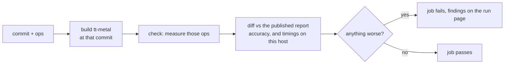
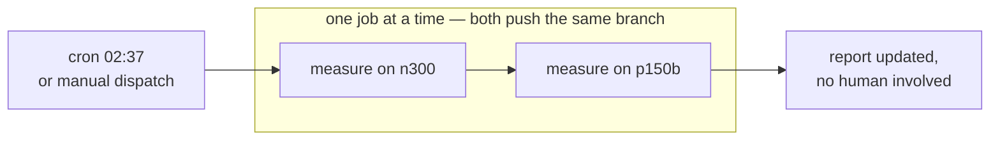
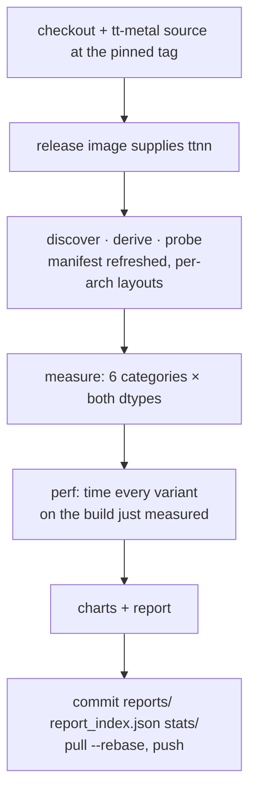
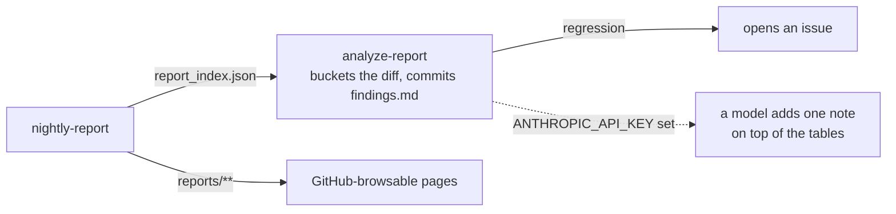

# Workflows

| Workflow | Trigger | Device | Publishes |
|---|---|---|---|
| [nightly-report.yml](nightly-report.yml) | cron 02:37, dispatch | `wh` + `bh` | commits `reports/`, `report_index.json`, `stats/` |
| [analyze-report.yml](analyze-report.yml) | after a nightly | none | commits `analyze-report/findings.md`, opens an issue on a regression |
| [validate-kernel.yml](validate-kernel.yml) | dispatch | one arch | artifact only — builds a commit you name, checks the ops it touches, fails on a finding |
| [perf-report.yml](perf-report.yml) | dispatch | one arch | artifact only — timings for one commit, or the diff between two |
| [custom-report.yml](custom-report.yml) | dispatch | one arch | artifact only — a report at parameters you name |

Only the nightly writes to the repository, so no other run can overwrite a baseline.

Every device job runs on the shared org pool in a tt-metal container image, so nothing is
assumed about the machine. Two shapes, because the workflows need different things:

| | Image | Runner | Why |
|---|---|---|---|
| nightly, custom-report | `tt-metalium-ubuntu-22.04-release-amd64:<tag>` | `tt-ubuntu-2204-n300-stable` / `-p150b-stable` | they need *a* tt-metal, so a released one serves and no build is needed |
| perf-report, validate-kernel | `tt-metalium/ubuntu-22.04-ci-build-amd64` | same | building the commit you name *is* the feature, and a release image only answers for commits already released |

`ttnn` comes from the image; `models` — tt-metal's own ULP, which this report imports
rather than reimplements — from a shallow checkout at the same tag. `DATA_DIR` is the
runner's scratch and does not survive the job, so a night cannot resume from the last one.

## Validating a change

The published report is the baseline, never the output — accuracy is deterministic, so it
is read from git rather than re-measured.

## One night

## One job

| Property | Choice |
|---|---|
| trigger | nightly cron + `workflow_dispatch` |
| runners | `tt-ubuntu-2204-n300-stable` / `-p150b-stable`, matrix `max-parallel: 1` |
| tt-metal version | the latest release tag, resolved once per night so both archs measure one version — recorded in `stats/runs/` |
| gate | none — regenerate and publish; `compare` exists as a manual tool |
| image provides | `ttnn` and `torch`; `models` from a checkout at the same tag |
| timeout | 12 h per arch |

## After it lands

Produced by rules, not by a model: `compare`'s buckets are the classification. The model
is optional and adds one note.
