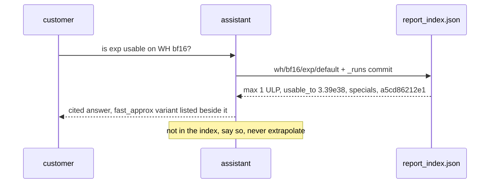
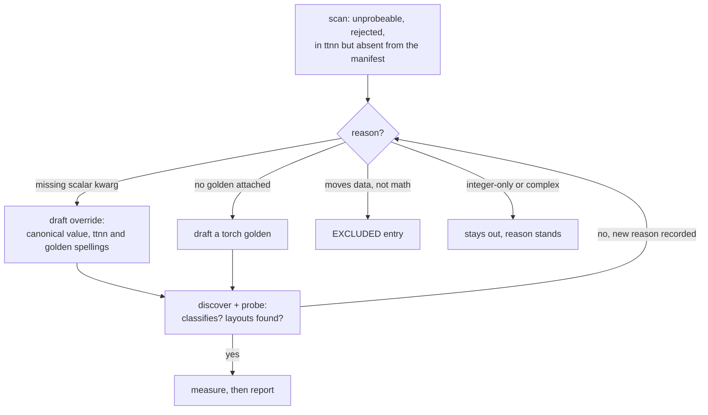
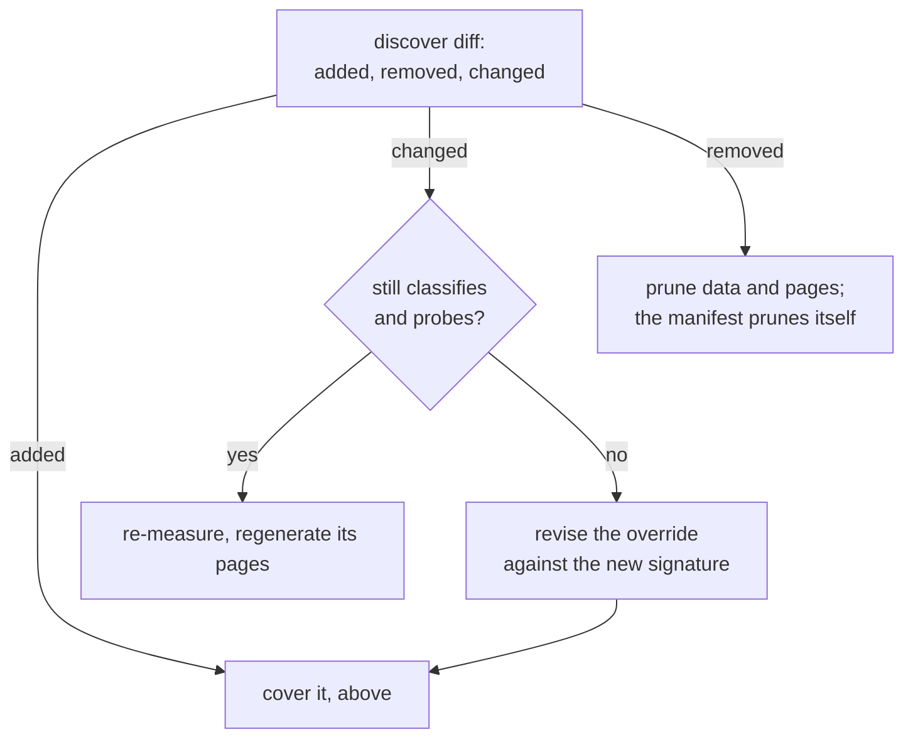

# Reading the report with an assistant

**Status: working today**, except where a row says otherwise.

The pipeline produces the data. An assistant reads it. Every judgment is precomputed and
committed, so a model looks decisions up instead of inventing them.

## Where each answer comes from

| Question | File |
|---|---|
| what exists, what is measurable, why not | `stats/ops_manifest.json` |
| at which parameters, against which golden | `src/ttnn_accuracy/ops/overrides.py` |
| what was measured, on what silicon | `data/{arch}/{dtype}/{op}/{variant}.csv`, `stats/runs/{id}.json` |
| the numbers an answer cites | `report_index.json` |
| the human view | `reports/**` |
| what the fields mean | [contract.md](contract.md) |
| what moved last night | [findings.md](findings.md), written by `analyze-report.yml` |
| everything in one page | [ask.md](ask.md) |

## Hand a chat the whole report

[ask.md](ask.md) is the contract plus every verdict in one self-contained page, 97 KB.
`ttnn-accuracy report` regenerates it, so it cannot disagree with the pages beside it.

While this repository is **private**, `raw.githubusercontent.com` returns 404 for everyone,
including you. Fetch the file with your own credentials and paste it:

```bash
gh api repos/tenstorrent/tt-eltwise-accuracy-report/contents/analyze-report/ask.md \
  --jq .content | base64 -d > ask.md
```

If the repository is made public, this link starts working and needs no account or key:

```
https://raw.githubusercontent.com/tenstorrent/tt-eltwise-accuracy-report/main/analyze-report/ask.md
```

## Answer a question about an op



No judgment is required at answer time. Each index entry carries a `verdict` (one of seven
fixed phrases, computed in `report/score.py::verdict`) and a `rationale`.
[contract.md](contract.md) defines every metric, threshold and answering rule.

## Cover an op that is not measured yet

**Status: manual.** The scan and the draft are done by a person or an assistant; only
`probe` validates automatically. Backlog: [uncovered.md](uncovered.md).

The recorded reason is the work order. `overrides.py` is the only file to edit.



## Keep coverage correct when ttnn changes

`discover` diffs ttnn against the committed manifest on every run. That diff is the trigger.


