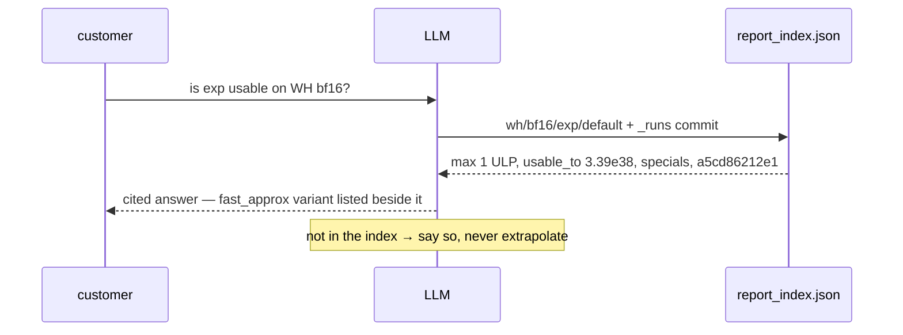
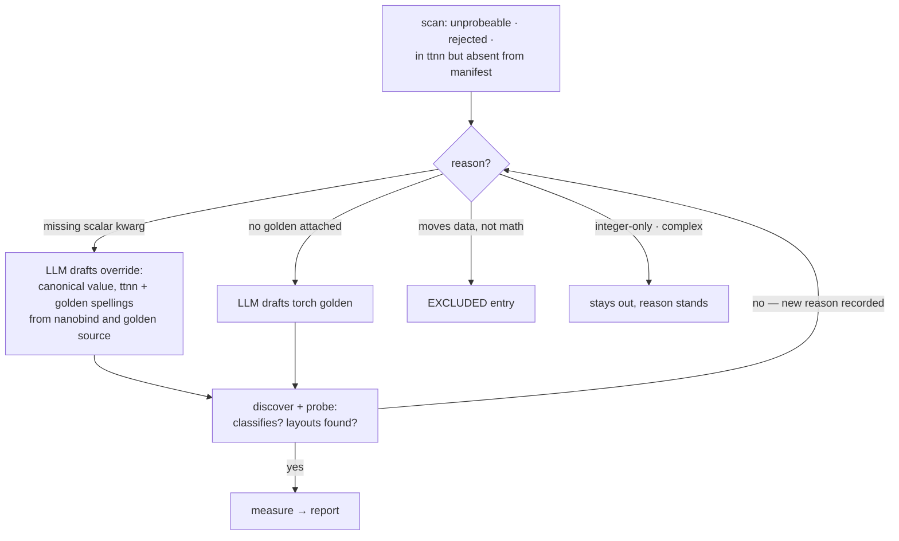
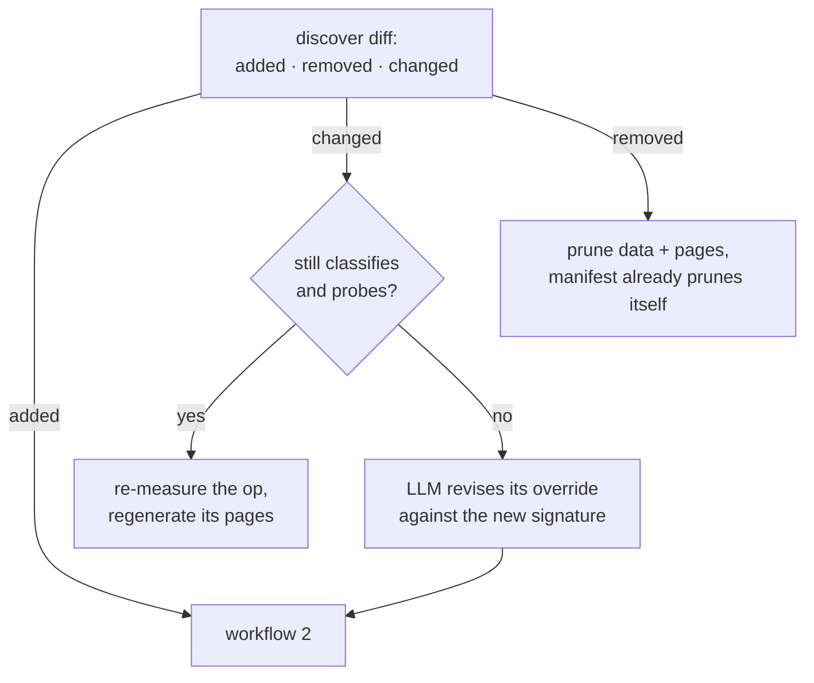

# LLM workflows

The pipeline produces the data; LLMs read and maintain it. Every judgment is predefined
in a committed artifact, so a model retrieves decisions — it never invents them.

## Where coverage and data are defined

| Question | Answered by |
|---|---|
| what exists, what is measurable, why not | `stats/ops_manifest.json` — `ops`, `unprobeable`, `rejected`, `EXCLUDED` reasons |
| at which parameters, against which golden | `src/ttnn_accuracy/ops/overrides.py` — the only hand-edited surface |
| what was measured, on what silicon | `data/{arch}/{dtype}/{op}/{variant}.csv` + `stats/runs/{id}.json` |
| the numbers an answer cites | `report_index.json` — per arch/dtype/op/variant, with provenance |
| the human view | `reports/**` pages and charts |
| the reader's definitions | [contract.md](contract.md) — metrics, outcomes, verdict rules, answering rules |

## 1 — Answer a customer

Built, so answers need no judgment: a `verdict` per index entry (five fixed phrases,
rules in `report/charts.py::verdict`), a `rationale` per override, and
[contract.md](contract.md) — the committed definition of every metric, threshold,
outcome label and answering rule.

## 2 — Cover an uncovered op

The recorded reason is the work order; `overrides.py` is the only file to write;
`probe` is the validator. Backlog: [uncovered.md](uncovered.md).

## 3 — Fix coverage when an op changes

`discover` diffs ttnn against the committed manifest on every run — the diff is the trigger.

