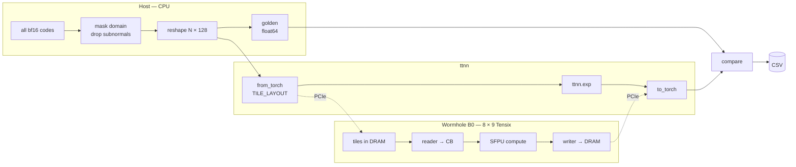
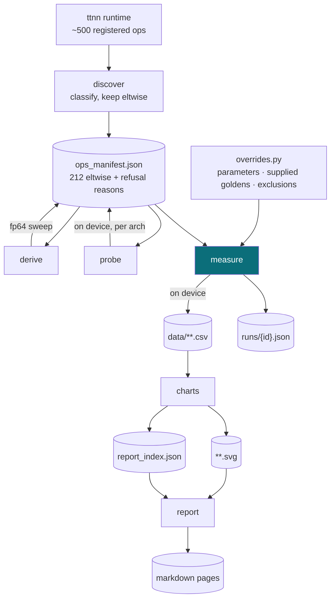
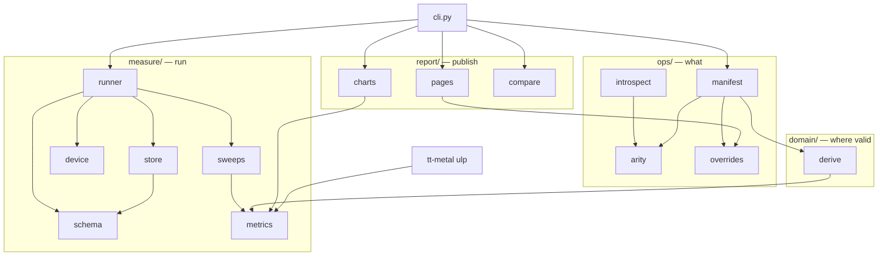
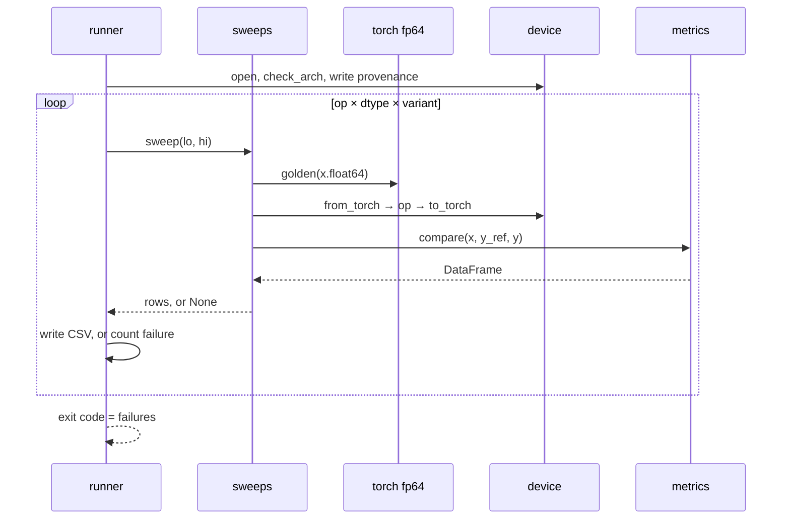

# Technical overview

## What is measured

```
ulp_error = |y_ref − y| / ULP(y_ref)
```

| | Source | Precision |
|---|---|---|
| `x` | a representable value of the target dtype | bf16 / fp32 |
| `y_ref` | PyTorch on CPU | float64 |
| `y` | Tenstorrent device | bf16 / fp32 |

- ULP, not absolute error: 0.001 wrong about `exp(-5)` is catastrophic, about `exp(80)` exact
- golden is fp64 — the reference is never the error source
- ULP imported from tt-metal — the whole org measures one thing
- bf16 exhaustive (all 2¹⁶); fp32 all 2³² in 1,024 blocks
- subnormals flushed on both sides, because the hardware flushes them

## Hardware path



32 × 32 tiles — hence the 128-column reshape. WH and BH run different kernels for the same
op, which is why architecture is an axis.

## Pipeline



Only `probe` and `measure` need silicon; everything else runs from the goldens on CPU.

## Modules



`schema.py` is the only definition of a result row. `metrics.py` is pure numerics and
carries the tests.

## One run



## Configuration

| Flag | Default | Effect |
|---|---|---|
| `--arch` | required | `wh`/`bh`, **verified against the device** |
| `--ops` / `--category` | `all` | which ops |
| `--dtype` | `bf16` | `bf16`, `fp32`, `both` |
| `--output-dir` | `data/` | redirect to fast local disk |
| `--device-id` | `0` | multi-card hosts |

| Axis | Values | Status |
|---|---|---|
| Architecture | WH, BH | active |
| Data type | bf16 exhaustive, fp32 in blocks | active |
| Op variant | `overrides.py`: `exp`/`gelu` `fast_approx`, per-op scalars | active |
| Layout | per op, from `probe` | active |
| Math fidelity | LoFi … HiFi4 | reserved, not varied |
| `fp32_dest_acc_en` | on/off | reserved, not varied |

Reserved axes are null columns in every run record — free now, unbackfillable later.

| Constant | Value | Meaning |
|---|---|---|
| `TILE_WIDTH` | 128 | columns per row, multiple of the 32-wide tile |
| `FP32_BLOCK` | 2²² | fp32 values per round-trip → 1,024 blocks |
| `FP32_GROUP` | 2¹⁶ | fp32 CSV row = worst of a group; bf16 rows are per input |
| `MIN_NORMAL` | 2⁻¹²⁶ | subnormal boundary |
| `ULP_CLIP` | 1000 | chart clamp; clipped points counted |
| `USABLE_ULP` | 2 | what "accurate to \|x\| ≤ B" means |
| `SPECIAL_VALUES` | ±0, ±inf, NaN, ±min | measured per op, no ULP, printed device-vs-golden |

## Artifacts

| Path | Committed | From | Contents |
|---|---|---|---|
| `stats/ops_manifest.json` | yes | discover, derive, probe | classification with reasons, derived domains, per-arch layouts. No timestamps — a diff means ttnn changed |
| `ops/overrides.py` | yes | hand-edited | every editorial decision: scalars, variants, supplied goldens, exclusions |
| `stats/runs/{id}.json` | yes | measure | tt-metal commit, versions, device |
| `data/**.csv` | no | measure | per-input rows; symlink to local disk |
| `report_index.json` | yes | charts | summary stats per arch/dtype/op/variant — what an LLM consumes |
| `reports/**` | yes | charts, report | SVGs and markdown |
