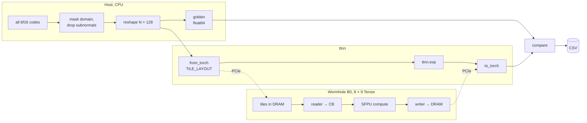
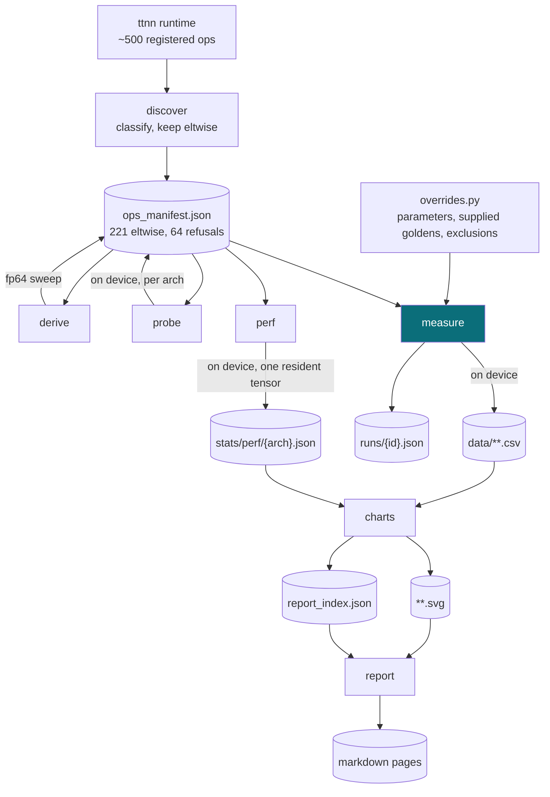
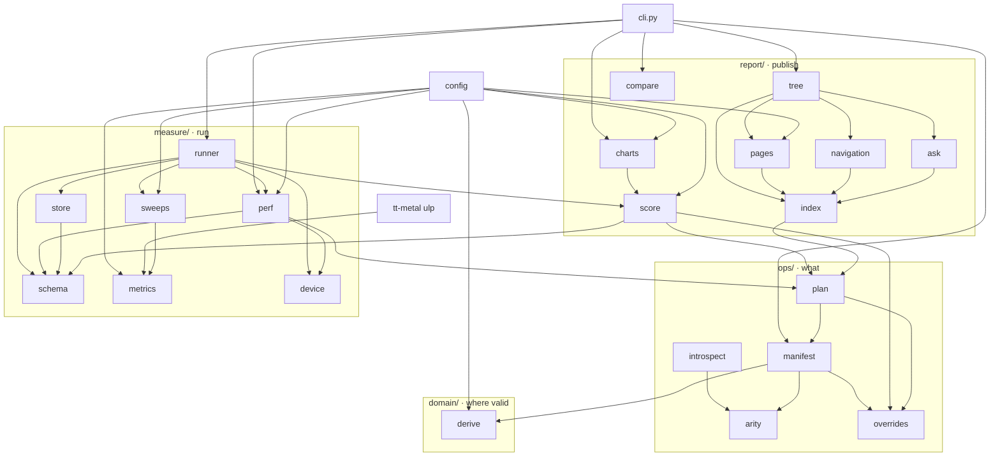
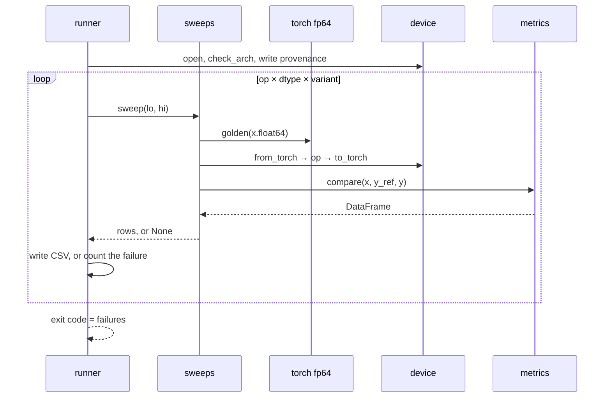

# Technical overview

## What is measured

```
ulp_error = |y_ref − y| / ULP(y_ref)
```

| | Source | Precision |
|---|---|---|
| `x` | a representable value of the target dtype | bf16, fp32 |
| `y_ref` | PyTorch on CPU | float64 |
| `y` | Tenstorrent device | bf16, fp32 |

| Choice | Reason |
|---|---|
| ULP, not absolute error | being 0.001 wrong about `exp(-5)` is catastrophic; about `exp(80)` it is exact |
| golden in fp64 | the reference can never be the error source |
| ULP imported from tt-metal | the whole org measures one thing |
| bf16 exhaustive, fp32 in 1,024 blocks | 2¹⁶ fits; 2³² fits if streamed |
| subnormals flushed on both sides | the hardware flushes them |

## Hardware path



Tiles are 32 × 32, which is why the reshape is 128 columns wide. WH and BH run different
kernels for the same op, so architecture is an axis.

## Pipeline



Only `probe`, `measure` and `perf` need silicon. Everything else runs from the goldens on
CPU. Accuracy is deterministic and comparable anywhere. A timing belongs to its host, so
`perf` records which host, and `compare` never scores the field.

## Modules



`schema.py` is the only definition of a result row. `metrics.py` is pure numerics and
carries the tests. `ttnn` is imported inside the functions that use it, so every module
here imports on a machine with no device.

## One run



## Configuration

| Flag | Default | Effect |
|---|---|---|
| `--arch` | required | `wh` or `bh`, **verified against the device** |
| `--ops`, `--category` | `all` | which ops |
| `--dtype` | `bf16` | `bf16`, `fp32`, `both` |
| `--output-dir` | `data/` | redirect to a fast local disk |
| `--device-id` | `0` | multi-card hosts |

## Axes

| Axis | Values | Status |
|---|---|---|
| architecture | WH, BH | varied |
| dtype | bf16 exhaustive, fp32 in blocks | varied |
| op variant | `overrides.py`: `fast_approx` for `exp` and `gelu`, per-op scalars | varied |
| layout | every accepted layout recorded by `probe`; sweeps take tile | recorded, not varied |
| shape | one tile-aligned block, `TILE_WIDTH` columns | fixed |
| math fidelity | HiFi4 | fixed by the kernel |
| `fp32_dest_acc_en` | follows the dtype | not free |

160 of 215 wh ops accept row-major and none is measured in it. That is the largest
untested surface in the report.

The last two rows are not axes for eltwise, whatever they are for matmul.
`unary_program_factory.cpp` hardcodes `.math_fidelity = MathFidelity::HiFi4`, and
`unary.cpp` derives `fp32_dest_acc_en` from `preserve_fp32_precision = (input_dtype ==
FLOAT32)`. Varying the dtype is the only way either one moves, and no eltwise op takes a
`compute_kernel_config`.

## Constants

Every tunable number lives in [config.py](../src/ttnn_accuracy/config.py). Structure — the
outcome labels, the CSV columns, which sweep each arity takes — stays with its own code.

| Constant | Value | Meaning |
|---|---|---|
| `TILE_WIDTH` | 128 | columns per row, a multiple of the 32-wide tile |
| `FP32_BLOCK` | 2²² | fp32 values per round-trip, so 1,024 blocks |
| `FP32_GROUP` | 2¹⁶ | an fp32 CSV row is the worst of a group. bf16 rows are per input |
| `MIN_NORMAL` | 2⁻¹²⁶ | subnormal boundary |
| `ULP_CLIP` | 1000 | chart clamp, and the CDF's right edge. Clipped points are counted |
| `USABLE_ULP` | 2 | what "accurate to \|x\| ≤ B" means |
| `ULP_LINES` | 1, 3, 10, 100 | chart reference lines, drawn once the data reaches the one before |
| `N_BINS`, `MIN_BIN` | 32, 8 | per-bin percentile panel; a bin under 8 points is hidden, not believed |
| `CDF_POINTS` | 200 | log grid for the CDF, so an fp32 sweep's 65k distinct ULPs draw as 200 |
| `SPECIAL_VALUES` | ±0, ±inf, NaN, ±min | measured per op, no ULP, printed device vs golden |
| `ELEMENTS` | 2²⁴ | one timed dispatch. At 2²⁰ host jitter moved it 70% |
| `NOISE_PCT` | 5 | `us_min` moved 3.1% between two runs of one build |

## Artifacts

| Path | Committed | From | Contents |
|---|---|---|---|
| `stats/ops_manifest.json` | yes | discover, derive, probe | classification with reasons, derived domains, per-arch layouts. No timestamps, so a diff means ttnn changed |
| `ops/overrides.py` | yes | hand-edited | every editorial decision: scalars, variants, supplied goldens, exclusions |
| `stats/runs/{id}.json` | yes | measure | tt-metal commit, versions, device |
| `stats/perf/{arch}.json` | yes | perf | µs per variant with its host. The full row, of which a page shows two figures |
| `data/**.csv` | no | measure | per-input rows. Symlink to a local disk |
| `report_index.json` | yes | charts | stats, verdict and rationale per arch/dtype/op/variant. What an assistant consumes, under [contract.md](../analyze-report/contract.md) |
| `reports/**` | yes | charts, report | SVGs and markdown |
