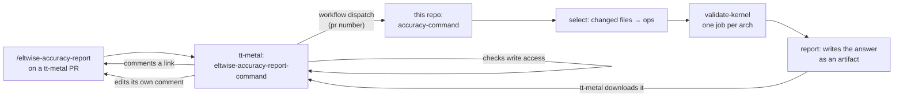

# `/eltwise-accuracy-report` on a tt-metal pull request

Comment `/eltwise-accuracy-report` on a tt-metal PR. It measures only the eltwise ops that change
can affect, on real silicon, against the published baseline, and answers with a link. It is
informational and never gates a merge.

Write access is required, as for `/test`. A comment from anyone else starts no run at all,
so it leaves no failed check behind.

## How it works



A comment fires an event only in the repository it was left in, so the tt-metal half exists
to check the commenter, dispatch, and wait. The work, the devices and the data stay here.

The answer is posted by tt-metal's own `GITHUB_TOKEN`, so it reads as `github-actions[bot]`
and nothing here needs write access to tt-metal. One comment per invocation: the "measuring"
acknowledgement is edited in place once the run finishes.

## What each side needs

| Side | Needs |
|---|---|
| tt-metal | `.github/workflows/eltwise-accuracy-report-command.yaml` — the copy in [tt-metal-eltwise-accuracy-report-command.yaml](tt-metal-eltwise-accuracy-report-command.yaml) |
| tt-metal | a secret `ACCURACY_REPORT_DISPATCH_TOKEN` that may dispatch workflows in this repository |
| here | a secret `TT_METAL_COMMENT_TOKEN` that may comment on tt-metal |

Two tokens, each one way and minimal. tt-metal may start a run here; this repository may
comment there. Without `TT_METAL_COMMENT_TOKEN` the run still measures and still reports on
its own page — only the closing comment is skipped.

## The tokens

| Secret | Lives in | Scope | Permission |
|---|---|---|---|
| `ACCURACY_REPORT_DISPATCH_TOKEN` | tt-metal | this repository | Actions: read and write |
| `TT_METAL_COMMENT_TOKEN` | this repository | tt-metal | **Issues: read and write** |

Issues, not Pull requests: a pull request's conversation comment is an issue comment, and a
PAT holding only Pull requests write is refused with `Resource not accessible (addComment)`.
The rule inverts for a `GITHUB_TOKEN`, which is checked against `pull-requests: write`.

## Selection

`ttnn-accuracy select` maps changed paths to ops:

| Path | Selects |
|---|---|
| `ckernel_sfpu_{op}.h` under an arch's `llk_sfpu` | that op and its `_bw` sibling, that arch |
| the same under `ckernels/common/llk_sfpu` | the same ops, both archs |
| any other header in those trees | every category, that arch — a shared header reaches every kernel |
| `hw/inc/api/compute/{op}.h` | that op, both archs |
| `ttnn/cpp/ttnn/operations/eltwise/{family}/` | that family's category |

A kernel written for one dtype or algorithm (`_bf16`, `_custom`, `_int32`) still selects its
base op. A header naming no op resolves through whoever includes it, and widens to the whole
architecture when it cannot — the blind spot that let a shared-header change ship unmeasured.
Selecting nothing is a valid answer, and what a docs-only change should produce.

Override it with `ops=`:

```
/eltwise-accuracy-report ops=exp,gelu
```

Past `SELECT_CAP` named ops the run asks for their categories instead.

## Cost

One tt-metal build per architecture, then minutes of measuring. The build dominates. Runs
queue per device against the weekly sweep, which holds both.
