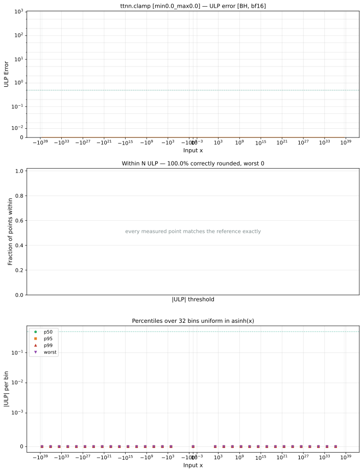
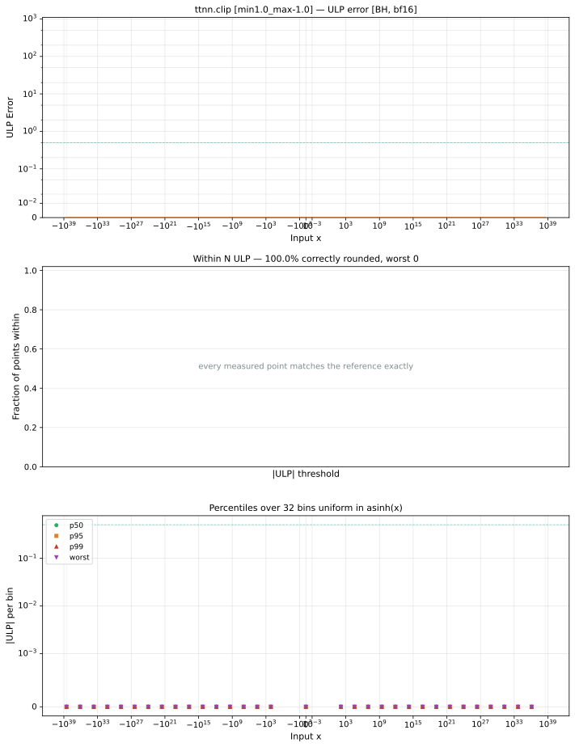
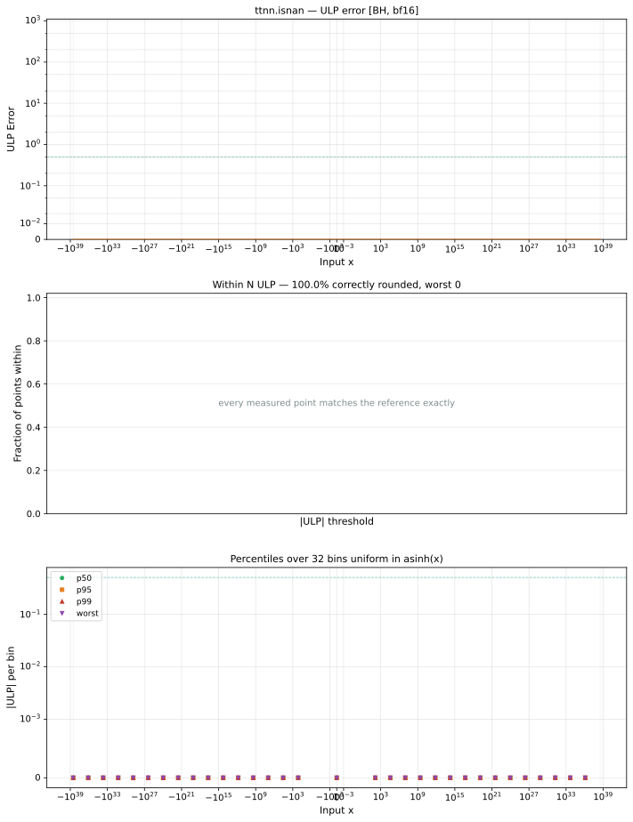
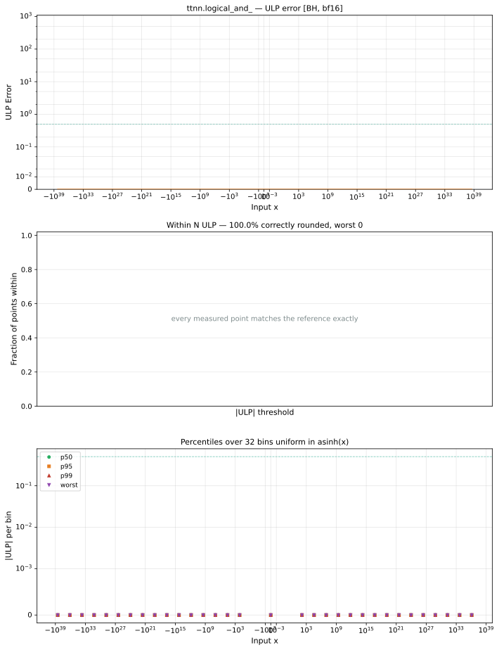
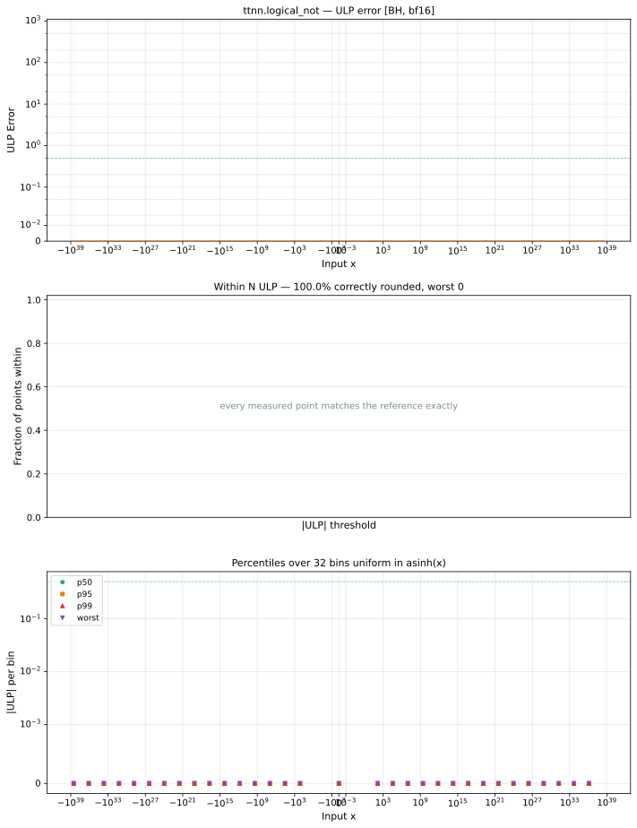
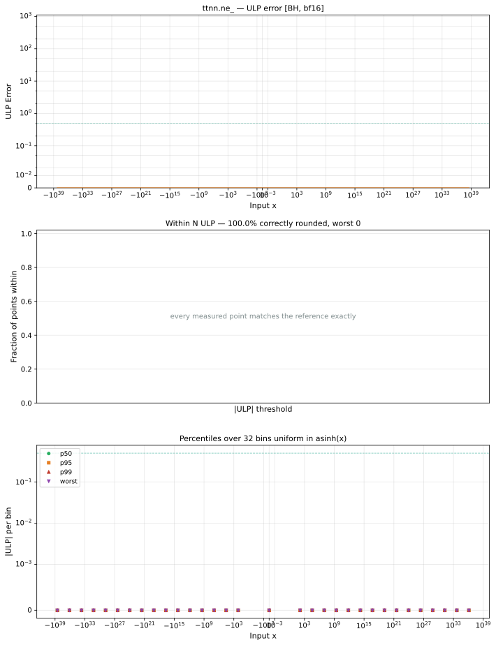
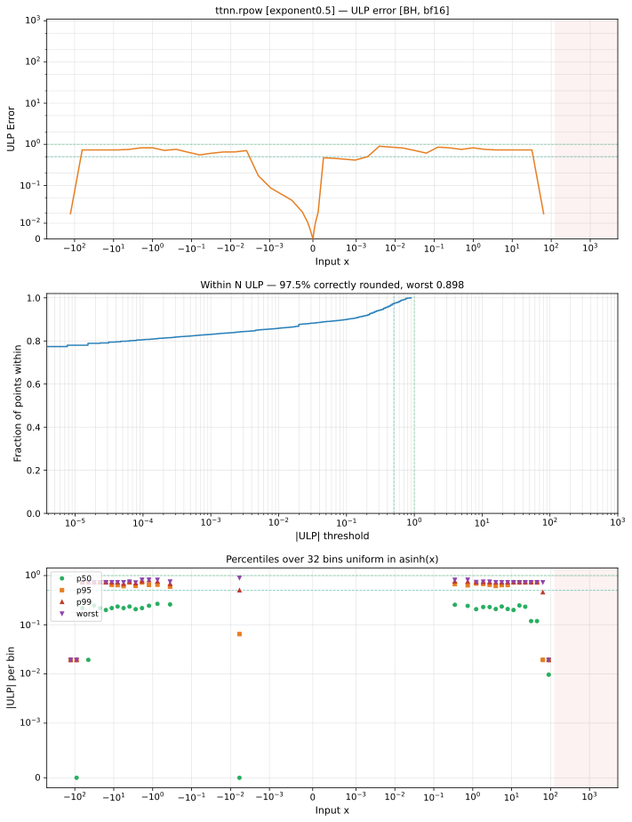
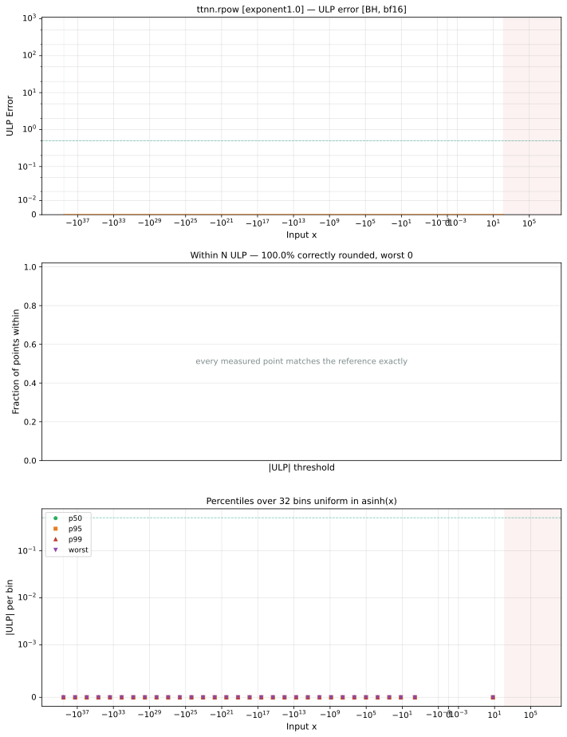

# Blackhole (BH) — bfloat16
_This page is auto-generated by `ttnn-accuracy report`. Do not edit manually._

[← Blackhole (BH)](../README.md) | [Top](../../../README.md)

## Operations Summary

_Accurate to \|x\|: the largest \|x\| within 2 ULP. `n/a` for ops of more than one operand, where a bound on x would describe its sampled partner instead._

| Op | Parameters | Max ULP | Mean ULP | Accurate to \|x\| | Max abs error | µs |
|----|------------|---------|----------|-----------------|---------------|----|
| [abs](abs.md) | `default` | 0 | 0 | 3.39e+38 | 0 | 189 |
| [abs_bw](abs_bw.md) | `default` | 0 | 0 | 3.39e+38 | 0 | 593 |
| [acos](acos.md) | `default` | 0.5 | 0 | 1 | 0.0078 | 270 |
| [acos_bw](acos_bw.md) | `default` | 2.7 | 0.744 | 0.949 | 0.0422 | 3520 |
| [acosh](acosh.md) | `default` | 1.41 | 0.596 | 3.39e+38 | 0.25 | 317 ±10% |
| [acosh_bw](acosh_bw.md) | `default` | 3.26 | 0.688 | 1.03 | 0.0509 | 4023 |
| [add](add.md) | `default` | 0.621 | 0.571 | n/a | 7.48e+35 | 246 |
| [add_](add_.md) | `default` | 0.621 | 0.571 | n/a | 7.48e+35 | 242 |
| [addalpha](addalpha.md) | `alpha=2.0` | 254 | 2 | n/a | 3.38e+38 | 267 |
| [addcdiv](addcdiv.md) | `default` | 2.11e+06 ⚠ | 2.35e+03 | n/a | 6.65e+35 | 356 ±9% |
| [addcmul](addcmul.md) | `default` | 126 | 19.4 | n/a | 6.65e+35 | 344 |
| [asin](asin.md) | `default` | 0.499 | 0 | nowhere | 0.00374 | 267 |
| [asin_bw](asin_bw.md) | `default` | 2.76 | 0.787 | 0.938 | 0.0431 | 3442 |
| [asinh](asinh.md) | `default` | 1.32 | 0.615 | 3.39e+38 | 0.25 | 439 |
| [asinh_bw](asinh_bw.md) | `default` | 1.33 | 0.681 | 1.84e+19 | 0.00518 | 595 |
| [atan](atan.md) | `default` | 0.527 | 0.513 | nowhere | 0.00395 | 203 |
| [atan2](atan2.md) | `default` | 200 | 3.56 | n/a | 0.783 | 276 ±6% |
| [atan2_bw](atan2_bw.md) | `default` | 248 | 4.89 | n/a | 4.47e+18 | 2512 |
| [atan_bw](atan_bw.md) | `default` | 2.23 | 0.867 | 0.23 | 0.00869 | 616 |
| [atanh](atanh.md) | `default` | 2.08 | 0.995 | nowhere | 0.00907 | 255 |
| [atanh_bw](atanh_bw.md) | `default` | 8.17 | 1 | 0.82 | 0.289 | 3853 |
| [bias_gelu](bias_gelu.md) | `default` | 1.14e+36 ⚠ | 4.5e+34 | n/a | 7.48e+35 | 255 ±12% |
| [bias_gelu_](bias_gelu_.md) | `default` | 1.14e+36 ⚠ | 4.5e+34 | n/a | 7.48e+35 | 241 |
| [cbrt](cbrt.md) | `default` | 0.507 | 0.502 | 3.39e+38 | 1.74e+10 | 214 |
| [ceil](ceil.md) | `default` | 0 | 0 | 3.39e+38 | 0 | 194 ±17% |
| [celu](celu.md) | `default` | 0.5 | 0 | 3.39e+38 | 0.00195 | 182 |
| [celu_bw](celu_bw.md) | `default` | 0.892 | 0.52 | 3.39e+38 | 0.00355 | 1262 |
| [clamp](clamp.md) | `min=-1.0,max=1.0` | 0 | 0 | 3.39e+38 | 0 | 195 ±5% |
|  | `min=0.0,max=0.0` | 0 | 0 | 3.39e+38 | 0 | 202 ±15% |
|  | `min=1.0,max=-1.0` | 0 | 0 | 3.39e+38 | 0 | 192 ±11% |
| [clamp_bw](clamp_bw.md) | `default` | 0 | 0 | n/a | 0 | 1093 |
| [clip](clip.md) | `min=-1.0,max=1.0` | 0 | 0 | 3.39e+38 | 0 | 189 ±10% |
|  | `min=0.0,max=0.0` | 0 | 0 | 3.39e+38 | 0 | 190 |
|  | `min=1.0,max=-1.0` | 0 | 0 | 3.39e+38 | 0 | 190 ±12% |
| [clip_bw](clip_bw.md) | `default` | 0 | 0 | n/a | 0 | 1093 |
| [cos](cos.md) | `default` | 0.552 | 0.552 | 9.99e+05 | 0.00195 | 242 |
| [cos_bw](cos_bw.md) | `default` | 2.09e+42 ⚠ | 2.59e+39 | 2.15e+06 | 3.32e+38 | 805 |
| [cosh](cosh.md) | `default` | 0.501 | 0.501 | 89 | 1.63e+35 | 257 ±5% |
| [cosh_bw](cosh_bw.md) | `default` | 0.5 | 0 | 88.5 | 1.63e+35 | 3061 |
| [deg2rad](deg2rad.md) | `default` | 0.998 | 0.744 | 6.7e-37 | 3.95e+34 | 191 |
| [digamma](digamma.md) | `default` | 5.57e+05 ⚠ | 177 | nowhere | 8.51e+37 | 373 |
| [digamma_bw](digamma_bw.md) | `default` | 1.02e+08 ⚠ | 1.36e+04 | 0.996 | 6.44e+36 | 3155 |
| [div](div.md) | `default` | 0.498 | 0 | n/a | 6.62e+35 | 271 ±8% |
| [div_bw](div_bw.md) | `default` | 0.498 | 0 | n/a | 1.65e+35 | 1570 |
| [div_no_nan](div_no_nan.md) | `default` | 0.498 | 0 | n/a | 6.62e+35 | 653 |
| [divide](divide.md) | `default` | 0.498 | 0 | n/a | 6.62e+35 | 252 |
| [divide_](divide_.md) | `default` | 0.498 | 0 | n/a | 6.62e+35 | 251 |
| [elu](elu.md) | `default` | 0.5 | 0 | 3.39e+38 | 0.00195 | 195 |
| [elu_bw](elu_bw.md) | `default` | 0.892 | 0.52 | 3.39e+38 | 0.00355 | 1269 |
| [eq](eq.md) | `default` | 0 | 0 | n/a | 0 | 283 ±43% |
| [eq_](eq_.md) | `default` | 0 | 0 | n/a | 0 | 241 |
| [eqz](eqz.md) | `default` | 0 | 0 | 3.39e+38 | 0 | 188 |
| [erf](erf.md) | `default` | 1.06 | 0.771 | 3.39e+38 | 0.00362 | 190 ±30% |
| [erf_bw](erf_bw.md) | `default` | 112 | 4.97 | 1.5 | 0.0108 | 1138 |
| [erfc](erfc.md) | `default` | 3.2e+28 ⚠ | 3.23e+24 | 2.5 | 0.0108 | 309 |
| [erfc_bw](erfc_bw.md) | `default` | 112 | 4.97 | 1.5 | 0.0108 | 1138 |
| [erfinv](erfinv.md) | `default` | 121 | 6.34 | 1.31e-38 | 0.0092 | 325 |
| [erfinv_bw](erfinv_bw.md) | `default` | 8.91 | 1.28 | 0.777 | 2.23 | 3578 |
| [exp](exp.md) | `default` | 0.892 | 0.556 | 3.39e+38 | 4.85e+35 | 193 |
|  | `fast_approx` | 6.08 | 3.05 | nowhere | 5.5e+36 | 187 |
| [exp2](exp2.md) | `default` | 0.898 | 0.564 | 3.39e+38 | 2.57e+34 | 227 |
| [exp2_bw](exp2_bw.md) | `default` | 1.89 | 0.942 | 128 | 6.29e+35 | 816 |
| [exp_bw](exp_bw.md) | `default` | 0.892 | 0.556 | 3.39e+38 | 4.85e+35 | 598 |
| [expm1](expm1.md) | `default` | 0.5 | 0 | 3.39e+38 | 3.25e+35 | 263 |
| [expm1_bw](expm1_bw.md) | `default` | 34 | 0.695 | 33.5 | 4.85e+35 | 595 |
| [floor](floor.md) | `default` | 0 | 0 | 3.39e+38 | 0 | 196 |
| [floor_div](floor_div.md) | `default` | 64 | 42 | n/a | 1 | 1155 |
| [fmod](fmod.md) | `default` | 9.14e+35 ⚠ | 8.94e+34 | n/a | 4.31e+31 | 259 |
| [frac](frac.md) | `default` | 0 | 0 | 3.39e+38 | 0 | 192 ±17% |
| [ge](ge.md) | `default` | 0 | 0 | n/a | 0 | 246 |
| [ge_](ge_.md) | `default` | 0 | 0 | n/a | 0 | 242 |
| [gelu](gelu.md) | `default` | 165 | 9.18 | 2.33e-38 | 0.00777 | 292 |
|  | `fast_approx` | 1.14e+36 ⚠ | 1.82e+34 | 2.33e-38 | 0.0239 | 188 |
| [gelu_bw](gelu_bw.md) | `default` | 0.939 | 0.681 | 3.39e+38 | 0.00719 | 669 |
| [gez](gez.md) | `default` | 0 | 0 | 3.39e+38 | 0 | 203 |
| [gt](gt.md) | `default` | 0 | 0 | n/a | 0 | 266 ±5% |
| [gt_](gt_.md) | `default` | 0 | 0 | n/a | 0 | 243 |
| [gtz](gtz.md) | `default` | 0 | 0 | 3.39e+38 | 0 | 189 |
| [hardmish](hardmish.md) | `default` | 1 | 0.913 | 3.39e+38 | 0.00195 | 190 |
| [hardshrink](hardshrink.md) | `default` | 0 | 0 | 3.39e+38 | 0 | 190 |
| [hardshrink_bw](hardshrink_bw.md) | `default` | 0 | 0 | 3.39e+38 | 0 | 766 |
| [hardsigmoid](hardsigmoid.md) | `default` | 1 | 0.557 | 3.39e+38 | 0.00389 | 189 |
| [hardsigmoid_bw](hardsigmoid_bw.md) | `default` | 0.333 | 0 | 3.39e+38 | 0.000326 | 1169 |
| [hardswish](hardswish.md) | `default` | 2.14 | 0.94 | 2.33e-38 | 0.0163 | 191 |
| [hardswish_bw](hardswish_bw.md) | `default` | 85.3 | 2.1 | 1.13 | 0.5 | 1642 |
| [hardtanh](hardtanh.md) | `default` | 0 | 0 | 3.39e+38 | 0 | 190 ±12% |
| [hardtanh_bw](hardtanh_bw.md) | `default` | 0 | 0 | 3.39e+38 | 0 | 977 |
| [heaviside](heaviside.md) | `value=0.0` | 0 | 0 | 3.39e+38 | 0 | 189 |
|  | `value=0.5` | 0 | 0 | 3.39e+38 | 0 | 194 |
|  | `value=1.0` | 0 | 0 | 3.39e+38 | 0 | 189 |
| [hypot](hypot.md) | `default` | 52.7 | 1.58 | n/a | 9.4e+16 | 255 |
| [hypot_bw](hypot_bw.md) | `default` | 74.6 | 2.43 | n/a | 0.292 | 1506 |
| [i0](i0.md) | `default` | 255 | 56.3 | 13.6 | 2.28e+38 | 247 ±6% |
| [i0_bw](i0_bw.md) | `default` | 218 | 8.58 | 2.33e-38 | 2.16e+38 | 826 |
| [i1](i1.md) | `default` | 0.858 | 0.589 | 2.33e-38 | 4.9e+34 | 421 |
| [identity](identity.md) | `default` | 0 | 0 | 3.39e+38 | 0 | 188 ±13% |
| [isclose](isclose.md) | `default` | 0 | 0 | n/a | 0 | 247 |
| [isfinite](isfinite.md) | `default` | 0 | 0 | 3.39e+38 | 0 | 190 ±5% |
| [isinf](isinf.md) | `default` | 0 | 0 | 3.39e+38 | 0 | 189 |
| [isnan](isnan.md) | `default` | 0 | 0 | 3.39e+38 | 0 | 190 |
| [isneginf](isneginf.md) | `default` | 0 | 0 | 3.39e+38 | 0 | 196 |
| [isposinf](isposinf.md) | `default` | 0 | 0 | 3.39e+38 | 0 | 190 ±6% |
| [l1_loss](l1_loss.md) | `default` | 0.621 | 0.571 | n/a | 7.48e+35 | 266 |
| [ldexp](ldexp.md) | `default` | 255 | 94.4 | n/a | 3.39e+38 | 274 ±6% |
| [ldexp_](ldexp_.md) | `default` | 255 | 94.4 | n/a | 3.39e+38 | 247 |
| [ldexp_bw](ldexp_bw.md) | `default` | 0.898 | 0.898 | n/a | 0.00351 | 1192 |
| [le](le.md) | `default` | 0 | 0 | n/a | 0 | 246 |
| [le_](le_.md) | `default` | 0 | 0 | n/a | 0 | 242 |
| [leaky_relu](leaky_relu.md) | `negative_slope=0.0` | 0 | 0 | 3.39e+38 | 0 | 189 |
|  | `negative_slope=0.01` | 0.96 | 0.741 | 3.39e+38 | 1.99e+34 | 190 |
|  | `negative_slope=1.0` | 0 | 0 | 3.39e+38 | 0 | 193 |
| [leaky_relu_bw](leaky_relu_bw.md) | `default` | 0.16 | 0 | 3.39e+38 | 9.77e-06 | 861 |
| [lerp](lerp.md) | `default` | 1.77e+03 ⚠ | 39.9 | n/a | 6.65e+35 | 358 ±6% |
| [lerp_bw](lerp_bw.md) | `default` | 0.506 | 0.506 | n/a | 0.00395 | 1270 |
| [lez](lez.md) | `default` | 0 | 0 | 3.39e+38 | 0 | 189 |
| [lgamma](lgamma.md) | `default` | 324 | 0.846 | 0.412 | 7.5e+35 | 847 |
| [lgamma_bw](lgamma_bw.md) | `default` | 5.57e+05 ⚠ | 177 | nowhere | 8.51e+37 | 775 |
| [log](log.md) | `default` | 0.78 | 0.534 | 3.39e+38 | 0.25 | 231 |
| [log10](log10.md) | `default` | 0.785 | 0.543 | 3.39e+38 | 0.125 | 240 |
| [log10_bw](log10_bw.md) | `default` | 1.74 | 0.803 | 3.69e+37 | 2.24e+35 | 2451 |
| [log1p](log1p.md) | `default` | 0.931 | 0.57 | 3.39e+38 | 0.25 | 240 |
| [log1p_bw](log1p_bw.md) | `default` | 1.42 | 0.744 | 8.47e+37 | 0.167 | 2406 |
| [log2](log2.md) | `default` | 0.766 | 0.542 | 3.39e+38 | 0.248 | 251 |
| [log2_bw](log2_bw.md) | `default` | 1.51 | 0.847 | nowhere | 5.03e+35 | 2436 |
| [log_bw](log_bw.md) | `default` | 0.498 | 0 | 8.47e+37 | 1.65e+35 | 1854 |
| [log_sigmoid](log_sigmoid.md) | `default` | 6.39 | 1.38 | 0.428 | 0.0215 | 220 |
| [log_sigmoid_bw](log_sigmoid_bw.md) | `default` | 1.71 | 0.722 | 3.39e+38 | 0.00528 | 2675 |
| [logaddexp](logaddexp.md) | `default` | 8.39e+06 ⚠ | 4.85e+03 | n/a | 0.248 | 315 |
| [logaddexp2](logaddexp2.md) | `default` | 3.03e+06 ⚠ | 4.08e+03 | n/a | 0.235 | 406 |
| [logaddexp2_](logaddexp2_.md) | `default` | 3.03e+06 ⚠ | 4.08e+03 | n/a | 0.235 | 385 |
| [logaddexp2_bw](logaddexp2_bw.md) | `default` | 41.4 | 3.6 | n/a | 0.00504 | 2505 |
| [logaddexp_](logaddexp_.md) | `default` | 8.39e+06 ⚠ | 4.85e+03 | n/a | 0.248 | 300 |
| [logaddexp_bw](logaddexp_bw.md) | `default` | 62.5 | 4.9 | n/a | 0.00278 | 2139 |
| [logical_and](logical_and.md) | `default` | 0 | 0 | n/a | 0 | 250 |
| [logical_and_](logical_and_.md) | `default` | 0 | 0 | n/a | 0 | 248 |
| [logical_not](logical_not.md) | `default` | 0 | 0 | 3.39e+38 | 0 | 189 |
| [logical_not_](logical_not_.md) | `default` | 0 | 0 | 1 | 0 | 186 |
| [logical_or](logical_or.md) | `default` | 0 | 0 | n/a | 0 | 252 |
| [logical_or_](logical_or_.md) | `default` | 0 | 0 | n/a | 0 | 246 |
| [logical_xor_](logical_xor_.md) | `default` | 0 | 0 | n/a | 0 | 268 |
| [logit](logit.md) | `default` | 64 | 1.67 | 0.395 | 0.25 | 324 |
| [logit_bw](logit_bw.md) | `default` | 1.65 | 0.729 | 0.996 | 1.65e+35 | 3040 |
| [logiteps_bw](logiteps_bw.md) | `default` | 1.65 | 0.729 | 0.996 | 1.65e+35 | 3825 |
| [lt](lt.md) | `default` | 0 | 0 | n/a | 0 | 243 |
| [lt_](lt_.md) | `default` | 0 | 0 | n/a | 0 | 242 |
| [ltz](ltz.md) | `default` | 0 | 0 | 3.39e+38 | 0 | 190 |
| [mac](mac.md) | `default` | 63.5 | 26.4 | n/a | 31.9 | 334 |
| [max_bw](max_bw.md) | `default` | 64 | 64 | n/a | 0.5 | 2480 |
| [maximum](maximum.md) | `default` | 0 | 0 | n/a | 0 | 244 |
| [min_bw](min_bw.md) | `default` | 64 | 64 | n/a | 0.5 | 2485 |
| [minimum](minimum.md) | `default` | 0 | 0 | n/a | 0 | 264 ±9% |
| [mish](mish.md) | `default` | 1.49 | 0.666 | 1.95e-38 | 0.00801 | 238 |
| [mse_loss](mse_loss.md) | `default` | 2.03 | 1.65 | n/a | 2.26e+36 | 267 |
| [mul_bw](mul_bw.md) | `default` | 0 | 0 | n/a | 0 | 641 ±49% |
| [multigammaln](multigammaln.md) | `default` | 724 | 1.67 | 5.59e-17 | 1.77e+36 | 4683 |
| [multigammaln_bw](multigammaln_bw.md) | `default` | 2.38e+06 ⚠ | 293 | 5.59e-17 | 2.34e+16 | 3723 |
| [multiply](multiply.md) | `default` | 0.5 | 0 | n/a | 0.0156 | 250 ±6% |
| [multiply_](multiply_.md) | `default` | 0.5 | 0 | n/a | 0.0156 | 243 |
| [ne](ne.md) | `default` | 0 | 0 | n/a | 0 | 267 |
| [ne_](ne_.md) | `default` | 0 | 0 | n/a | 0 | 242 |
| [neg](neg.md) | `default` | 0 | 0 | 3.39e+38 | 0 | 190 |
| [nextafter](nextafter.md) | `default` | 1.3e+33 ⚠ | 2.32e+31 | n/a | 2.38e-07 | 1428 |
| [nez](nez.md) | `default` | 0 | 0 | 3.39e+38 | 0 | 189 |
| [polygamma](polygamma.md) | `k=1` | 1.02e+08 ⚠ | 2.13e+05 | 0.996 | 6.44e+36 | 326 |
|  | `k=2` | 3.57e+08 ⚠ | 1.21e+06 | 4.47 | 6.75e+35 | 375 |
|  | `k=4` | 3.22e+09 ⚠ | 1.66e+07 | 3.5 | 6.61e+35 | 423 |
| [polygamma_bw](polygamma_bw.md) | `n=1` | 3.57e+08 ⚠ | 1.21e+06 | 4.47 | 6.75e+35 | 3203 |
| [pow](pow.md) | `default` | 4.86e+18 ⚠ | 2.08e+14 | n/a | 2.31e+38 | 414 |
| [pow_bw](pow_bw.md) | `exponent=2.0` | 0 | 0 | 1.69e+38 | 0 | 1201 |
| [prelu](prelu.md) | `weight=0.25` | 0 | 0 | 4.68e-38 | 1.17e-38 | 193 ±6% |
| [rad2deg](rad2deg.md) | `default` | 0.992 | 0.75 | 5.9e+36 | 1.32e+36 | 188 |
| [rdiv](rdiv.md) | `value=2.0` | 0.498 | 0 | 8.47e+37 | 3.31e+35 | 189 |
| [rdiv_bw](rdiv_bw.md) | `scalar=2.0` | 1.51 | 0.837 | 7.67e-20 | 8.19e+35 | 3146 |
| [reciprocal](reciprocal.md) | `default` | 0.498 | 0 | 8.47e+37 | 1.65e+35 | 190 |
| [reciprocal_bw](reciprocal_bw.md) | `default` | 1.51 | 0.837 | 5.42e-20 | 4.09e+35 | 2378 |
| [relu](relu.md) | `default` | 0 | 0 | 3.39e+38 | 0 | 192 ±5% |
| [relu6](relu6.md) | `default` | 0 | 0 | 3.39e+38 | 0 | 189 |
| [relu6_bw](relu6_bw.md) | `default` | 0 | 0 | 3.39e+38 | 0 | 1817 |
| [relu_bw](relu_bw.md) | `default` | 0 | 0 | 3.39e+38 | 0 | 595 |
| [relu_max](relu_max.md) | `upper_limit=0.0` | 0 | 0 | 3.39e+38 | 0 | 193 ±14% |
|  | `upper_limit=1.0` | 0 | 0 | 3.39e+38 | 0 | 189 |
|  | `upper_limit=6.0` | 0 | 0 | 3.39e+38 | 0 | 190 ±9% |
| [relu_min](relu_min.md) | `lower_limit=0.0` | 0 | 0 | 3.39e+38 | 0 | 189 |
|  | `lower_limit=1.0` | 0 | 0 | 3.39e+38 | 0 | 189 |
| [remainder](remainder.md) | `default` | 1.08e+36 ⚠ | 1.22e+35 | n/a | 4.31e+31 | 293 ±12% |
| [round](round.md) | `default` | 0 | 0 | 3.39e+38 | 0 | 194 |
| [rpow](rpow.md) | `exponent=0.5` | 0.898 | 0.564 | 3.39e+38 | 2.57e+34 | 377 |
|  | `exponent=1.0` | 0 | 0 | 3.39e+38 | 0 | 372 |
|  | `exponent=2.0` | 0.898 | 0.564 | 3.39e+38 | 2.57e+34 | 376 |
| [rpow_bw](rpow_bw.md) | `exponent=2.0` | 0 | 0 | 1.18e-38 | 0 | 1351 |
| [rsqrt](rsqrt.md) | `default` | 0.499 | 0 | 3.39e+38 | 1.8e+16 | 243 |
| [rsqrt_bw](rsqrt_bw.md) | `default` | 3.23 | 1.19 | nowhere | 1.56e+36 | 2824 ±126% |
| [rsub](rsub.md) | `default` | 0.621 | 0.571 | n/a | 7.48e+35 | 243 |
| [rsub_](rsub_.md) | `default` | 0.621 | 0.571 | n/a | 7.48e+35 | 242 |
| [selu](selu.md) | `default` | 0.5 | 0 | 3.39e+38 | 6.6e+35 | 193 |
| [selu_bw](selu_bw.md) | `default` | 2.62 | 1.06 | 0.00443 | 0.0173 | 1456 |
| [sigmoid](sigmoid.md) | `default` | 0.873 | 0.522 | 3.39e+38 | 0.00235 | 262 |
| [sigmoid_accurate](sigmoid_accurate.md) | `default` | 0.873 | 0.522 | 3.39e+38 | 0.00235 | 261 |
| [sigmoid_bw](sigmoid_bw.md) | `default` | 125 | 4.81 | 1.76 | 0.00192 | 1053 |
| [sign](sign.md) | `default` | 0 | 0 | 3.39e+38 | 0 | 188 |
| [signbit](signbit.md) | `default` | 0 | 0 | 3.39e+38 | 0 | 189 |
| [silu](silu.md) | `default` | 0.888 | 0.582 | 2.33e-38 | 0.0156 | 215 ±7% |
| [silu_bw](silu_bw.md) | `default` | 285 | 1.3 | 0.863 | 0.0113 | 1446 |
| [sin](sin.md) | `default` | 0.552 | 0.526 | 9.99e+05 | 0.00195 | 220 |
| [sin_bw](sin_bw.md) | `default` | 2.98e+41 ⚠ | 1.39e+39 | 1.07e+06 | 3.32e+38 | 660 ±5% |
| [sinh](sinh.md) | `default` | 0.5 | 0 | 89 | 1.63e+35 | 171 ±17% |
| [sinh_bw](sinh_bw.md) | `default` | 0.501 | 0.501 | 88.5 | 1.63e+35 | 2788 |
| [softcap](softcap.md) | `beta=50.0` | 0.718 | 0.574 | nowhere | 0.166 | 230 ±13% |
| [softplus](softplus.md) | `default` | 0.775 | 0.556 | 5.03 | 0.0155 | 165 ±6% |
| [softplus_bw](softplus_bw.md) | `default` | 1.71 | 0.678 | 3.39e+38 | 0.00576 | 2019 |
| [softshrink](softshrink.md) | `default` | 1 | 0.948 | 3.39e+38 | 3.28e+04 | 189 |
| [softshrink_bw](softshrink_bw.md) | `default` | 0 | 0 | 3.39e+38 | 0 | 982 |
| [softsign](softsign.md) | `default` | 1 | 0.605 | 8.47e+37 | 1 | 191 |
| [softsign_bw](softsign_bw.md) | `default` | 81 | 3.24 | 0.00391 | 0.0169 | 628 |
| [sqrt](sqrt.md) | `default` | 0.5 | 0 | 3.39e+38 | 3.6e+16 | 223 ±15% |
| [sqrt_bw](sqrt_bw.md) | `default` | 1.14 | 0.699 | 3.39e+38 | 2.06e+16 | 3023 |
| [square](square.md) | `default` | 0.973 | 0.688 | 1.84e+19 | 1.29e+36 | 185 ±18% |
| [square_bw](square_bw.md) | `default` | 0 | 0 | 1.69e+38 | 0 | 600 |
| [squared_difference](squared_difference.md) | `default` | 2.03 | 1.65 | n/a | 2.26e+36 | 242 ±22% |
| [squared_difference_](squared_difference_.md) | `default` | 2.03 | 1.65 | n/a | 2.26e+36 | 245 ±14% |
| [squared_difference_bw](squared_difference_bw.md) | `default` | 0.621 | 0.571 | n/a | 8.2e+35 | 1022 ±8% |
| [subalpha](subalpha.md) | `alpha=2.0` | 254 | 2 | n/a | 3.38e+38 | 265 |
| [subtract](subtract.md) | `default` | 0.621 | 0.571 | n/a | 7.48e+35 | 241 |
| [subtract_](subtract_.md) | `default` | 0.621 | 0.571 | n/a | 7.48e+35 | 240 |
| [swish](swish.md) | `default` | 0.888 | 0.582 | 2.33e-38 | 0.0156 | 215 ±6% |
| [tan](tan.md) | `default` | 0.551 | 0.509 | 9.99e+05 | 2.86 | 259 |
| [tan_bw](tan_bw.md) | `default` | 3.57e+40 ⚠ | 1.01e+38 | 1.13 | 3.32e+38 | 1005 |
| [tanh](tanh.md) | `default` | 0.811 | 0.586 | nowhere | 0.00317 | 189 |
| [tanh_bw](tanh_bw.md) | `default` | 1.16 | 0.525 | 3.39e+38 | 0.00276 | 612 |
| [tanhshrink](tanhshrink.md) | `default` | 63.5 | 9.38 | 1.35e-08 | 1 | 218 ±10% |
| [tanhshrink_bw](tanhshrink_bw.md) | `default` | 63 | 3.52 | 7.45e-09 | 0.0083 | 769 |
| [threshold](threshold.md) | `threshold=0.0,value=1.0` | 0 | 0 | 3.39e+38 | 0 | 189 |
|  | `threshold=0.5,value=0.0` | 0 | 0 | 3.39e+38 | 0 | 190 ±5% |
| [threshold_bw](threshold_bw.md) | `min=0.5,max=0.0` | 0 | 0 | 3.39e+38 | 0 | 758 |
| [trunc](trunc.md) | `default` | 0 | 0 | 3.39e+38 | 0 | 190 |
| [where](where.md) | `default` | 0 | 0 | n/a | 0 | 327 |
| [xielu](xielu.md) | `default` | 0.5 | 0.5 | 2.33e-38 | 6.6e+35 | 399 |
| [xlogy](xlogy.md) | `default` | 897 | 655 | n/a | 4.65e+36 | 275 |
| [xlogy_bw](xlogy_bw.md) | `default` | 0.78 | 0.78 | n/a | 0.000762 | 4104 |

## Not measurable on Blackhole (BH), bfloat16

In scope, but produced no data — each with the reason recorded when it was probed or swept.

| Op | Why |
|----|-----|
| `bias_gelu_bw` | crashed the process while probing — see the run log |

---

## Charts Preview

### [abs](abs.md)

### [abs_bw](abs_bw.md)

### [acos](acos.md)

### [acos_bw](acos_bw.md)

### [acosh](acosh.md)

### [acosh_bw](acosh_bw.md)

### [add](add.md)

### [add_](add_.md)

### [addalpha](addalpha.md)

### [addcdiv](addcdiv.md)

### [addcmul](addcmul.md)

### [asin](asin.md)

### [asin_bw](asin_bw.md)

### [asinh](asinh.md)

### [asinh_bw](asinh_bw.md)

### [atan](atan.md)

### [atan2](atan2.md)

### [atan2_bw](atan2_bw.md)

### [atan_bw](atan_bw.md)

### [atanh](atanh.md)

### [atanh_bw](atanh_bw.md)

### [bias_gelu](bias_gelu.md)

### [bias_gelu_](bias_gelu_.md)

### [cbrt](cbrt.md)

### [ceil](ceil.md)

### [celu](celu.md)

### [celu_bw](celu_bw.md)

### [clamp](clamp.md)

### [clamp_bw](clamp_bw.md)

### [clip](clip.md)

### [clip_bw](clip_bw.md)

### [cos](cos.md)

### [cos_bw](cos_bw.md)

### [cosh](cosh.md)

### [cosh_bw](cosh_bw.md)

### [deg2rad](deg2rad.md)

### [digamma](digamma.md)

### [digamma_bw](digamma_bw.md)

### [div](div.md)

### [div_bw](div_bw.md)

### [div_no_nan](div_no_nan.md)

### [divide](divide.md)

### [divide_](divide_.md)

### [elu](elu.md)

### [elu_bw](elu_bw.md)

### [eq](eq.md)

### [eq_](eq_.md)

### [eqz](eqz.md)

### [erf](erf.md)

### [erf_bw](erf_bw.md)

### [erfc](erfc.md)

### [erfc_bw](erfc_bw.md)

### [erfinv](erfinv.md)

### [erfinv_bw](erfinv_bw.md)

### [exp](exp.md)

### [exp2](exp2.md)

### [exp2_bw](exp2_bw.md)

### [exp_bw](exp_bw.md)

### [expm1](expm1.md)

### [expm1_bw](expm1_bw.md)

### [floor](floor.md)

### [floor_div](floor_div.md)

### [fmod](fmod.md)

### [frac](frac.md)

### [ge](ge.md)

### [ge_](ge_.md)

### [gelu](gelu.md)

### [gelu_bw](gelu_bw.md)

### [gez](gez.md)

### [gt](gt.md)

### [gt_](gt_.md)

### [gtz](gtz.md)

### [hardmish](hardmish.md)

### [hardshrink](hardshrink.md)

### [hardshrink_bw](hardshrink_bw.md)

### [hardsigmoid](hardsigmoid.md)

### [hardsigmoid_bw](hardsigmoid_bw.md)

### [hardswish](hardswish.md)

### [hardswish_bw](hardswish_bw.md)

### [hardtanh](hardtanh.md)

### [hardtanh_bw](hardtanh_bw.md)

### [heaviside](heaviside.md)

### [hypot](hypot.md)

### [hypot_bw](hypot_bw.md)

### [i0](i0.md)

### [i0_bw](i0_bw.md)

### [i1](i1.md)

### [identity](identity.md)

### [isclose](isclose.md)

### [isfinite](isfinite.md)

### [isinf](isinf.md)

### [isnan](isnan.md)

### [isneginf](isneginf.md)

### [isposinf](isposinf.md)

### [l1_loss](l1_loss.md)

### [ldexp](ldexp.md)

### [ldexp_](ldexp_.md)

### [ldexp_bw](ldexp_bw.md)

### [le](le.md)

### [le_](le_.md)

### [leaky_relu](leaky_relu.md)

### [leaky_relu_bw](leaky_relu_bw.md)

### [lerp](lerp.md)

### [lerp_bw](lerp_bw.md)

### [lez](lez.md)

### [lgamma](lgamma.md)

### [lgamma_bw](lgamma_bw.md)

### [log](log.md)

### [log10](log10.md)

### [log10_bw](log10_bw.md)

### [log1p](log1p.md)

### [log1p_bw](log1p_bw.md)

### [log2](log2.md)

### [log2_bw](log2_bw.md)

### [log_bw](log_bw.md)

### [log_sigmoid](log_sigmoid.md)

### [log_sigmoid_bw](log_sigmoid_bw.md)

### [logaddexp](logaddexp.md)

### [logaddexp2](logaddexp2.md)

### [logaddexp2_](logaddexp2_.md)

### [logaddexp2_bw](logaddexp2_bw.md)

### [logaddexp_](logaddexp_.md)

### [logaddexp_bw](logaddexp_bw.md)

### [logical_and](logical_and.md)

### [logical_and_](logical_and_.md)

### [logical_not](logical_not.md)

### [logical_not_](logical_not_.md)

### [logical_or](logical_or.md)

### [logical_or_](logical_or_.md)

### [logical_xor_](logical_xor_.md)

### [logit](logit.md)

### [logit_bw](logit_bw.md)

### [logiteps_bw](logiteps_bw.md)

### [lt](lt.md)

### [lt_](lt_.md)

### [ltz](ltz.md)

### [mac](mac.md)

### [max_bw](max_bw.md)

### [maximum](maximum.md)

### [min_bw](min_bw.md)

### [minimum](minimum.md)

### [mish](mish.md)

### [mse_loss](mse_loss.md)

### [mul_bw](mul_bw.md)

### [multigammaln](multigammaln.md)

### [multigammaln_bw](multigammaln_bw.md)

### [multiply](multiply.md)

### [multiply_](multiply_.md)

### [ne](ne.md)

### [ne_](ne_.md)

### [neg](neg.md)

### [nextafter](nextafter.md)

### [nez](nez.md)

### [polygamma](polygamma.md)

### [polygamma_bw](polygamma_bw.md)

### [pow](pow.md)

### [pow_bw](pow_bw.md)

### [prelu](prelu.md)

### [rad2deg](rad2deg.md)

### [rdiv](rdiv.md)

### [rdiv_bw](rdiv_bw.md)

### [reciprocal](reciprocal.md)

### [reciprocal_bw](reciprocal_bw.md)

### [relu](relu.md)

### [relu6](relu6.md)

### [relu6_bw](relu6_bw.md)

### [relu_bw](relu_bw.md)

### [relu_max](relu_max.md)

### [relu_min](relu_min.md)

### [remainder](remainder.md)

### [round](round.md)

### [rpow](rpow.md)

### [rpow_bw](rpow_bw.md)

### [rsqrt](rsqrt.md)

### [rsqrt_bw](rsqrt_bw.md)

### [rsub](rsub.md)

### [rsub_](rsub_.md)

### [selu](selu.md)

### [selu_bw](selu_bw.md)

### [sigmoid](sigmoid.md)

### [sigmoid_accurate](sigmoid_accurate.md)

### [sigmoid_bw](sigmoid_bw.md)

### [sign](sign.md)

### [signbit](signbit.md)

### [silu](silu.md)

### [silu_bw](silu_bw.md)

### [sin](sin.md)

### [sin_bw](sin_bw.md)

### [sinh](sinh.md)

### [sinh_bw](sinh_bw.md)

### [softcap](softcap.md)

### [softplus](softplus.md)

### [softplus_bw](softplus_bw.md)

### [softshrink](softshrink.md)

### [softshrink_bw](softshrink_bw.md)

### [softsign](softsign.md)

### [softsign_bw](softsign_bw.md)

### [sqrt](sqrt.md)

### [sqrt_bw](sqrt_bw.md)

### [square](square.md)

### [square_bw](square_bw.md)

### [squared_difference](squared_difference.md)

### [squared_difference_](squared_difference_.md)

### [squared_difference_bw](squared_difference_bw.md)

### [subalpha](subalpha.md)

### [subtract](subtract.md)

### [subtract_](subtract_.md)

### [swish](swish.md)

### [tan](tan.md)

### [tan_bw](tan_bw.md)

### [tanh](tanh.md)

### [tanh_bw](tanh_bw.md)

### [tanhshrink](tanhshrink.md)

### [tanhshrink_bw](tanhshrink_bw.md)

### [threshold](threshold.md)

### [threshold_bw](threshold_bw.md)

### [trunc](trunc.md)

### [where](where.md)

### [xielu](xielu.md)

### [xlogy](xlogy.md)

### [xlogy_bw](xlogy_bw.md)

