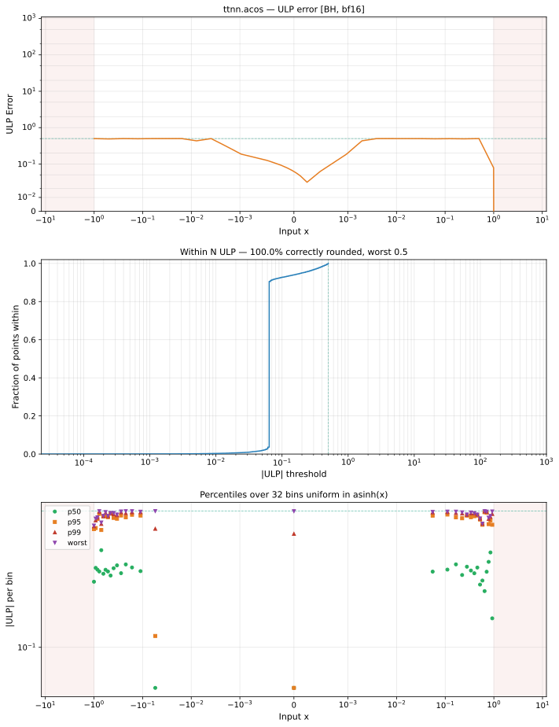

# acos — Blackhole (BH), bfloat16
_This page is auto-generated by `ttnn-accuracy report`. Do not edit manually._

**Architecture:** Blackhole (BH)  
**Data type:** bfloat16  

---

[← Blackhole (BH) bfloat16 ops](README.md) | [All archs for acos](../../../by_op/acos/README.md) | [Top](../../../README.md)

**Measured input range:** x ∈ [-1, 1]  

|  | `default` |
|---|---|
| Max ULP | 0 |
| Mean ULP | — |
| Accurate to \|x\| | 1 |
| Max abs error | 0 |

**default** — bit-exact  

**Outcomes**

| Parameters | exact |
|---|---|
| `default` | 32,258 |

### Special values

| Variant | x | device | golden |  |
|---|---|---|---|---|
| `default` | 0 | 1.57 | 1.571 | **differ** |
| `default` | -0 | 1.57 | 1.571 | **differ** |
| `default` | inf | inf | nan | **differ** |
| `default` | -inf | inf | nan | **differ** |
| `default` | nan | inf | nan | **differ** |
| `default` | 1.175e-38 | 1.57 | 1.571 | **differ** |
| `default` | -1.175e-38 | 1.57 | 1.571 | **differ** |

_Measured on BLACKHOLE · tt-metal `fbf7d27db93` · ttnn `0.75.0rc10.dev916+ga5cd86212e1` · run `20260903T150812`_

