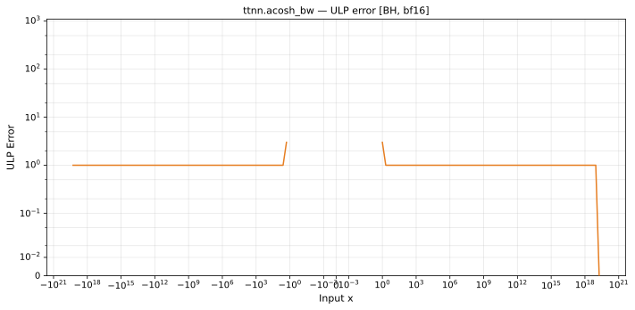

# acosh_bw — Blackhole (BH), bfloat16
_This page is auto-generated by `ttnn-accuracy report`. Do not edit manually._

**Architecture:** Blackhole (BH)  
**Data type:** bfloat16  

---

[← Blackhole (BH) bfloat16 ops](README.md) | [All archs for acosh_bw](../../../by_op/acosh_bw/README.md) | [Top](../../../README.md)

**Measured input range:** x ∈ [-8.507e+37, 8.507e+37]  

|  | `default` |
|---|---|
| Max ULP | 3 |
| Mean ULP | 1.01 |
| Accurate to \|x\| | 1.05 |
| Max abs error | 0.0469 |

**default** — 15874 of 64514 points returned inf or zero where a value exists  

**Outcomes**

| Parameters | exact | inexact | mismatch | zeroed |
|---|---|---|---|---|
| `default` | 12,788 | 3,594 | 32,258 | 15,874 |

### Special values

| Variant | x | device | golden |  |
|---|---|---|---|---|
| `default` | 0 | 7.004e+19 | nan | **differ** |
| `default` | -0 | 7.004e+19 | nan | **differ** |
| `default` | inf | 0 | 0 | agree |
| `default` | -inf | 0 | 0 | agree |
| `default` | nan | 0 | nan | **differ** |
| `default` | 1.175e-38 | 7.004e+19 | nan | **differ** |
| `default` | -1.175e-38 | 7.004e+19 | nan | **differ** |

_Measured on BLACKHOLE · tt-metal `fbf7d27db93` · ttnn `0.75.0rc10.dev916+ga5cd86212e1` · run `20260903T150812`_

