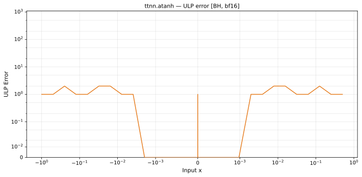

# atanh — Blackhole (BH), bfloat16
_This page is auto-generated by `ttnn-accuracy report`. Do not edit manually._

**Architecture:** Blackhole (BH)  
**Data type:** bfloat16  

---

[← Blackhole (BH) bfloat16 ops](README.md) | [All archs for atanh](../../../by_op/atanh/README.md) | [Top](../../../README.md)

**Measured input range:** x ∈ [-0.9961, 0.9961]  

|  | `default` |
|---|---|
| Max ULP | 2.08 |
| Min ULP | 0 |
| Mean ULP | 0.995 |
| Signed bias (ULP) | 0 |
| p50 ULP | 1 |
| p95 ULP | 1 |
| p99 ULP | 1.01 |
| Exact fraction | 0.169 |
| Correctly rounded | 0.175 |
| Accurate to \|x\| | nowhere |
| Max abs error | 0.00907 |
| Max rel error | 0.00899 |
| Median rel error | 0.00518 |
| Bits of precision (worst) | 6.8 |
| Bits of precision (median) | 7.59 |

**default** — 2/32256 defects; rest 2.08 ULP  

**Outcomes**

| Parameters | exact | faithful | inexact | zeroed |
|---|---|---|---|---|
| `default` | 5,440 | 268 | 26,546 | 2 |

**Worst points**

| Parameters | x | golden | device | ULP |
|---|---|---|---|---|
| `default` | 0.030761719 | 0.030761719 | 0.030517578 | 2.08 |
| `default` | -0.030761719 | -0.030761719 | -0.030517578 | 2.08 |
| `default` | 0.030517578 | 0.030517578 | 0.030273438 | 2.08 |
| `default` | -0.030517578 | -0.030517578 | -0.030273438 | 2.08 |
| `default` | 0.01550293 | 0.01550293 | 0.015380859 | 2.02 |
| `default` | -0.01550293 | -0.01550293 | -0.015380859 | 2.02 |
| `default` | 0.20117188 | 0.20410156 | 0.20214844 | 1.85 |
| `default` | -0.20117188 | -0.20410156 | -0.20214844 | 1.85 |
| `default` | 0.21582031 | 0.21972656 | 0.21777344 | 1.53 |
| `default` | -0.21582031 | -0.21972656 | -0.21777344 | 1.53 |

**Monotonicity**

_Checked only where the reference is itself ordered, and never across a discontinuity._

| Parameters | Pairs | Violations | Rate | Worst \|Δy\| |
|---|---|---|---|---|
| `default` | 32,252 | 0 | 0 | 0 |

### Special values

| Variant | x | device | golden |  |
|---|---|---|---|---|
| `default` | 0 | 0 | 0 | agree |
| `default` | -0 | 0 | -0 | **differ** |
| `default` | inf | inf | nan | **differ** |
| `default` | -inf | inf | nan | **differ** |
| `default` | nan | inf | nan | **differ** |
| `default` | 1.1754944e-38 | 0 | 1.1754944e-38 | **differ** |
| `default` | -1.1754944e-38 | 0 | -1.1754944e-38 | **differ** |

> **Provenance unknown.** These figures predate run tracking. Re-measure to attribute them.

