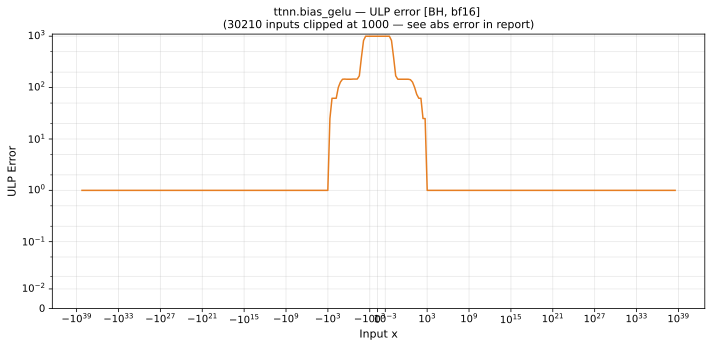

# bias_gelu — Blackhole (BH), bfloat16
_This page is auto-generated by `ttnn-accuracy report`. Do not edit manually._

_Generated: 2026-09-02 14:00_

**Architecture:** Blackhole (BH)  
**Data type:** bfloat16  

---

[← Blackhole (BH) bfloat16 ops](README.md) | [All archs for bias_gelu](../../../by_op/bias_gelu/README.md) | [Top](../../../README.md)

**Measured input range:** all normal values  

| Parameters | Max ULP | Mean ULP | Max abs error |
|------------|---------|----------|---------------|
| `default` | 1.14e+36 ⚠ | 4.5e+34 | 1.33e+36 |

**default** — worst pairing 1.14e+36 ULP; mean 4.5e+34  

**Outcomes**

| Parameters | exact | inexact | overflow | undefined |
|------------|------|------|------|------|
| `default` | 256 | 64,768 | 1 | 1 |

### Special values

| Variant | x | device | golden | |
|---|---|---|---|---|
| `default` | 0 | 0.8359 | 0.8413 | **differ** |
| `default` | -0 | 0.8359 | 0.8413 | **differ** |
| `default` | inf | inf | inf | agree |
| `default` | -inf | inf | nan | **differ** |
| `default` | nan | inf | nan | **differ** |
| `default` | 1.175e-38 | 0.8359 | 0.8413 | **differ** |
| `default` | -1.175e-38 | 0.8359 | 0.8413 | **differ** |

_Measured on BLACKHOLE · tt-metal `f9377427c7f` · ttnn `0.75.0rc10.dev916+ga5cd86212e1` · run `20260901T134349`_

