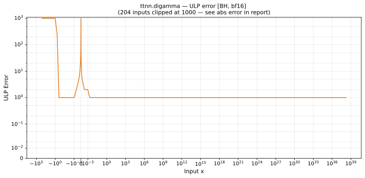

# digamma — Blackhole (BH), bfloat16
_This page is auto-generated by `ttnn-accuracy report`. Do not edit manually._

**Architecture:** Blackhole (BH)  
**Data type:** bfloat16  

---

[← Blackhole (BH) bfloat16 ops](README.md) | [All archs for digamma](../../../by_op/digamma/README.md) | [Top](../../../README.md)

**Measured input range:** x ∈ [-127.5, 3.39e+38]  

|  | `default` |
|---|---|
| Max ULP | 5.57e+05 ⚠ |
| Min ULP | 0.000168 |
| Mean ULP | 177 |
| Signed bias (ULP) | -33.6 |
| p50 ULP | 136 |
| p95 ULP | 240 |
| p99 ULP | 355 |
| Exact fraction | 0.172 |
| Correctly rounded | 0.173 |
| Accurate to \|x\| | nowhere |
| Max abs error | 8.51e+37 |
| Max rel error | 2.29e+03 |
| Median rel error | 1 |
| Bits of precision (worst) | -11.2 |
| Bits of precision (median) | -0 |

**default** — never within 2 ULP  

**Outcomes**

| Parameters | exact | faithful | inexact | mismatch |
|---|---|---|---|---|
| `default` | 8,485 | 9,279 | 31,645 | 127 |

**Worst points**

| Parameters | x | golden | device | ULP |
|---|---|---|---|---|
| `default` | -17.75 | -0.23730469 | 544 | 5.57e+05 |
| `default` | -22.75 | 0.0047912598 | 8.8125 | 2.89e+05 |
| `default` | -2.965331e-06 | 337920 | 306184200 | 1.49e+05 |
| `default` | -7.6875 | 0.0040893555 | 2.6875 | 8.79e+04 |
| `default` | -4.65625 | -0.037353516 | 12.6875 | 5.21e+04 |
| `default` | -17.625 | 1.59375 | -362 | 4.65e+04 |
| `default` | -2.95043e-06 | 337920 | -85458940 | 4.19e+04 |
| `default` | -21.75 | -0.0390625 | 10.1875 | 4.19e+04 |
| `default` | -23.75 | 0.046875 | 7.875 | 3.21e+04 |
| `default` | -18.75 | -0.18359375 | 29.625 | 3.05e+04 |

**Monotonicity**

_Checked only where the reference is itself ordered, and never across a discontinuity._

| Parameters | Pairs | Violations | Rate | Worst \|Δy\| |
|---|---|---|---|---|
| `default` | 32,511 | 0 | 0 | 0 |

**Non-finite outputs**

| Parameters | Points | Both | Device only | Golden only | Device inf | Device nan | Golden inf | Golden nan |
|---|---|---|---|---|---|---|---|---|
| `default` | 127 | 0 | 0 | 127 | 0 | 0 | 0 | 127 |

| Parameters | x | golden | device |
|---|---|---|---|
| `default` | -1 | nan | -12.1875 |
| `default` | -2 | nan | 1.3203125 |
| `default` | -3 | nan | -2.234375 |
| `default` | -4 | nan | -45 |
| `default` | -5 | nan | 8.375 |
| `default` | -6 | nan | 4.65625 |
| `default` | -7 | nan | 3.296875 |
| `default` | -8 | nan | 2.4375 |
| `default` | -9 | nan | 1.7578125 |
| `default` | -10 | nan | 1.0859375 |

### Special values

| Variant | x | device | golden |  |
|---|---|---|---|---|
| `default` | 0 | -335872 | -inf | **differ** |
| `default` | -0 | -335872 | inf | **differ** |
| `default` | inf | inf | inf | agree |
| `default` | -inf | inf | nan | **differ** |
| `default` | nan | 89 | nan | **differ** |
| `default` | 1.1754944e-38 | -335872 | -8.507059e+37 | **differ** |
| `default` | -1.1754944e-38 | -335872 | 8.507059e+37 | **differ** |

> **Provenance unknown.** These figures predate run tracking. Re-measure to attribute them.

