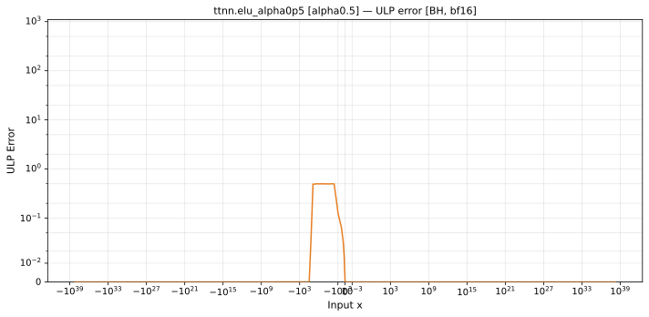
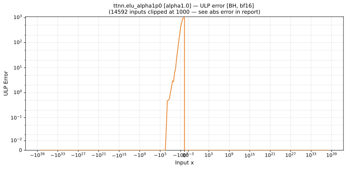
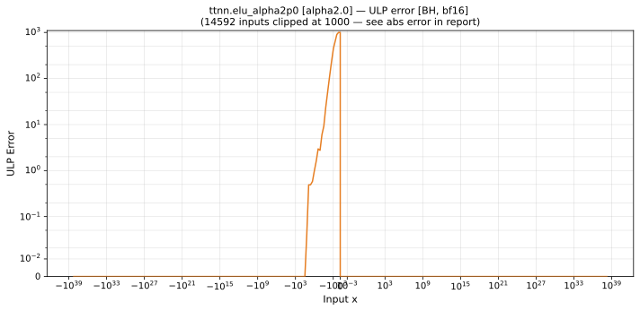

# elu — Blackhole (BH), bfloat16
_This page is auto-generated by `scripts/generate_reports.py`. Do not edit manually._

_Generated: 2026-06-25 19:04 UTC_

**Architecture:** Blackhole (BH)  
**Data type:** bfloat16  

---

[← Blackhole (BH) bfloat16 ops](README.md) | [All archs for elu](../../../by_op/elu/README.md) | [Top](../../../README.md)

**Measured input range:** all normal values  

| Parameters | Max ULP | Mean ULP | Max abs error |
|------------|---------|----------|---------------|
| `alpha=0.5` | 0.5 | 0.00659 | 0.000976 |
| `alpha=1.0` | 0.5 | 0.00659 | 0.00195 |
| `alpha=2.0` | 0.5 | 0.00659 | 0.0039 |

### `alpha=0.5`

### `alpha=1.0`

### `alpha=2.0`

