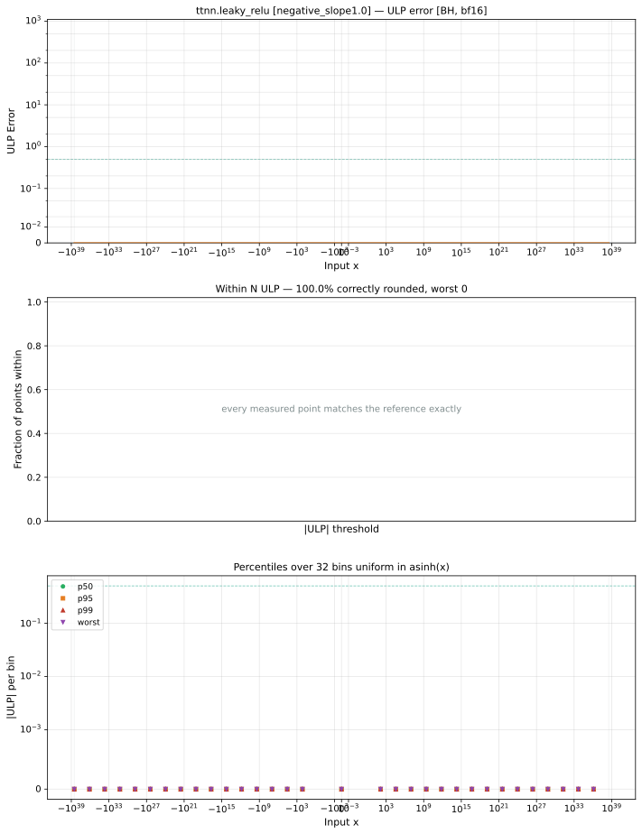

# leaky_relu — Blackhole (BH), bfloat16
_This page is auto-generated by `ttnn-accuracy report`. Do not edit manually._

**Architecture:** Blackhole (BH)  
**Data type:** bfloat16  

---

[← Blackhole (BH) bfloat16 ops](README.md) | [All archs for leaky_relu](../../../by_op/leaky_relu/README.md) | [Top](../../../README.md)

**Measured input range:** x ∈ [-3.39e+38, 3.39e+38]  

|  | `negative_slope=0.0` | `negative_slope=0.01` | `negative_slope=1.0` |
|---|---|---|---|
| Max ULP | 0 | 0.96 | 0 |
| Min ULP | 0 | 0 | 0 |
| Mean ULP | 0 | 0.741 | 0 |
| Signed bias (ULP) | 0 | -0.741 | 0 |
| p50 ULP | 0 | 0 | 0 |
| p95 ULP | 0 | 0.88 | 0 |
| p99 ULP | 0 | 0.96 | 0 |
| Exact fraction | 1 | 0.761 | 1 |
| Correctly rounded | 1 | 0.761 | 1 |
| Accurate to \|x\| | 3.39e+38 | 3.39e+38 | 3.39e+38 |
| Max abs error | 0 | 1.99e+34 | 0 |
| Max rel error | 0 | 0.00708 | 0 |
| Median rel error | 0 | 0.00412 | 0 |
| Bits of precision (worst) | — | 7.14 | — |
| Bits of precision (median) | — | 7.92 | — |

**negative_slope=0.0** — bit-exact · _degenerates to relu_  
**negative_slope=0.01** — faithful; 15341/65024 tie-breaks · _torch's default slope_  
**negative_slope=1.0** — bit-exact · _degenerates to identity_  

**Outcomes**

| Parameters | exact | faithful | flushed |
|---|---|---|---|
| `negative_slope=0.0` | 65,024 | 0 | 0 |
| `negative_slope=0.01` | 48,843 | 15,341 | 840 |
| `negative_slope=1.0` | 65,024 | 0 | 0 |

**Worst points**

| Parameters | x | golden | device | ULP |
|---|---|---|---|---|
| `negative_slope=0.01` | -1.257779e-36 | -1.2581463e-38 | -1.2489627e-38 | 0.96 |
| `negative_slope=0.01` | -1.40471575e-36 | -1.4050831e-38 | -1.3958995e-38 | 0.96 |
| `negative_slope=0.01` | -1.5516525e-36 | -1.5520199e-38 | -1.5428363e-38 | 0.96 |
| `negative_slope=0.01` | -1.8455261e-36 | -1.8458935e-38 | -1.8367099e-38 | 0.96 |
| `negative_slope=0.01` | -2.1393997e-36 | -2.139767e-38 | -2.1305835e-38 | 0.96 |
| `negative_slope=0.01` | -2.515558e-36 | -2.5162926e-38 | -2.4979255e-38 | 0.96 |
| `negative_slope=0.01` | -2.8094315e-36 | -2.8101662e-38 | -2.791799e-38 | 0.96 |
| `negative_slope=0.01` | -3.103305e-36 | -3.1040398e-38 | -3.0856727e-38 | 0.96 |
| `negative_slope=0.01` | -3.6910523e-36 | -3.691787e-38 | -3.6734198e-38 | 0.96 |
| `negative_slope=0.01` | -4.2787994e-36 | -4.279534e-38 | -4.261167e-38 | 0.96 |

**Monotonicity**

_Checked only where the reference is itself ordered, and never across a discontinuity._

| Parameters | Pairs | Violations | Rate | Worst \|Δy\| |
|---|---|---|---|---|
| `negative_slope=0.0` | 65,022 | 0 | 0 | 0 |
| `negative_slope=0.01` | 64,182 | 0 | 0 | 0 |
| `negative_slope=1.0` | 65,022 | 0 | 0 | 0 |

### Special values

| Variant | x | device | golden |  |
|---|---|---|---|---|
| `negative_slope=0.0` | 0 | 0 | 0 | agree |
| `negative_slope=0.0` | -0 | 0 | -0 | **differ** |
| `negative_slope=0.0` | inf | inf | inf | agree |
| `negative_slope=0.0` | -inf | inf | nan | **differ** |
| `negative_slope=0.0` | nan | inf | nan | **differ** |
| `negative_slope=0.0` | 1.1754944e-38 | 1.1754944e-38 | 1.1754944e-38 | agree |
| `negative_slope=0.0` | -1.1754944e-38 | 0 | -0 | **differ** |
| `negative_slope=0.01` | 0 | 0 | 0 | agree |
| `negative_slope=0.01` | -0 | 0 | -0 | **differ** |
| `negative_slope=0.01` | inf | inf | inf | agree |
| `negative_slope=0.01` | -inf | -inf | -inf | agree |
| `negative_slope=0.01` | nan | inf | nan | **differ** |
| `negative_slope=0.01` | 1.1754944e-38 | 1.1754944e-38 | 1.1754944e-38 | agree |
| `negative_slope=0.01` | -1.1754944e-38 | 0 | -9.1835e-41 | **differ** |
| `negative_slope=1.0` | 0 | 0 | 0 | agree |
| `negative_slope=1.0` | -0 | 0 | -0 | **differ** |
| `negative_slope=1.0` | inf | inf | inf | agree |
| `negative_slope=1.0` | -inf | -inf | -inf | agree |
| `negative_slope=1.0` | nan | inf | nan | **differ** |
| `negative_slope=1.0` | 1.1754944e-38 | 1.1754944e-38 | 1.1754944e-38 | agree |
| `negative_slope=1.0` | -1.1754944e-38 | -1.1754944e-38 | -1.1754944e-38 | agree |

_Measured on BLACKHOLE · tt-metal `de546d3b146` · ttnn `0.79.0` · run `20261010T030214`_

### `negative_slope=0.0`

### `negative_slope=0.01`

### `negative_slope=1.0`

