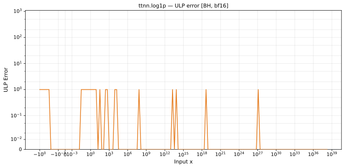

# log1p — Blackhole (BH), bfloat16
_This page is auto-generated by `ttnn-accuracy report`. Do not edit manually._

_Generated: 2026-09-03 10:37_

**Architecture:** Blackhole (BH)  
**Data type:** bfloat16  

---

[← Blackhole (BH) bfloat16 ops](README.md) | [All archs for log1p](../../../by_op/log1p/README.md) | [Top](../../../README.md)

**Measured input range:** x ∈ [-0.9961, 3.39e+38]  

| Parameters | Max ULP | Mean ULP | Accurate to \|x\| | Max abs error |
|---|---|---|---|---------------|
| `default` | 1 | 1 | 3.39e+38 | 0.25 |

**default** — within 2 ULP everywhere  

**Outcomes**

| Parameters | exact | inexact |
|------------|------|------|
| `default` | 48,531 | 109 |

### Special values

| Variant | x | device | golden | |
|---|---|---|---|---|
| `default` | 0 | 0 | 0 | agree |
| `default` | -0 | 0 | -0 | **differ** |
| `default` | inf | inf | inf | agree |
| `default` | -inf | inf | nan | **differ** |
| `default` | nan | inf | nan | **differ** |
| `default` | 1.175e-38 | 1.175e-38 | 1.175e-38 | agree |
| `default` | -1.175e-38 | -1.175e-38 | -1.175e-38 | agree |

_Measured on BLACKHOLE · tt-metal `72023534b03` · ttnn `0.75.0rc10.dev916+ga5cd86212e1` · run `20260903T103548`_

