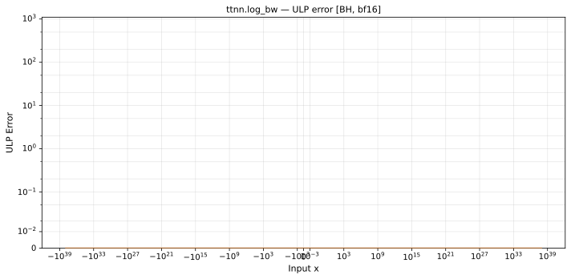

# log_bw — Blackhole (BH), bfloat16
_This page is auto-generated by `ttnn-accuracy report`. Do not edit manually._

**Architecture:** Blackhole (BH)  
**Data type:** bfloat16  

---

[← Blackhole (BH) bfloat16 ops](README.md) | [All archs for log_bw](../../../by_op/log_bw/README.md) | [Top](../../../README.md)

**Measured input range:** x ∈ [-8.507e+37, 8.507e+37]  

|  | `default` |
|---|---|
| Max ULP | 0 |
| Mean ULP | — |
| Accurate to \|x\| | 8.47e+37 |
| Max abs error | 1.18e-38 |

**default** — 2 of 64514 points returned inf or zero where a value exists  

**Outcomes**

| Parameters | exact | zeroed |
|---|---|---|
| `default` | 64,512 | 2 |

### Special values

| Variant | x | device | golden |  |
|---|---|---|---|---|
| `default` | 0 | inf | inf | agree |
| `default` | -0 | inf | -inf | **differ** |
| `default` | inf | 0 | 0 | agree |
| `default` | -inf | 0 | -0 | **differ** |
| `default` | nan | 0 | nan | **differ** |
| `default` | 1.175e-38 | 8.507e+37 | 8.507e+37 | agree |
| `default` | -1.175e-38 | -8.507e+37 | -8.507e+37 | agree |

_Measured on BLACKHOLE · tt-metal `fbf7d27db93` · ttnn `0.75.0rc10.dev916+ga5cd86212e1` · run `20260903T150812`_

