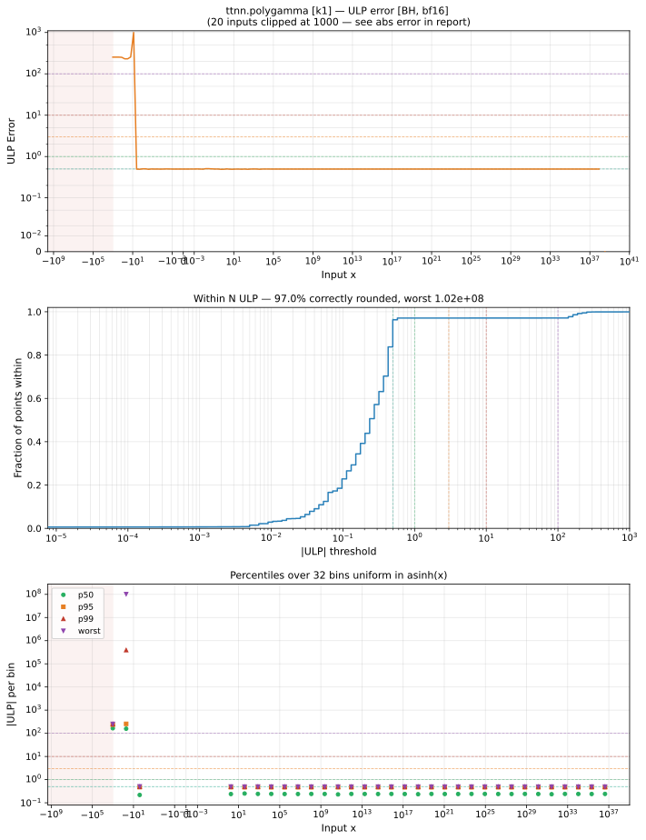
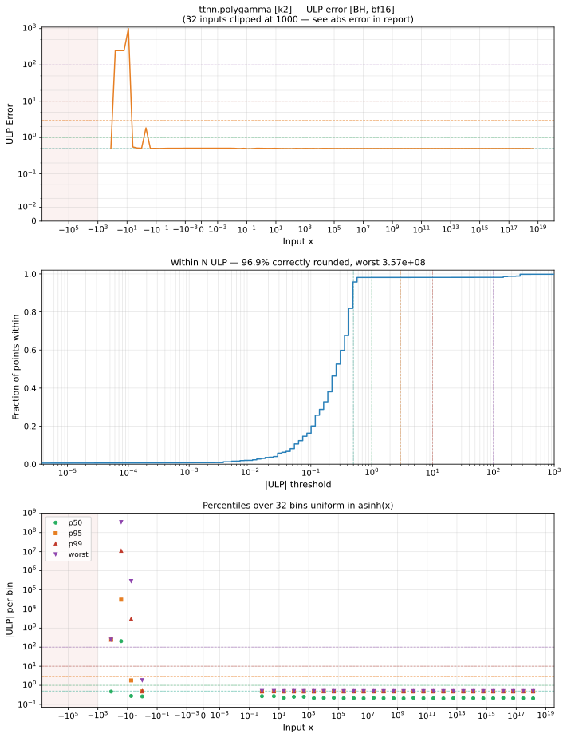
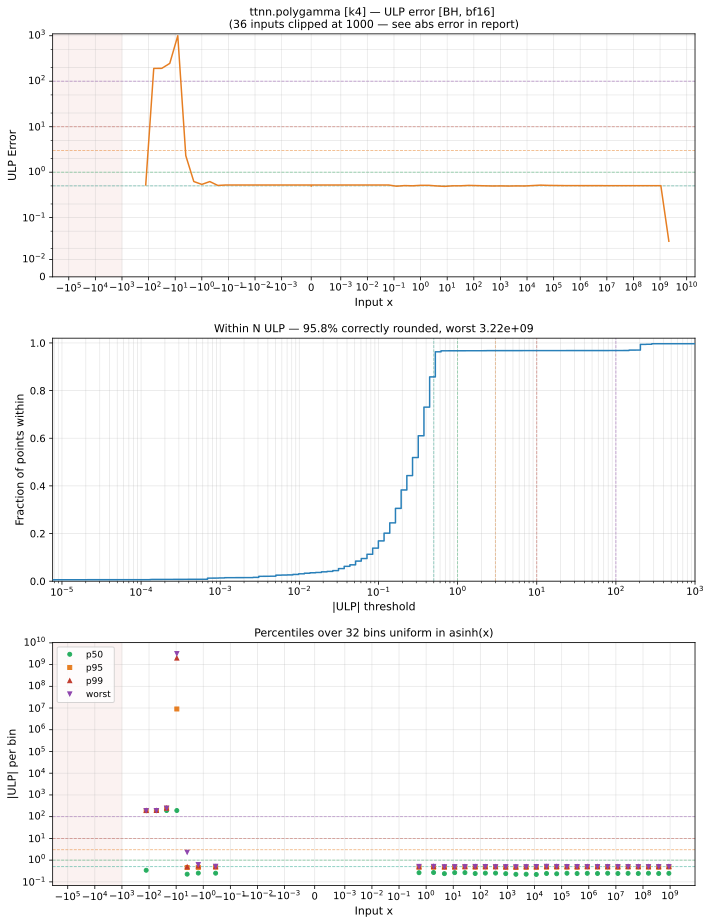

# polygamma — Blackhole (BH), bfloat16
_This page is auto-generated by `ttnn-accuracy report`. Do not edit manually._

**Architecture:** Blackhole (BH)  
**Data type:** bfloat16  

---

[← Blackhole (BH) bfloat16 ops](README.md) | [All archs for polygamma](../../../by_op/polygamma/README.md) | [Top](../../../README.md)

**Measured input range:** x ≥ -1024  

|  | `k=1` | `k=2` | `k=4` |
|---|---|---|---|
| Max ULP | 1.02e+08 ⚠ | 3.57e+08 ⚠ | 3.22e+09 ⚠ |
| Min ULP | 0 | 0 | 0 |
| Mean ULP | 2.13e+05 | 1.21e+06 | 1.66e+07 |
| Signed bias (ULP) | 162 | 1.21e+06 | 1.66e+07 |
| p50 ULP | 0.232 | 0.238 | 0.257 |
| p95 ULP | 0.488 | 0.487 | 0.494 |
| p99 ULP | 182 | 241 | 192 |
| Exact fraction | 0.97 | 0.969 | 0.958 |
| Correctly rounded | 0.97 | 0.969 | 0.958 |
| Accurate to \|x\| | 0.996 | 4.47 | 3.5 |
| Max abs error | 6.44e+36 | 6.75e+35 | 6.61e+35 |
| Max rel error | 7.96e+05 | 2.79e+06 | 1.68e+07 |
| Median rel error | 1 | 1 | 1 |
| Bits of precision (worst) | -19.6 | -21.4 | -24 |
| Bits of precision (median) | -0 | 0.000125 | 9.22e-11 |

**k=1** — 7/49922 defects; rest 1.02e+08 ULP · _trigamma, the first order in use_  
**k=2** — 75/49922 defects; rest 3.57e+08 ULP · _tetragamma; the order changes the series, not just a constant_  
**k=4** — 142/49922 defects; rest 3.22e+09 ULP · _high enough that the reference and the kernel can diverge_  

**Outcomes**

| Parameters | exact | faithful | flushed | inexact | mismatch | overflow | zeroed |
|---|---|---|---|---|---|---|---|
| `k=1` | 32,787 | 16 | 255 | 983 | 6 | 15,874 | 1 |
| `k=2` | 19,003 | 252 | 8,319 | 360 | 507 | 21,406 | 75 |
| `k=4` | 10,606 | 105 | 12,274 | 362 | 507 | 25,926 | 142 |

**Worst points**

| Parameters | x | golden | device | ULP |
|---|---|---|---|---|
| `k=1` | -6.03125 | 1024 | -817889300 | 1.02e+08 |
| `k=1` | -5.96875 | 1024 | 817889300 | 1.02e+08 |
| `k=1` | -6.0625 | 260 | -6356992 | 3.18e+06 |
| `k=1` | -5.9375 | 260 | 6356992 | 3.18e+06 |
| `k=1` | -5.90625 | 117 | 370688 | 7.41e+05 |
| `k=1` | -6.09375 | 117 | -368640 | 7.38e+05 |
| `k=1` | -6.125 | 67 | -48896 | 9.79e+04 |
| `k=1` | -5.875 | 67 | 48896 | 9.77e+04 |
| `k=1` | -6.15625 | 44.25 | -10112 | 4.06e+04 |
| `k=1` | -5.84375 | 44.25 | 10176 | 4.05e+04 |
| `k=2` | -6.03125 | 65536 | -1.8253611e+11 | 3.57e+08 |
| `k=2` | -5.96875 | -65536 | -1.8253611e+11 | 3.57e+08 |
| `k=2` | -6.0625 | 8192 | -713031700 | 1.11e+07 |
| `k=2` | -5.9375 | -8192 | -713031700 | 1.11e+07 |
| `k=2` | -6.09375 | 2432 | -27656192 | 1.73e+06 |
| `k=2` | -5.90625 | -2432 | -27656192 | 1.73e+06 |
| `k=2` | -6.125 | 1024 | -2752512 | 3.44e+05 |
| `k=2` | -5.875 | -1024 | -2752512 | 3.44e+05 |
| `k=2` | -6.5 | -0.020263672 | -35.25 | 2.89e+05 |
| `k=2` | -5.5 | -0.02758789 | -35.25 | 2.89e+05 |
| `k=4` | -6.03125 | 805306400 | -1.3510799e+16 | 3.22e+09 |
| `k=4` | -5.96875 | -805306400 | -1.3510799e+16 | 3.22e+09 |
| `k=4` | -6.5 | -0.002456665 | -10816 | 7.09e+08 |
| `k=4` | -5.5 | -0.0045166016 | -10816 | 3.54e+08 |
| `k=4` | -6.0625 | 25165824 | -1.319414e+13 | 1.01e+08 |
| `k=4` | -5.9375 | -25165824 | -1.319414e+13 | 1.01e+08 |
| `k=4` | -6.09375 | 3309568 | -2.2763327e+11 | 1.39e+07 |
| `k=4` | -5.90625 | -3309568 | -2.2763327e+11 | 1.39e+07 |
| `k=4` | -6.125 | 786432 | -1.2750684e+10 | 3.11e+06 |
| `k=4` | -5.875 | -786432 | -1.2750684e+10 | 3.11e+06 |

**Monotonicity**

_Checked only where the reference is itself ordered, and never across a discontinuity._

| Parameters | Pairs | Violations | Rate | Worst \|Δy\| |
|---|---|---|---|---|
| `k=1` | 24,318 | 0 | 0 | 0 |
| `k=2` | 13,417 | 0 | 0 | 0 |
| `k=4` | 7,135 | 0 | 0 | 0 |

**Non-finite outputs**

| Parameters | Points | Both | Device only | Golden only | Device inf | Device nan | Golden inf | Golden nan |
|---|---|---|---|---|---|---|---|---|
| `k=1` | 15,880 | 15,874 | 6 | 0 | 15,880 | 0 | 15,874 | 0 |
| `k=2` | 21,913 | 21,406 | 0 | 507 | 21,406 | 0 | 21,912 | 1 |
| `k=4` | 26,433 | 25,926 | 0 | 507 | 25,926 | 0 | 26,432 | 1 |

| Parameters | x | golden | device |
|---|---|---|---|
| `k=1` | 1.1754944e-38 | inf | inf |
| `k=1` | 1.1846779e-38 | inf | inf |
| `k=1` | 1.1938615e-38 | inf | inf |
| `k=1` | 1.203045e-38 | inf | inf |
| `k=1` | 1.2122285e-38 | inf | inf |
| `k=1` | 1.2214121e-38 | inf | inf |
| `k=1` | 1.2305956e-38 | inf | inf |
| `k=1` | 1.2397792e-38 | inf | inf |
| `k=1` | 1.2489627e-38 | inf | inf |
| `k=1` | 1.2581463e-38 | inf | inf |
| `k=2` | 1.1754944e-38 | -inf | -inf |
| `k=2` | 1.1846779e-38 | -inf | -inf |
| `k=2` | 1.1938615e-38 | -inf | -inf |
| `k=2` | 1.203045e-38 | -inf | -inf |
| `k=2` | 1.2122285e-38 | -inf | -inf |
| `k=2` | 1.2214121e-38 | -inf | -inf |
| `k=2` | 1.2305956e-38 | -inf | -inf |
| `k=2` | 1.2397792e-38 | -inf | -inf |
| `k=2` | 1.2489627e-38 | -inf | -inf |
| `k=2` | 1.2581463e-38 | -inf | -inf |
| `k=4` | 1.1754944e-38 | -inf | -inf |
| `k=4` | 1.1846779e-38 | -inf | -inf |
| `k=4` | 1.1938615e-38 | -inf | -inf |
| `k=4` | 1.203045e-38 | -inf | -inf |
| `k=4` | 1.2122285e-38 | -inf | -inf |
| `k=4` | 1.2214121e-38 | -inf | -inf |
| `k=4` | 1.2305956e-38 | -inf | -inf |
| `k=4` | 1.2397792e-38 | -inf | -inf |
| `k=4` | 1.2489627e-38 | -inf | -inf |
| `k=4` | 1.2581463e-38 | -inf | -inf |

### Special values

| Variant | x | device | golden |  |
|---|---|---|---|---|
| `k=1` | 0 | inf | inf | agree |
| `k=1` | -0 | inf | inf | agree |
| `k=1` | inf | 0 | 0 | agree |
| `k=1` | -inf | 0 | nan | **differ** |
| `k=1` | nan | 0 | nan | **differ** |
| `k=1` | 1.1754944e-38 | inf | inf | agree |
| `k=1` | -1.1754944e-38 | inf | inf | agree |
| `k=2` | 0 | -inf | -inf | agree |
| `k=2` | -0 | -inf | -inf | agree |
| `k=2` | inf | 0 | nan | **differ** |
| `k=2` | -inf | 0 | -inf | **differ** |
| `k=2` | nan | 0 | nan | **differ** |
| `k=2` | 1.1754944e-38 | -inf | -inf | agree |
| `k=2` | -1.1754944e-38 | inf | inf | agree |
| `k=4` | 0 | -inf | -inf | agree |
| `k=4` | -0 | -inf | -inf | agree |
| `k=4` | inf | 0 | nan | **differ** |
| `k=4` | -inf | 0 | -inf | **differ** |
| `k=4` | nan | 0 | nan | **differ** |
| `k=4` | 1.1754944e-38 | -inf | -inf | agree |
| `k=4` | -1.1754944e-38 | inf | inf | agree |

_Measured on BLACKHOLE · tt-metal `de546d3b146` · ttnn `0.79.0` · run `20261010T030214`_

### `k=1`

### `k=2`

### `k=4`

