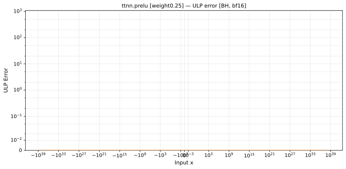

# prelu — Blackhole (BH), bfloat16
_This page is auto-generated by `ttnn-accuracy report`. Do not edit manually._

_Generated: 2026-09-01 13:48_

**Architecture:** Blackhole (BH)  
**Data type:** bfloat16  

---

[← Blackhole (BH) bfloat16 ops](README.md) | [All archs for prelu](../../../by_op/prelu/README.md) | [Top](../../../README.md)

**Measured input range:** x ∈ [-3.39e+38, 3.39e+38]  

| Parameters | Max ULP | Mean ULP | Accurate to \|x\| | Max abs error |
|---|---|---|---|---------------|
| `weight=0.25` | 0 | — | 3.39e+38 | 1.18e-38 |

**weight=0.25** — bit-exact · _torch's channel-weight init_  

**Outcomes**

| Parameters | exact | flushed | zeroed |
|------------|------|------|------|
| `weight=0.25` | 64,768 | 255 | 1 |

### Special values

| Variant | x | device | golden | |
|---|---|---|---|---|
| `weight=0.25` | 0 | 0 | 0 | agree |
| `weight=0.25` | -0 | 0 | -0 | **differ** |
| `weight=0.25` | inf | inf | inf | agree |
| `weight=0.25` | -inf | -inf | -inf | agree |
| `weight=0.25` | nan | inf | nan | **differ** |
| `weight=0.25` | 1.175e-38 | 1.175e-38 | 1.175e-38 | agree |
| `weight=0.25` | -1.175e-38 | 0 | -2.939e-39 | **differ** |

_Measured on BLACKHOLE · tt-metal `f9377427c7f` · ttnn `0.75.0rc10.dev916+ga5cd86212e1` · run `20260901T134349`_

