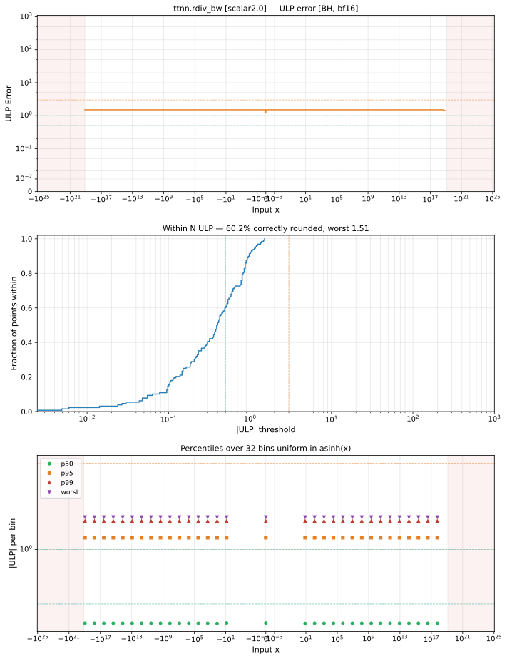

# rdiv_bw — Blackhole (BH), bfloat16
_This page is auto-generated by `ttnn-accuracy report`. Do not edit manually._

**Architecture:** Blackhole (BH)  
**Data type:** bfloat16  

---

[← Blackhole (BH) bfloat16 ops](README.md) | [All archs for rdiv_bw](../../../by_op/rdiv_bw/README.md) | [Top](../../../README.md)

**Measured input range:** x ∈ [-1.304e+19, 1.304e+19]  

|  | `scalar=2.0` |
|---|---|
| Max ULP | 1.51 |
| Min ULP | 0 |
| Mean ULP | 0.837 |
| Signed bias (ULP) | 0.837 |
| p50 ULP | 0.391 |
| p95 ULP | 1.16 |
| p99 ULP | 1.44 |
| Exact fraction | 0.602 |
| Correctly rounded | 0.602 |
| Accurate to \|x\| | 7.67e-20 |
| Max abs error | 8.19e+35 |
| Max rel error | 0.0076 |
| Median rel error | 0.00459 |
| Bits of precision (worst) | 7.04 |
| Bits of precision (median) | 7.77 |

**scalar=2.0** — 256 of 48492 points returned inf or zero where a value exists · _2 keeps the op distinct from reciprocal_  

**Outcomes**

| Parameters | exact | faithful | inexact | mismatch | overflow | zeroed |
|---|---|---|---|---|---|---|
| `scalar=2.0` | 19,404 | 10,332 | 2,520 | 148 | 15,980 | 108 |

**Worst points**

| Parameters | x | golden | device | ULP |
|---|---|---|---|---|
| `scalar=2.0` | 1.5500703e-19 | -8.307675e+37 | -8.3741364e+37 | 1.51 |
| `scalar=2.0` | 3.1001406e-19 | -2.0769187e+37 | -2.0935341e+37 | 1.51 |
| `scalar=2.0` | 6.200281e-19 | -5.192297e+36 | -5.2338352e+36 | 1.51 |
| `scalar=2.0` | 1.2400562e-18 | -1.2980742e+36 | -1.3084588e+36 | 1.51 |
| `scalar=2.0` | 2.4801125e-18 | -3.2451855e+35 | -3.271147e+35 | 1.51 |
| `scalar=2.0` | 4.960225e-18 | -8.112964e+34 | -8.1778676e+34 | 1.51 |
| `scalar=2.0` | 9.92045e-18 | -2.028241e+34 | -2.0444669e+34 | 1.51 |
| `scalar=2.0` | 1.98409e-17 | -5.0706024e+33 | -5.1111672e+33 | 1.51 |
| `scalar=2.0` | 3.96818e-17 | -1.2676506e+33 | -1.2777918e+33 | 1.51 |
| `scalar=2.0` | 7.93636e-17 | -3.1691265e+32 | -3.1944795e+32 | 1.51 |

**Monotonicity**

_Checked only where the reference is itself ordered, and never across a discontinuity._

| Parameters | Pairs | Violations | Rate | Worst \|Δy\| |
|---|---|---|---|---|
| `scalar=2.0` | 32,254 | 0 | 0 | 0 |

**Non-finite outputs**

| Parameters | Points | Both | Device only | Golden only | Device inf | Device nan | Golden inf | Golden nan |
|---|---|---|---|---|---|---|---|---|
| `scalar=2.0` | 16,128 | 15,980 | 148 | 0 | 16,128 | 0 | 15,980 | 0 |

| Parameters | x | golden | device |
|---|---|---|---|
| `scalar=2.0` | 1.1754944e-38 | -inf | -inf |
| `scalar=2.0` | 1.1846779e-38 | -inf | -inf |
| `scalar=2.0` | 1.1938615e-38 | -inf | -inf |
| `scalar=2.0` | 1.203045e-38 | -inf | -inf |
| `scalar=2.0` | 1.2122285e-38 | -inf | -inf |
| `scalar=2.0` | 1.2214121e-38 | -inf | -inf |
| `scalar=2.0` | 1.2305956e-38 | -inf | -inf |
| `scalar=2.0` | 1.2397792e-38 | -inf | -inf |
| `scalar=2.0` | 1.2489627e-38 | -inf | -inf |
| `scalar=2.0` | 1.2581463e-38 | -inf | -inf |

### Special values

| Variant | x | device | golden |  |
|---|---|---|---|---|
| `scalar=2.0` | 0 | -inf | -inf | agree |
| `scalar=2.0` | -0 | -inf | -inf | agree |
| `scalar=2.0` | inf | 0 | -0 | **differ** |
| `scalar=2.0` | -inf | 0 | -0 | **differ** |
| `scalar=2.0` | nan | 0 | nan | **differ** |
| `scalar=2.0` | 1.1754944e-38 | -inf | -inf | agree |
| `scalar=2.0` | -1.1754944e-38 | -inf | -inf | agree |

_Measured on BLACKHOLE · tt-metal `a3a9fb4229a` · ttnn `0.78.0` · run `20260918T102923`_

