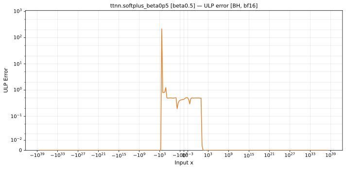
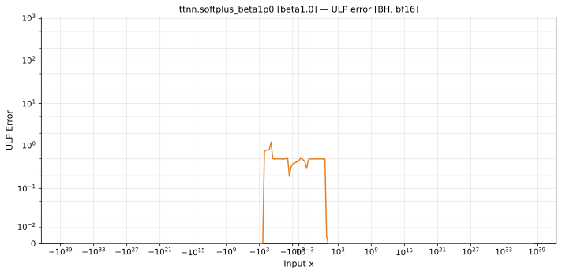

# softplus — Blackhole (BH), bfloat16
_This page is auto-generated by `ttnn-accuracy report`. Do not edit manually._

_Generated: 2026-08-26 07:39_

**Architecture:** Blackhole (BH)  
**Data type:** bfloat16  

---

[← Blackhole (BH) bfloat16 ops](README.md) | [All archs for softplus](../../../by_op/softplus/README.md) | [Top](../../../README.md)

**Measured input range:** x ≥ -174  

| Parameters | Max ULP | Mean ULP | Max abs error |
|------------|---------|----------|---------------|
| `beta=0.5` | 1.24 | 0.288 | 0.0311 |
| `beta=1.0` | 1.24 | 0.287 | 0.0155 |
| `beta=2.0` | 1.24 | 0.285 | 0.00777 |

### `beta=0.5`

### `beta=1.0`

### `beta=2.0`

