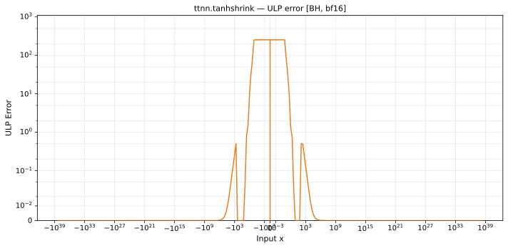

# tanhshrink — Blackhole (BH), bfloat16
_This page is auto-generated by `ttnn-accuracy report`. Do not edit manually._

**Architecture:** Blackhole (BH)  
**Data type:** bfloat16  

---

[← Blackhole (BH) bfloat16 ops](README.md) | [All archs for tanhshrink](../../../by_op/tanhshrink/README.md) | [Top](../../../README.md)

**Measured input range:** x ∈ [-3.39e+38, 3.39e+38]  

|  | `default` |
|---|---|
| Max ULP | 63.5 |
| Mean ULP | 9.5 |
| Accurate to \|x\| | 1.35e-08 |
| Max abs error | 2 |

**default** — accurate to |x| <= 1.35e-08; up to 63.5 ULP beyond  

**Outcomes**

| Parameters | exact | inexact |
|---|---|---|
| `default` | 59,698 | 5,326 |

### Special values

| Variant | x | device | golden |  |
|---|---|---|---|---|
| `default` | 0 | 0 | 0 | agree |
| `default` | -0 | 0 | 0 | agree |
| `default` | inf | inf | inf | agree |
| `default` | -inf | -inf | -inf | agree |
| `default` | nan | inf | nan | **differ** |
| `default` | 1.175e-38 | 0 | 0 | agree |
| `default` | -1.175e-38 | 0 | 0 | agree |

_Measured on BLACKHOLE · tt-metal `fbf7d27db93` · ttnn `0.75.0rc10.dev916+ga5cd86212e1` · run `20260903T150812`_

