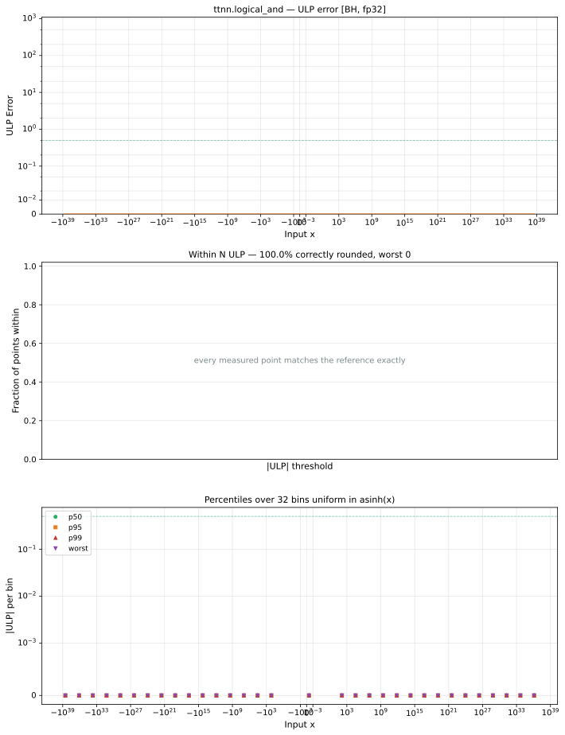
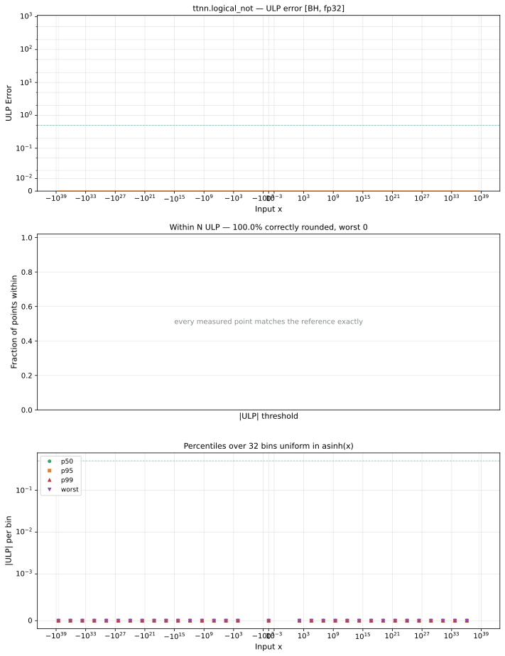
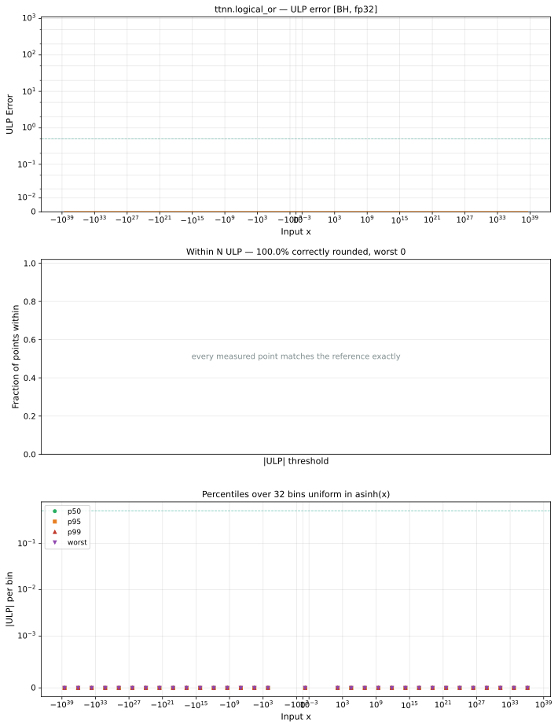
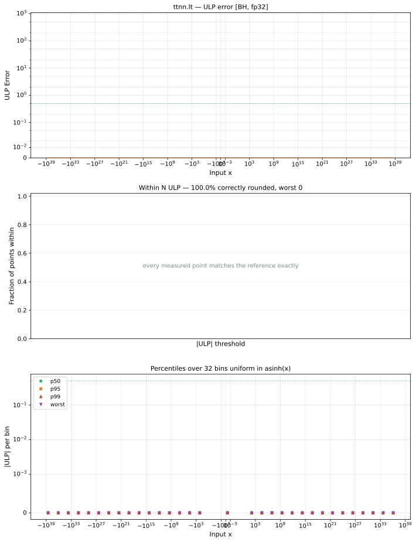
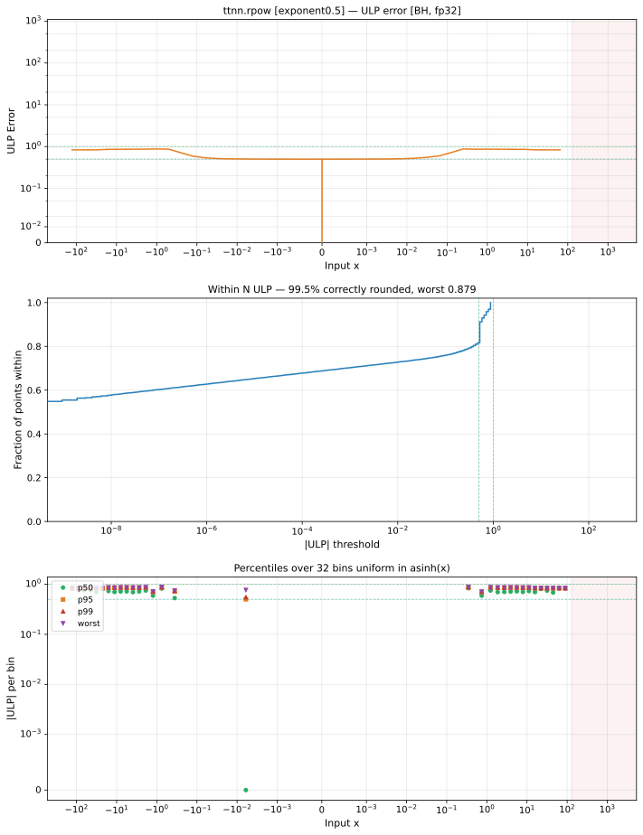
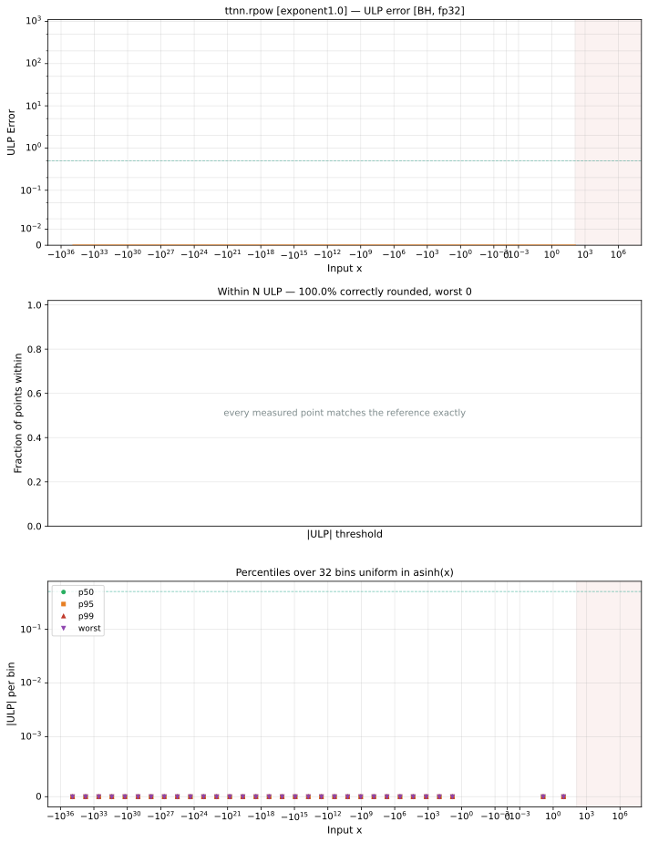
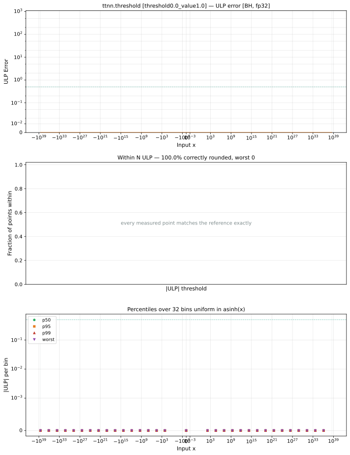

# Blackhole (BH) — float32
_This page is auto-generated by `ttnn-accuracy report`. Do not edit manually._

[← Blackhole (BH)](../README.md) | [Top](../../../README.md)

## Operations Summary

_Accurate to \|x\|: the largest \|x\| within 2 ULP. `n/a` for ops of more than one operand, where a bound on x would describe its sampled partner instead._

| Op | Parameters | Max ULP | Mean ULP | Accurate to \|x\| | Max abs error | µs |
|----|------------|---------|----------|-----------------|---------------|----|
| [abs](abs.md) | `default` | 0 | 0 | 3.39e+38 | 0 | 348 |
| [abs_bw](abs_bw.md) | `default` | 0 | 0 | 3.39e+38 | 0 | 1146 |
| [acos](acos.md) | `default` | 1.55 | 0.865 | 1 | 2.97e-07 | 469 ±6% |
| [acos_bw](acos_bw.md) | `default` | 609 | 1.34 | 0.926 | 0.00232 | 6842 |
| [acosh](acosh.md) | `default` | 2.47 | 0.76 | nowhere | 5.54e-06 | 395 |
| [acosh_bw](acosh_bw.md) | `default` | 724 | 1.13 | 0.996 | 0.00276 | 7811 |
| [add](add.md) | `default` | 0.5 | 0 | n/a | 1.01e+31 | 475 |
| [add_](add_.md) | `default` | 0.5 | 0 | n/a | 1.01e+31 | 473 |
| [addalpha](addalpha.md) | `alpha=2.0` | 0.5 | 0 | n/a | 1.01e+31 | 501 ±6% |
| [addcdiv](addcdiv.md) | `default` | 2.19e+12 ⚠ | 8.82e+07 | n/a | 4.06e+31 | 667 |
| [addcmul](addcmul.md) | `default` | 2.13e+06 ⚠ | 1.59e+04 | n/a | 1.01e+31 | 667 |
| [asin](asin.md) | `default` | 1.77 | 0.795 | 1 | 1.69e-07 | 448 |
| [asin_bw](asin_bw.md) | `default` | 609 | 1.34 | 0.926 | 0.00232 | 6693 |
| [asinh](asinh.md) | `default` | 1.64 | 0.773 | 3.39e+38 | 5.54e-06 | 535 |
| [asinh_bw](asinh_bw.md) | `default` | 1.98 | 1.06 | 1.84e+19 | 9.48e-08 | 1204 |
| [atan](atan.md) | `default` | 2.34 | 0.806 | 0.902 | 1.48e-07 | 400 ±823% |
| [atan2](atan2.md) | `default` | 1.32e+07 ⚠ | 1.26e+05 | n/a | 0.785 | 508 ±6% |
| [atan2_bw](atan2_bw.md) | `default` | 1.64e+07 ⚠ | 1.66e+05 | n/a | 4.5e+18 | 4895 |
| [atan_bw](atan_bw.md) | `default` | 9.02e+04 ⚠ | 3.25e+03 | 1.02 | 1.04e-07 | 1139 |
| [atanh](atanh.md) | `default` | 2.97 | 1.51 | 0.000229 | 1.62e-07 | 503 |
| [atanh_bw](atanh_bw.md) | `default` | 9.02e+04 ⚠ | 3.31e+03 | 0.681 | 0.25 | 7525 |
| [bias_gelu](bias_gelu.md) | `default` | 7.45e+40 ⚠ | 6.51e+39 | n/a | 1.01e+31 | 495 |
| [bias_gelu_](bias_gelu_.md) | `default` | 7.45e+40 ⚠ | 6.51e+39 | n/a | 1.01e+31 | 471 |
| [cbrt](cbrt.md) | `default` | 2.55 | 1.76 | 2.26e-38 | 1.2e+06 | 391 ±89% |
| [ceil](ceil.md) | `default` | 0 | 0 | 3.39e+38 | 0 | 344 |
| [celu](celu.md) | `default` | 1.36 | 0.799 | 3.39e+38 | 4.68e-08 | 386 |
| [celu_bw](celu_bw.md) | `default` | 0.866 | 0.578 | 3.39e+38 | 4.31e-08 | 2499 |
| [clamp](clamp.md) | `min=-1.0,max=1.0` | 0 | 0 | 3.39e+38 | 0 | 347 |
|  | `min=0.0,max=0.0` | 0 | 0 | 3.39e+38 | 0 | 345 |
|  | `min=1.0,max=-1.0` | 0 | 0 | 3.39e+38 | 0 | 344 |
| [clamp_bw](clamp_bw.md) | `default` | 0 | 0 | n/a | 0 | 2172 |
| [clip](clip.md) | `min=-1.0,max=1.0` | 0 | 0 | 3.39e+38 | 0 | 347 |
|  | `min=0.0,max=0.0` | 0 | 0 | 3.39e+38 | 0 | 345 |
|  | `min=1.0,max=-1.0` | 0 | 0 | 3.39e+38 | 0 | 344 |
| [clip_bw](clip_bw.md) | `default` | 0 | 0 | n/a | 0 | 2184 |
| [cos](cos.md) | `default` | 1.34e+08 ⚠ | 1.33e+05 | 92.4 | 2.86e-06 | 383 |
| [cos_bw](cos_bw.md) | `default` | 8.59e+51 ⚠ | 3.23e+48 | 28 | 3.4e+38 | 1504 |
| [cosh](cosh.md) | `default` | 1.35 | 0.791 | 89.1 | 1.57e+31 | 388 |
| [cosh_bw](cosh_bw.md) | `default` | 2.2 | 1.16 | 0.0155 | 8.81e+30 | 6103 |
| [deg2rad](deg2rad.md) | `default` | 0.63 | 0.595 | 3.4e+38 | 3.63e+29 | 347 |
| [digamma](digamma.md) | `default` | 3.66e+17 ⚠ | 7.77e+12 | nowhere | 8.51e+37 | 702 |
| [digamma_bw](digamma_bw.md) | `default` | 7.91e+33 ⚠ | 3.25e+29 | 5.4e-20 | 2.59e+38 | 6569 |
| [div](div.md) | `default` | 2.44 | 1.44 | n/a | 1.45e+31 | 505 ±5% |
| [div_bw](div_bw.md) | `default` | 7.95e+04 ⚠ | 7.95e+04 | n/a | 4.46e-40 | 3047 |
| [div_no_nan](div_no_nan.md) | `default` | 9.24e+04 ⚠ | 4.51e+04 | n/a | 1.36e+25 | 1583 |
| [divide](divide.md) | `default` | 2.44 | 1.44 | n/a | 1.45e+31 | 481 |
| [divide_](divide_.md) | `default` | 2.44 | 1.44 | n/a | 1.45e+31 | 479 |
| [elu](elu.md) | `default` | 1.36 | 0.799 | 3.39e+38 | 4.68e-08 | 393 |
| [elu_bw](elu_bw.md) | `default` | 0.866 | 0.578 | 3.39e+38 | 4.31e-08 | 2481 |
| [eq](eq.md) | `default` | 0 | 0 | n/a | 0 | 477 |
| [eq_](eq_.md) | `default` | 0 | 0 | n/a | 0 | 471 |
| [eqz](eqz.md) | `default` | 0 | 0 | 3.39e+38 | 0 | 345 |
| [erf](erf.md) | `default` | 7.38 | 1.36 | 0.000334 | 4.77e-07 | 531 |
| [erf_bw](erf_bw.md) | `default` | 65.5 | 3.73 | 0.348 | 1.53e-07 | 2185 |
| [erfc](erfc.md) | `default` | 2.1e+33 ⚠ | 1.71e+29 | nowhere | 0.00388 | 461 ±9% |
| [erfc_bw](erfc_bw.md) | `default` | 65.5 | 3.73 | 0.348 | 1.53e-07 | 2188 |
| [erfinv](erfinv.md) | `default` | 7.96e+06 ⚠ | 2.59e+05 | 1.32e-38 | 0.0149 | 338 ±7% |
| [erfinv_bw](erfinv_bw.md) | `default` | 1.03e+06 ⚠ | 1.67e+03 | 0.000456 | 2.57e+05 | 6719 |
| [exp](exp.md) | `default` | 0.866 | 0.578 | 3.39e+38 | 1.5e+31 | 385 |
|  | `fast_approx` | 3.79e+05 ⚠ | 2e+05 | nowhere | 6.16e+36 | 354 |
| [exp2](exp2.md) | `default` | 0.965 | 0.626 | 3.39e+38 | 1.88e+31 | 379 |
| [exp2_bw](exp2_bw.md) | `default` | 1.85 | 1.09 | 128 | 1.78e+31 | 1501 |
| [exp_bw](exp_bw.md) | `default` | 0.866 | 0.578 | 3.39e+38 | 1.5e+31 | 1176 |
| [expm1](expm1.md) | `default` | 0.997 | 0.565 | 3.39e+38 | 1.76e+31 | 429 |
| [expm1_bw](expm1_bw.md) | `default` | 4.19e+06 ⚠ | 3.83e+03 | 22 | 1.5e+31 | 1178 |
| [floor](floor.md) | `default` | 0 | 0 | 3.39e+38 | 0 | 346 |
| [floor_div](floor_div.md) | `default` | 4.19e+06 ⚠ | 1.56e+03 | n/a | 1 | 2257 |
| [fmod](fmod.md) | `default` | 1.61e+45 ⚠ | 2.55e+41 | n/a | 3.8e+31 | 489 |
| [frac](frac.md) | `default` | 0 | 0 | 3.39e+38 | 0 | 346 |
| [ge](ge.md) | `default` | 0 | 0 | n/a | 0 | 474 |
| [ge_](ge_.md) | `default` | 0 | 0 | n/a | 0 | 476 |
| [gelu](gelu.md) | `default` | 1.71e+08 ⚠ | 1.7e+05 | 0.208 | 3.81e-06 | 349 |
|  | `fast_approx` | 7.45e+40 ⚠ | 1.18e+39 | 2.33e-38 | 0.0234 | 346 |
| [gelu_bw](gelu_bw.md) | `default` | 1.47e+08 ⚠ | 2.3e+04 | 0.0298 | 0.00751 | 828 |
| [gez](gez.md) | `default` | 0 | 0 | 3.39e+38 | 0 | 344 |
| [gt](gt.md) | `default` | 0 | 0 | n/a | 0 | 499 |
| [gt_](gt_.md) | `default` | 0 | 0 | n/a | 0 | 472 |
| [gtz](gtz.md) | `default` | 0 | 0 | 3.39e+38 | 0 | 345 |
| [hardmish](hardmish.md) | `default` | 0 | 0 | 3.39e+38 | 0 | 345 |
| [hardshrink](hardshrink.md) | `default` | 0 | 0 | 3.39e+38 | 0 | 344 |
| [hardshrink_bw](hardshrink_bw.md) | `default` | 0 | 0 | 3.39e+38 | 0 | 1471 |
| [hardsigmoid](hardsigmoid.md) | `default` | 4.89e+06 ⚠ | 3e+03 | 2.25 | 3.97e-08 | 346 |
| [hardsigmoid_bw](hardsigmoid_bw.md) | `default` | 0 | 0 | 3.39e+38 | 0 | 2287 |
| [hardswish](hardswish.md) | `default` | 7.34e+06 ⚠ | 1.41e+03 | 2.36 | 2.38e-07 | 355 |
| [hardswish_bw](hardswish_bw.md) | `default` | 1.41e+10 ⚠ | 6e+06 | 0.00133 | 0.5 | 3241 |
| [hardtanh](hardtanh.md) | `default` | 0 | 0 | 3.39e+38 | 0 | 345 |
| [hardtanh_bw](hardtanh_bw.md) | `default` | 0 | 0 | 3.39e+38 | 0 | 1938 |
| [heaviside](heaviside.md) | `value=0.0` | 0 | 0 | 3.39e+38 | 0 | 346 |
|  | `value=0.5` | 0 | 0 | 3.39e+38 | 0 | 345 |
|  | `value=1.0` | 0 | 0 | 3.39e+38 | 0 | 344 |
| [hypot](hypot.md) | `default` | 3.44e+06 ⚠ | 3.28e+04 | n/a | 1.56e+12 | 496 |
| [hypot_bw](hypot_bw.md) | `default` | 4.86e+06 ⚠ | 4.48e+04 | n/a | 1 | 2971 |
| [i0](i0.md) | `default` | 1.68e+07 ⚠ | 2.19e+06 | 2.45 | 3.09e+38 | 403 |
| [i0_bw](i0_bw.md) | `default` | 1.56e+07 ⚠ | 4.1e+04 | 0.00362 | 2.96e+38 | 1324 |
| [i1](i1.md) | `default` | 8.02 | 0.731 | 0.00362 | 1.85e+30 | 540 |
| [identity](identity.md) | `default` | 0 | 0 | 3.39e+38 | 0 | 343 |
| [isclose](isclose.md) | `default` | 0 | 0 | n/a | 0 | 502 |
| [isfinite](isfinite.md) | `default` | 0 | 0 | 3.39e+38 | 0 | 345 |
| [isinf](isinf.md) | `default` | 0 | 0 | 3.39e+38 | 0 | 343 |
| [isnan](isnan.md) | `default` | 0 | 0 | 3.39e+38 | 0 | 352 ±17% |
| [isneginf](isneginf.md) | `default` | 0 | 0 | 3.39e+38 | 0 | 344 |
| [isposinf](isposinf.md) | `default` | 0 | 0 | 3.39e+38 | 0 | 343 |
| [l1_loss](l1_loss.md) | `default` | 0.5 | 0 | n/a | 1.01e+31 | 496 ±6% |
| [ldexp](ldexp.md) | `default` | 1.92 | 1.52 | n/a | 3.77e+31 | 510 ±6% |
| [ldexp_](ldexp_.md) | `default` | 1.92 | 1.52 | n/a | 3.77e+31 | 484 |
| [ldexp_bw](ldexp_bw.md) | `default` | 0.742 | 0.742 | n/a | 4.42e-08 | 2214 |
| [le](le.md) | `default` | 0 | 0 | n/a | 0 | 474 |
| [le_](le_.md) | `default` | 0 | 0 | n/a | 0 | 473 |
| [leaky_relu](leaky_relu.md) | `negative_slope=0.0` | 0 | 0 | 3.39e+38 | 0 | 350 ±6% |
|  | `negative_slope=0.01` | 0.84 | 0.747 | 3.39e+38 | 2.28e+29 | 346 |
|  | `negative_slope=1.0` | 0 | 0 | 3.39e+38 | 0 | 344 |
| [leaky_relu_bw](leaky_relu_bw.md) | `default` | 0.24 | 0 | 3.39e+38 | 2.24e-10 | 1640 |
| [lerp](lerp.md) | `default` | 1.46e+08 ⚠ | 9.53e+04 | n/a | 2.44e+31 | 653 |
| [lerp_bw](lerp_bw.md) | `default` | 0.5 | 0 | n/a | 1 | 2515 |
| [lez](lez.md) | `default` | 0 | 0 | 3.39e+38 | 0 | 343 |
| [lgamma](lgamma.md) | `default` | 3.27e+07 ⚠ | 2.98e+03 | 0.0181 | 3.25e+31 | 1291 |
| [lgamma_bw](lgamma_bw.md) | `default` | 3.66e+17 ⚠ | 7.77e+12 | nowhere | 8.51e+37 | 1480 |
| [log](log.md) | `default` | 0.961 | 0.562 | 3.39e+38 | 4.53e-06 | 401 |
| [log10](log10.md) | `default` | 2.13 | 1.36 | 0.336 | 4.76e-06 | 400 |
| [log10_bw](log10_bw.md) | `default` | 9.02e+04 ⚠ | 1.73e+03 | 4.42e+30 | 4.09e+30 | 4702 |
| [log1p](log1p.md) | `default` | 0.967 | 0.558 | 3.39e+38 | 4.53e-06 | 397 |
| [log1p_bw](log1p_bw.md) | `default` | 9.02e+04 ⚠ | 2.96e+03 | 2.02e+31 | 6.19e-05 | 4705 |
| [log2](log2.md) | `default` | 2.43 | 0.517 | 0.704 | 3.88e-06 | 391 |
| [log2_bw](log2_bw.md) | `default` | 9.02e+04 ⚠ | 1.76e+03 | nowhere | 8.94e+30 | 4694 |
| [log_bw](log_bw.md) | `default` | 9.02e+04 ⚠ | 1.72e+03 | 2.02e+31 | 3.77e+30 | 3541 |
| [log_sigmoid](log_sigmoid.md) | `default` | 4.4e+05 ⚠ | 1.82e+04 | nowhere | 0.0181 | 457 |
| [log_sigmoid_bw](log_sigmoid_bw.md) | `default` | 2.93 | 1.28 | 0.163 | 8.99e-08 | 5207 |
| [logaddexp](logaddexp.md) | `default` | 5.23e+08 ⚠ | 7.28e+06 | n/a | 4.53e-06 | 614 ±5% |
| [logaddexp2](logaddexp2.md) | `default` | 1.54e+09 ⚠ | 1.05e+07 | n/a | 3.93e-06 | 542 |
| [logaddexp2_](logaddexp2_.md) | `default` | 1.54e+09 ⚠ | 1.05e+07 | n/a | 3.93e-06 | 519 |
| [logaddexp2_bw](logaddexp2_bw.md) | `default` | 9.02e+04 ⚠ | 5.6e+04 | n/a | 9.05e-08 | 4729 |
| [logaddexp_](logaddexp_.md) | `default` | 5.23e+08 ⚠ | 7.28e+06 | n/a | 4.53e-06 | 579 |
| [logaddexp_bw](logaddexp_bw.md) | `default` | 8.98e+04 ⚠ | 4.46e+04 | n/a | 9.35e-08 | 4255 |
| [logical_and](logical_and.md) | `default` | 0 | 0 | n/a | 0 | 487 |
| [logical_and_](logical_and_.md) | `default` | 0 | 0 | n/a | 0 | 486 |
| [logical_not](logical_not.md) | `default` | 0 | 0 | 3.39e+38 | 0 | 348 |
| [logical_not_](logical_not_.md) | `default` | 0 | 0 | 1 | 0 | 343 |
| [logical_or](logical_or.md) | `default` | 0 | 0 | n/a | 0 | 485 |
| [logical_or_](logical_or_.md) | `default` | 0 | 0 | n/a | 0 | 485 |
| [logical_xor_](logical_xor_.md) | `default` | 0 | 0 | n/a | 0 | 509 |
| [logit](logit.md) | `default` | 4.19e+06 ⚠ | 261 | 0.266 | 4.53e-06 | 355 |
| [logit_bw](logit_bw.md) | `default` | 2.28 | 0.789 | 2.97e-08 | 3.77e+30 | 5987 |
| [logiteps_bw](logiteps_bw.md) | `default` | 2.28 | 0.789 | 2.97e-08 | 3.77e+30 | 7485 |
| [lt](lt.md) | `default` | 0 | 0 | n/a | 0 | 500 |
| [lt_](lt_.md) | `default` | 0 | 0 | n/a | 0 | 472 |
| [ltz](ltz.md) | `default` | 0 | 0 | 3.39e+38 | 0 | 345 |
| [mac](mac.md) | `default` | 4.22e+06 ⚠ | 7.31e+05 | n/a | 3.8e+30 | 669 |
| [max_bw](max_bw.md) | `default` | 4.19e+06 ⚠ | 4.19e+06 | n/a | 0.5 | 4855 |
| [maximum](maximum.md) | `default` | 0 | 0 | n/a | 0 | 501 |
| [min_bw](min_bw.md) | `default` | 4.19e+06 ⚠ | 4.19e+06 | n/a | 0.5 | 4837 |
| [minimum](minimum.md) | `default` | 0 | 0 | n/a | 0 | 500 |
| [mish](mish.md) | `default` | 7 | 2.58 | 1.49e-07 | 1.91e-06 | 519 |
| [mse_loss](mse_loss.md) | `default` | 1.91 | 1.78 | n/a | 3.01e+31 | 502 |
| [mul_bw](mul_bw.md) | `default` | 0 | 0 | n/a | 0 | 1254 |
| [multigammaln](multigammaln.md) | `default` | 3.51e+07 ⚠ | 9.16e+03 | 5.55e-17 | 3.19e+31 | 7855 |
| [multigammaln_bw](multigammaln_bw.md) | `default` | 1.36e+15 ⚠ | 2.04e+11 | 5.55e-17 | 2.36e+16 | 7265 |
| [multiply](multiply.md) | `default` | 0.5 | 0 | n/a | 1.01e+31 | 475 |
| [multiply_](multiply_.md) | `default` | 0.5 | 0 | n/a | 1.01e+31 | 475 |
| [ne](ne.md) | `default` | 0 | 0 | n/a | 0 | 486 |
| [ne_](ne_.md) | `default` | 0 | 0 | n/a | 0 | 474 ±6% |
| [neg](neg.md) | `default` | 0 | 0 | 3.39e+38 | 0 | 347 |
| [nextafter](nextafter.md) | `default` | 8.51e+37 ⚠ | 1.34e+36 | n/a | 3.78e+22 | 2880 |
| [nez](nez.md) | `default` | 0 | 0 | 3.39e+38 | 0 | 349 ±9% |
| [polygamma](polygamma.md) | `k=1` | 7.91e+33 ⚠ | 4.68e+29 | 5.4e-20 | 2.59e+38 | 1021 |
|  | `k=2` | 4.45e+30 ⚠ | 4.42e+26 | 1.79e-13 | 2.99e+38 | 1063 |
|  | `k=4` | 3.77e+25 ⚠ | 6.51e+21 | 3.68e-08 | 3.32e+38 | 1078 |
| [polygamma_bw](polygamma_bw.md) | `n=1` | 4.45e+30 ⚠ | 4.42e+26 | 1.79e-13 | 2.99e+38 | 6609 |
| [pow](pow.md) | `default` | 5.92e+03 ⚠ | 3.17 | n/a | 3e+34 | 677 |
| [pow_bw](pow_bw.md) | `exponent=2.0` | 0 | 0 | 1.69e+38 | 0 | 2275 |
| [prelu](prelu.md) | `weight=0.25` | 0.5 | 0 | 3.39e+38 | 1.17e-38 | 345 |
| [rad2deg](rad2deg.md) | `default` | 0.696 | 0.643 | 5.93e+36 | 1.41e+31 | 345 |
| [rdiv](rdiv.md) | `value=2.0` | 1.49 | 1.19 | 8.47e+37 | 1.51e+31 | 345 |
| [rdiv_bw](rdiv_bw.md) | `scalar=2.0` | 9.02e+04 ⚠ | 1.92e+03 | 7.67e-20 | 1.7e+31 | 6095 |
| [reciprocal](reciprocal.md) | `default` | 9.02e+04 ⚠ | 1.72e+03 | 2.02e+31 | 3.77e+30 | 344 |
| [reciprocal_bw](reciprocal_bw.md) | `default` | 9.02e+04 ⚠ | 1.92e+03 | 5.42e-20 | 8.48e+30 | 4559 |
| [relu](relu.md) | `default` | 0 | 0 | 3.39e+38 | 0 | 346 |
| [relu6](relu6.md) | `default` | 0 | 0 | 3.39e+38 | 0 | 345 |
| [relu6_bw](relu6_bw.md) | `default` | 0 | 0 | 3.39e+38 | 0 | 3596 |
| [relu_bw](relu_bw.md) | `default` | 0 | 0 | 3.39e+38 | 0 | 1131 |
| [relu_max](relu_max.md) | `upper_limit=0.0` | 0 | 0 | 3.39e+38 | 0 | 347 |
|  | `upper_limit=1.0` | 0 | 0 | 3.39e+38 | 0 | 348 ±6% |
|  | `upper_limit=6.0` | 0 | 0 | 3.39e+38 | 0 | 346 |
| [relu_min](relu_min.md) | `lower_limit=0.0` | 0 | 0 | 3.39e+38 | 0 | 345 |
|  | `lower_limit=1.0` | 0 | 0 | 3.39e+38 | 0 | 345 |
| [remainder](remainder.md) | `default` | 8.92e+44 ⚠ | 2.49e+41 | n/a | 4.82e+31 | 513 |
| [round](round.md) | `default` | 0 | 0 | 3.39e+38 | 0 | 348 |
| [rpow](rpow.md) | `exponent=0.5` | 0.879 | 0.609 | 3.39e+38 | 1.69e+31 | 632 |
|  | `exponent=1.0` | 0 | 0 | 8.28e+34 | 0 | 621 |
|  | `exponent=2.0` | 0.879 | 0.609 | 8.28e+34 | 1.69e+31 | 630 |
| [rpow_bw](rpow_bw.md) | `exponent=2.0` | 0 | 0 | 1.18e-38 | 0 | 2592 ±52% |
| [rsqrt](rsqrt.md) | `default` | 1.12 | 0.834 | 3.39e+38 | 6.13e+11 | 381 |
| [rsqrt_bw](rsqrt_bw.md) | `default` | 6.21 | 4.15 | nowhere | 6.3e+31 | 5213 |
| [rsub](rsub.md) | `default` | 0.5 | 0 | n/a | 1.01e+31 | 501 |
| [rsub_](rsub_.md) | `default` | 0.5 | 0 | n/a | 1.01e+31 | 474 |
| [selu](selu.md) | `default` | 51.3 | 26.3 | nowhere | 3.46e+32 | 423 |
| [selu_bw](selu_bw.md) | `default` | 50.7 | 20.4 | nowhere | 5.26e-06 | 2823 |
| [sigmoid](sigmoid.md) | `default` | 3.31 | 1.59 | 1.59e-05 | 1.46e-07 | 418 |
| [sigmoid_accurate](sigmoid_accurate.md) | `default` | 3.31 | 1.59 | 1.59e-05 | 1.46e-07 | 416 |
| [sigmoid_bw](sigmoid_bw.md) | `default` | 8.39e+06 ⚠ | 2.54e+04 | 0.283 | 1.45e-07 | 1991 |
| [sign](sign.md) | `default` | 0 | 0 | 3.39e+38 | 0 | 344 |
| [signbit](signbit.md) | `default` | 0 | 0 | 3.39e+38 | 0 | 345 |
| [silu](silu.md) | `default` | 3.61 | 1.78 | 2.01e-05 | 1.85e-06 | 426 |
| [silu_bw](silu_bw.md) | `default` | 5.72e+06 ⚠ | 842 | 2.98e-07 | 1.38e-06 | 2787 |
| [sin](sin.md) | `default` | 3.36e+07 ⚠ | 3.07e+04 | 28 | 1.91e-06 | 377 |
| [sin_bw](sin_bw.md) | `default` | 1.24e+52 ⚠ | 3.44e+48 | 92.4 | 3.4e+38 | 1165 |
| [sinh](sinh.md) | `default` | 2.2 | 1.16 | 0.0155 | 1.82e+31 | 432 ±6% |
| [sinh_bw](sinh_bw.md) | `default` | 1.35 | 0.791 | 88.5 | 7.52e+30 | 5366 |
| [softplus](softplus.md) | `default` | 8.21e+03 ⚠ | 656 | nowhere | 0.47 | 368 |
| [softplus_bw](softplus_bw.md) | `default` | 2.93 | 1.33 | 0.164 | 1.58e-07 | 3942 ±8% |
| [softshrink](softshrink.md) | `default` | 0.5 | 0 | 3.39e+38 | 0.5 | 344 |
| [softshrink_bw](softshrink_bw.md) | `default` | 0 | 0 | 3.39e+38 | 0 | 1939 |
| [softsign](softsign.md) | `default` | 3 | 1.28 | 1.21e-05 | 1 | 346 |
| [softsign_bw](softsign_bw.md) | `default` | 8.38e+06 ⚠ | 1.54e+05 | 1.79e-07 | 2.17e-07 | 1175 |
| [sqrt](sqrt.md) | `default` | 0.867 | 0.827 | 3.39e+38 | 9.53e+11 | 368 |
| [sqrt_bw](sqrt_bw.md) | `default` | 2.19 | 1.4 | nowhere | 6.02e+11 | 5773 |
| [square](square.md) | `default` | 0.5 | 0 | 1.84e+19 | 1.01e+31 | 350 ±12% |
| [square_bw](square_bw.md) | `default` | 0 | 0 | 1.69e+38 | 0 | 1131 |
| [squared_difference](squared_difference.md) | `default` | 1.91 | 1.78 | n/a | 3.01e+31 | 472 ±7% |
| [squared_difference_](squared_difference_.md) | `default` | 1.91 | 1.78 | n/a | 3.01e+31 | 481 ±10% |
| [squared_difference_bw](squared_difference_bw.md) | `default` | 0.5 | 0 | n/a | 1.01e+31 | 1942 |
| [subalpha](subalpha.md) | `alpha=2.0` | 0.5 | 0 | n/a | 1.01e+31 | 470 |
| [subtract](subtract.md) | `default` | 0.5 | 0 | n/a | 1.01e+31 | 471 |
| [subtract_](subtract_.md) | `default` | 0.5 | 0 | n/a | 1.01e+31 | 469 |
| [swish](swish.md) | `default` | 3.61 | 1.78 | 2.01e-05 | 1.85e-06 | 422 ±6% |
| [tan](tan.md) | `default` | 2.26e+08 ⚠ | 2.32e+05 | 3.92 | 1.41e+07 | 450 |
| [tan_bw](tan_bw.md) | `default` | 2.85e+45 ⚠ | 4.74e+44 | 0.852 | 3.4e+38 | 1905 |
| [tanh](tanh.md) | `default` | 2.6 | 1.45 | 0.000946 | 9.62e-08 | 387 |
| [tanh_bw](tanh_bw.md) | `default` | 6.59e+04 ⚠ | 7.51e+03 | nowhere | 0.000814 | 859 |
| [tanhshrink](tanhshrink.md) | `default` | 4.19e+06 ⚠ | 1.23e+05 | 1.34e-08 | 1 | 344 |
| [tanhshrink_bw](tanhshrink_bw.md) | `default` | 4.19e+06 ⚠ | 1.02e+05 | 7.42e-09 | 2.18e-07 | 1506 |
| [threshold](threshold.md) | `threshold=0.0,value=1.0` | 0 | 0 | 3.39e+38 | 0 | 349 |
|  | `threshold=0.5,value=0.0` | 0 | 0 | 3.39e+38 | 0 | 345 |
| [threshold_bw](threshold_bw.md) | `min=0.5,max=0.0` | 0 | 0 | 3.39e+38 | 0 | 1461 |
| [trunc](trunc.md) | `default` | 0 | 0 | 3.39e+38 | 0 | 348 |
| [where](where.md) | `default` | 0 | 0 | n/a | 0 | 648 |
| [xielu](xielu.md) | `default` | 1.08e+07 ⚠ | 256 | 1.71e-13 | 2.37e+31 | 398 |
| [xlogy](xlogy.md) | `default` | 8.84e+07 ⚠ | 6.07e+07 | n/a | 4.73e+36 | 504 |
| [xlogy_bw](xlogy_bw.md) | `default` | 0.766 | 0.766 | n/a | 4.56e-08 | 8026 |

## Not measurable on Blackhole (BH), float32

In scope, but produced no data — each with the reason recorded when it was probed or swept.

| Op | Why |
|----|-----|
| `bias_gelu_bw` | crashed the process while probing — see the run log |

---

## Charts Preview

### [abs](abs.md)

### [abs_bw](abs_bw.md)

### [acos](acos.md)

### [acos_bw](acos_bw.md)

### [acosh](acosh.md)

### [acosh_bw](acosh_bw.md)

### [add](add.md)

### [add_](add_.md)

### [addalpha](addalpha.md)

### [addcdiv](addcdiv.md)

### [addcmul](addcmul.md)

### [asin](asin.md)

### [asin_bw](asin_bw.md)

### [asinh](asinh.md)

### [asinh_bw](asinh_bw.md)

### [atan](atan.md)

### [atan2](atan2.md)

### [atan2_bw](atan2_bw.md)

### [atan_bw](atan_bw.md)

### [atanh](atanh.md)

### [atanh_bw](atanh_bw.md)

### [bias_gelu](bias_gelu.md)

### [bias_gelu_](bias_gelu_.md)

### [cbrt](cbrt.md)

### [ceil](ceil.md)

### [celu](celu.md)

### [celu_bw](celu_bw.md)

### [clamp](clamp.md)

### [clamp_bw](clamp_bw.md)

### [clip](clip.md)

### [clip_bw](clip_bw.md)

### [cos](cos.md)

### [cos_bw](cos_bw.md)

### [cosh](cosh.md)

### [cosh_bw](cosh_bw.md)

### [deg2rad](deg2rad.md)

### [digamma](digamma.md)

### [digamma_bw](digamma_bw.md)

### [div](div.md)

### [div_bw](div_bw.md)

### [div_no_nan](div_no_nan.md)

### [divide](divide.md)

### [divide_](divide_.md)

### [elu](elu.md)

### [elu_bw](elu_bw.md)

### [eq](eq.md)

### [eq_](eq_.md)

### [eqz](eqz.md)

### [erf](erf.md)

### [erf_bw](erf_bw.md)

### [erfc](erfc.md)

### [erfc_bw](erfc_bw.md)

### [erfinv](erfinv.md)

### [erfinv_bw](erfinv_bw.md)

### [exp](exp.md)

### [exp2](exp2.md)

### [exp2_bw](exp2_bw.md)

### [exp_bw](exp_bw.md)

### [expm1](expm1.md)

### [expm1_bw](expm1_bw.md)

### [floor](floor.md)

### [floor_div](floor_div.md)

### [fmod](fmod.md)

### [frac](frac.md)

### [ge](ge.md)

### [ge_](ge_.md)

### [gelu](gelu.md)

### [gelu_bw](gelu_bw.md)

### [gez](gez.md)

### [gt](gt.md)

### [gt_](gt_.md)

### [gtz](gtz.md)

### [hardmish](hardmish.md)

### [hardshrink](hardshrink.md)

### [hardshrink_bw](hardshrink_bw.md)

### [hardsigmoid](hardsigmoid.md)

### [hardsigmoid_bw](hardsigmoid_bw.md)

### [hardswish](hardswish.md)

### [hardswish_bw](hardswish_bw.md)

### [hardtanh](hardtanh.md)

### [hardtanh_bw](hardtanh_bw.md)

### [heaviside](heaviside.md)

### [hypot](hypot.md)

### [hypot_bw](hypot_bw.md)

### [i0](i0.md)

### [i0_bw](i0_bw.md)

### [i1](i1.md)

### [identity](identity.md)

### [isclose](isclose.md)

### [isfinite](isfinite.md)

### [isinf](isinf.md)

### [isnan](isnan.md)

### [isneginf](isneginf.md)

### [isposinf](isposinf.md)

### [l1_loss](l1_loss.md)

### [ldexp](ldexp.md)

### [ldexp_](ldexp_.md)

### [ldexp_bw](ldexp_bw.md)

### [le](le.md)

### [le_](le_.md)

### [leaky_relu](leaky_relu.md)

### [leaky_relu_bw](leaky_relu_bw.md)

### [lerp](lerp.md)

### [lerp_bw](lerp_bw.md)

### [lez](lez.md)

### [lgamma](lgamma.md)

### [lgamma_bw](lgamma_bw.md)

### [log](log.md)

### [log10](log10.md)

### [log10_bw](log10_bw.md)

### [log1p](log1p.md)

### [log1p_bw](log1p_bw.md)

### [log2](log2.md)

### [log2_bw](log2_bw.md)

### [log_bw](log_bw.md)

### [log_sigmoid](log_sigmoid.md)

### [log_sigmoid_bw](log_sigmoid_bw.md)

### [logaddexp](logaddexp.md)

### [logaddexp2](logaddexp2.md)

### [logaddexp2_](logaddexp2_.md)

### [logaddexp2_bw](logaddexp2_bw.md)

### [logaddexp_](logaddexp_.md)

### [logaddexp_bw](logaddexp_bw.md)

### [logical_and](logical_and.md)

### [logical_and_](logical_and_.md)

### [logical_not](logical_not.md)

### [logical_not_](logical_not_.md)

### [logical_or](logical_or.md)

### [logical_or_](logical_or_.md)

### [logical_xor_](logical_xor_.md)

### [logit](logit.md)

### [logit_bw](logit_bw.md)

### [logiteps_bw](logiteps_bw.md)

### [lt](lt.md)

### [lt_](lt_.md)

### [ltz](ltz.md)

### [mac](mac.md)

### [max_bw](max_bw.md)

### [maximum](maximum.md)

### [min_bw](min_bw.md)

### [minimum](minimum.md)

### [mish](mish.md)

### [mse_loss](mse_loss.md)

### [mul_bw](mul_bw.md)

### [multigammaln](multigammaln.md)

### [multigammaln_bw](multigammaln_bw.md)

### [multiply](multiply.md)

### [multiply_](multiply_.md)

### [ne](ne.md)

### [ne_](ne_.md)

### [neg](neg.md)

### [nextafter](nextafter.md)

### [nez](nez.md)

### [polygamma](polygamma.md)

### [polygamma_bw](polygamma_bw.md)

### [pow](pow.md)

### [pow_bw](pow_bw.md)

### [prelu](prelu.md)

### [rad2deg](rad2deg.md)

### [rdiv](rdiv.md)

### [rdiv_bw](rdiv_bw.md)

### [reciprocal](reciprocal.md)

### [reciprocal_bw](reciprocal_bw.md)

### [relu](relu.md)

### [relu6](relu6.md)

### [relu6_bw](relu6_bw.md)

### [relu_bw](relu_bw.md)

### [relu_max](relu_max.md)

### [relu_min](relu_min.md)

### [remainder](remainder.md)

### [round](round.md)

### [rpow](rpow.md)

### [rpow_bw](rpow_bw.md)

### [rsqrt](rsqrt.md)

### [rsqrt_bw](rsqrt_bw.md)

### [rsub](rsub.md)

### [rsub_](rsub_.md)

### [selu](selu.md)

### [selu_bw](selu_bw.md)

### [sigmoid](sigmoid.md)

### [sigmoid_accurate](sigmoid_accurate.md)

### [sigmoid_bw](sigmoid_bw.md)

### [sign](sign.md)

### [signbit](signbit.md)

### [silu](silu.md)

### [silu_bw](silu_bw.md)

### [sin](sin.md)

### [sin_bw](sin_bw.md)

### [sinh](sinh.md)

### [sinh_bw](sinh_bw.md)

### [softplus](softplus.md)

### [softplus_bw](softplus_bw.md)

### [softshrink](softshrink.md)

### [softshrink_bw](softshrink_bw.md)

### [softsign](softsign.md)

### [softsign_bw](softsign_bw.md)

### [sqrt](sqrt.md)

### [sqrt_bw](sqrt_bw.md)

### [square](square.md)

### [square_bw](square_bw.md)

### [squared_difference](squared_difference.md)

### [squared_difference_](squared_difference_.md)

### [squared_difference_bw](squared_difference_bw.md)

### [subalpha](subalpha.md)

### [subtract](subtract.md)

### [subtract_](subtract_.md)

### [swish](swish.md)

### [tan](tan.md)

### [tan_bw](tan_bw.md)

### [tanh](tanh.md)

### [tanh_bw](tanh_bw.md)

### [tanhshrink](tanhshrink.md)

### [tanhshrink_bw](tanhshrink_bw.md)

### [threshold](threshold.md)

### [threshold_bw](threshold_bw.md)

### [trunc](trunc.md)

### [where](where.md)

### [xielu](xielu.md)

### [xlogy](xlogy.md)

### [xlogy_bw](xlogy_bw.md)

