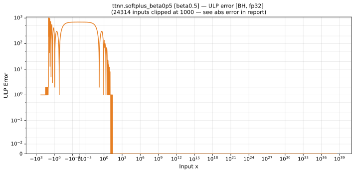
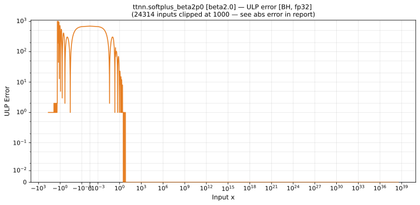

# Blackhole (BH) — float32
_This page is auto-generated by `scripts/generate_reports.py`. Do not edit manually._

_Generated: 2026-06-25 19:04 UTC_

[← Blackhole (BH)](../README.md) | [Top](../../../README.md)

## Operations Summary

| Op | Parameters | Max ULP | Mean ULP | Max abs error |
|----|------------|---------|----------|---------------|
| [abs](abs.md) | `default` | 0 | 0 | 0 |
| [acos](acos.md) | `default` | 1.27e+03 ⚠ | 0.209 | 3.58e-06 |
| [asin](asin.md) | `default` | 56 | 0.159 | 3.34e-06 |
| [atan](atan.md) | `default` | 3 | 0.0874 | 2.38e-07 |
| [cbrt](cbrt.md) | `default` | 3 | 1.36 | 1.05e+06 |
| [ceil](ceil.md) | `default` | 0 | 0 | 0 |
| [celu](celu.md) | `alpha=0.5` | 1 | 0.0264 | 2.98e-08 |
|  | `alpha=1.0` | 1 | 0.0264 | 5.96e-08 |
|  | `alpha=2.0` | 1.68e+07 ⚠ | 2.48e+04 | 1.19e-07 |
| [cos](cos.md) | `default` | 2 | 0.119 | 1.19e-07 |
| [cosh](cosh.md) | `default` | 1 | 0.0852 | 2.03e+31 |
| [digamma](digamma.md) | `default` | 4.8e+06 ⚠ | 2.23e+04 | 1.76e+05 |
| [elu](elu.md) | `alpha=0.5` | 1 | 0.0264 | 2.98e-08 |
|  | `alpha=1.0` | 1 | 0.0264 | 5.96e-08 |
|  | `alpha=2.0` | 1 | 0.0264 | 1.19e-07 |
| [erf](erf.md) | `default` | 7 | 0.566 | 4.77e-07 |
| [erfinv](erfinv.md) | `default` | 1.68e+07 ⚠ | 1.11e+07 | 0.00521 |
| [exp](exp.md) | `default` | 1 | 0.062 | 1.01e+31 |
|  | `fast_approx` | 8.63e+06 ⚠ | 1.34e+05 | 3.77e+36 |
| [exp2](exp2.md) | `default` | 1 | 0.0743 | 2.03e+31 |
| [expm1](expm1.md) | `default` | 1 | 0.0541 | 2.03e+31 |
| [floor](floor.md) | `default` | 0 | 0 | 0 |
| [gelu](gelu.md) | `default` | 1.71e+08 ⚠ | 2.42e+04 | 3.81e-06 |
|  | `fast_approx` | 2.91e+38 ⚠ | 2.38e+36 | 0.0234 |
| [hardmish](hardmish.md) | `default` | 1 | 0.0233 | 2.98e-08 |
| [hardtanh](hardtanh.md) | `min=-1,max=1` | 0 | 0 | 0 |
|  | `min=-2,max=2` | 0 | 0 | 0 |
| [identity](identity.md) | `default` | 0 | 0 | 0 |
| [lgamma](lgamma.md) | `default` | 1.16e+06 ⚠ | 3.33e+03 | 4.06e+31 |
| [log](log.md) | `default` | 1 | 0.992 | 7.63e-06 |
| [log10](log10.md) | `default` | 2 | 1.13 | 3.81e-06 |
| [log1p](log1p.md) | `default` | 1 | 0.363 | 7.63e-06 |
| [log2](log2.md) | `default` | 2 | 1 | 7.63e-06 |
| [log_sigmoid](log_sigmoid.md) | `default` | 8.63e+06 ⚠ | 8.51e+03 | 0.0181 |
| [logit](logit.md) | `default` | 4.19e+06 ⚠ | 4.8 | 9.54e-07 |
| [mish](mish.md) | `default` | 1.68e+07 ⚠ | 1.66e+03 | 1.91e-06 |
| [reciprocal](reciprocal.md) | `default` | 9.02e+04 ⚠ | 728 | 5.07e+30 |
| [relu](relu.md) | `default` | 0 | 0 | 0 |
| [relu_max](relu_max.md) | `upper_limit=0.5` | 0 | 0 | 0 |
|  | `upper_limit=1.0` | 0 | 0 | 0 |
|  | `upper_limit=2.0` | 0 | 0 | 0 |
| [relu_min](relu_min.md) | `lower_limit=0.5` | 0 | 0 | 0 |
|  | `lower_limit=1.0` | 0 | 0 | 0 |
|  | `lower_limit=2.0` | 0 | 0 | 0 |
| [round](round.md) | `default` | 0 | 0 | 0 |
| [rsqrt](rsqrt.md) | `default` | 1 | 0.998 | 5.5e+11 |
| [selu](selu.md) | `default` | 51 | 26.1 | 3.45e+32 |
| [sigmoid](sigmoid.md) | `default` | 3 | 0.0973 | 1.19e-07 |
| [silu](silu.md) | `default` | 4 | 0.148 | 1.91e-06 |
| [sin](sin.md) | `default` | 2 | 0.0809 | 1.19e-07 |
| [sinh](sinh.md) | `default` | 2 | 0.147 | 2.03e+31 |
| [softplus](softplus.md) | `beta=0.5` | 8.2e+03 ⚠ | 446 | 8.33e-05 |
|  | `beta=1.0` | 8.2e+03 ⚠ | 443 | 4.17e-05 |
|  | `beta=2.0` | 8.2e+03 ⚠ | 441 | 2.08e-05 |
| [softsign](softsign.md) | `default` | 3 | 0.578 | 1.79e-07 |
| [sqrt](sqrt.md) | `default` | 1 | 0.997 | 1.1e+12 |
| [tan](tan.md) | `default` | 2 | 0.0256 | 7.63e-06 |
| [tanh](tanh.md) | `default` | 5 | 0.515 | 2.98e-07 |
| [tanhshrink](tanhshrink.md) | `default` | 1.18e+21 ⚠ | 1.72e+18 | 4.77e-07 |

---

## Charts Preview

### [abs](abs.md)

### [acos](acos.md)

### [asin](asin.md)

### [atan](atan.md)

### [cbrt](cbrt.md)

### [ceil](ceil.md)

### [celu](celu.md)

### [cos](cos.md)

### [cosh](cosh.md)

### [digamma](digamma.md)

### [elu](elu.md)

### [erf](erf.md)

### [erfinv](erfinv.md)

### [exp](exp.md)

### [exp2](exp2.md)

### [expm1](expm1.md)

### [floor](floor.md)

### [gelu](gelu.md)

### [hardmish](hardmish.md)

### [hardtanh](hardtanh.md)

### [identity](identity.md)

### [lgamma](lgamma.md)

### [log](log.md)

### [log10](log10.md)

### [log1p](log1p.md)

### [log2](log2.md)

### [log_sigmoid](log_sigmoid.md)

### [logit](logit.md)

### [mish](mish.md)

### [reciprocal](reciprocal.md)

### [relu](relu.md)

### [relu_max](relu_max.md)

### [relu_min](relu_min.md)

### [round](round.md)

### [rsqrt](rsqrt.md)

### [selu](selu.md)

### [sigmoid](sigmoid.md)

### [silu](silu.md)

### [sin](sin.md)

### [sinh](sinh.md)

### [softplus](softplus.md)

### [softsign](softsign.md)

### [sqrt](sqrt.md)

### [tan](tan.md)

### [tanh](tanh.md)

### [tanhshrink](tanhshrink.md)

