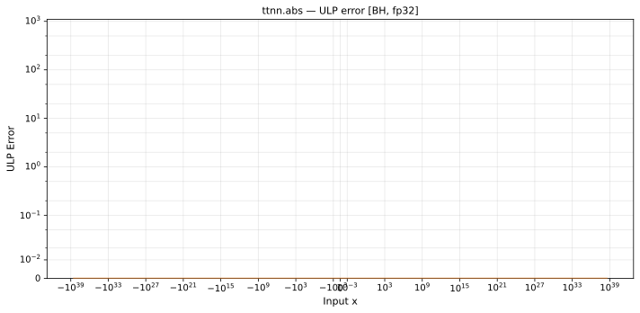

# abs — Blackhole (BH), float32
_This page is auto-generated by `scripts/generate_reports.py`. Do not edit manually._

_Generated: 2026-04-30 07:30 UTC_

**Architecture:** Blackhole (BH)  
**Data type:** float32  

---

[← Blackhole (BH) float32 ops](README.md) | [All archs for abs](../../../by_op/abs/README.md) | [Top](../../../README.md)

**Measured input range:** all normal values  

| Parameters | Max ULP | Mean ULP | Max abs error |
|------------|---------|----------|---------------|
| `default` | 0 | 0 | 0 |

