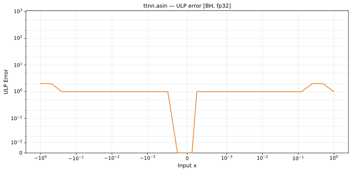

# asin — Blackhole (BH), float32
_This page is auto-generated by `ttnn-accuracy report`. Do not edit manually._

**Architecture:** Blackhole (BH)  
**Data type:** float32  

---

[← Blackhole (BH) float32 ops](README.md) | [All archs for asin](../../../by_op/asin/README.md) | [Top](../../../README.md)

**Measured input range:** x ∈ [-1, 1]  

|  | `default` |
|---|---|
| Max ULP | 1.77 |
| Min ULP | 0 |
| Mean ULP | 0.795 |
| Signed bias (ULP) | 0 |
| p50 ULP | 0 |
| p95 ULP | 0.51 |
| p99 ULP | 1.09 |
| Exact fraction | 0.934 |
| Correctly rounded | 0.985 |
| Accurate to \|x\| | 1 |
| Max abs error | 1.69e-07 |
| Max rel error | 1.65e-07 |
| Median rel error | 5.77e-08 |
| Bits of precision (worst) | 22.5 |
| Bits of precision (median) | 24 |

**default** — within 2 ULP everywhere  

**Outcomes**

| Parameters | exact | faithful | inexact |
|---|---|---|---|
| `default` | 30,134 | 1,700 | 424 |

**Worst points**

| Parameters | x | golden | device | ULP |
|---|---|---|---|---|
| `default` | 0.8376915 | 0.99304247 | 0.9930426 | 1.77 |
| `default` | -0.8376915 | -0.99304247 | -0.9930426 | 1.77 |
| `default` | 0.6822397 | 0.75082165 | 0.75082153 | 1.75 |
| `default` | -0.6822397 | -0.75082165 | -0.75082153 | 1.75 |
| `default` | 0.82800627 | 0.9755426 | 0.9755427 | 1.74 |
| `default` | -0.82800627 | -0.9755426 | -0.9755427 | 1.74 |
| `default` | 0.833969 | 0.9862617 | 0.98626184 | 1.74 |
| `default` | -0.833969 | -0.9862617 | -0.98626184 | 1.74 |
| `default` | 0.8312884 | 0.9814216 | 0.9814217 | 1.74 |
| `default` | -0.8312884 | -0.9814216 | -0.9814217 | 1.74 |

**Monotonicity**

_Checked only where the reference is itself ordered, and never across a discontinuity._

| Parameters | Pairs | Violations | Rate | Worst \|Δy\| |
|---|---|---|---|---|
| `default` | 32,256 | 0 | 0 | 0 |

### Special values

| Variant | x | device | golden |  |
|---|---|---|---|---|
| `default` | 0 | 0 | 0 | agree |
| `default` | -0 | -0 | -0 | agree |
| `default` | inf | nan | nan | agree |
| `default` | -inf | nan | nan | agree |
| `default` | nan | nan | nan | agree |
| `default` | 1.1754944e-38 | 1.1754944e-38 | 1.1754944e-38 | agree |
| `default` | -1.1754944e-38 | -1.1754944e-38 | -1.1754944e-38 | agree |

_Measured on BLACKHOLE · tt-metal `a3a9fb4229a` · ttnn `0.78.0` · run `20260918T102923`_

