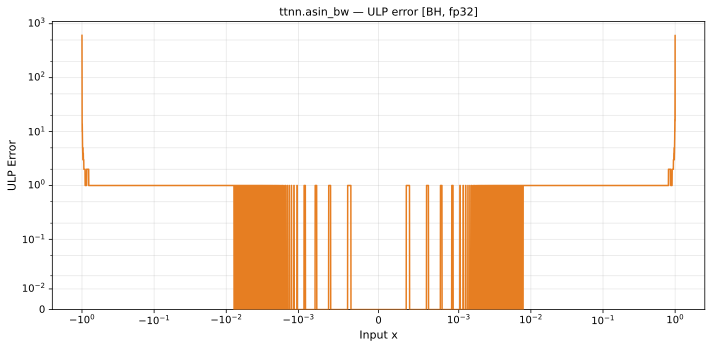

# asin_bw — Blackhole (BH), float32
_This page is auto-generated by `ttnn-accuracy report`. Do not edit manually._

**Architecture:** Blackhole (BH)  
**Data type:** float32  

---

[← Blackhole (BH) float32 ops](README.md) | [All archs for asin_bw](../../../by_op/asin_bw/README.md) | [Top](../../../README.md)

**Measured input range:** x ∈ [-1, 1]  

| Parameters | Max ULP | Mean ULP | Accurate to \|x\| | Max abs error |
|---|---|---|---|---------------|
| `default` | 609 | 1.61 | 0.938 | 0.00232 |

**default** — accurate to |x| <= 0.938; up to 609 ULP beyond  

**Outcomes**

| Parameters | exact | inexact |
|------------|------|------|
| `default` | 29,938 | 2,318 |

### Special values

| Variant | x | device | golden | |
|---|---|---|---|---|
| `default` | 0 | 1 | 1 | agree |
| `default` | -0 | 1 | 1 | agree |
| `default` | inf | nan | nan | agree |
| `default` | -inf | nan | nan | agree |
| `default` | nan | nan | nan | agree |
| `default` | 1.175e-38 | 1 | 1 | agree |
| `default` | -1.175e-38 | 1 | 1 | agree |

_Measured on BLACKHOLE · tt-metal `72023534b03` · ttnn `0.75.0rc10.dev916+ga5cd86212e1` · run `20260903T103548`_

