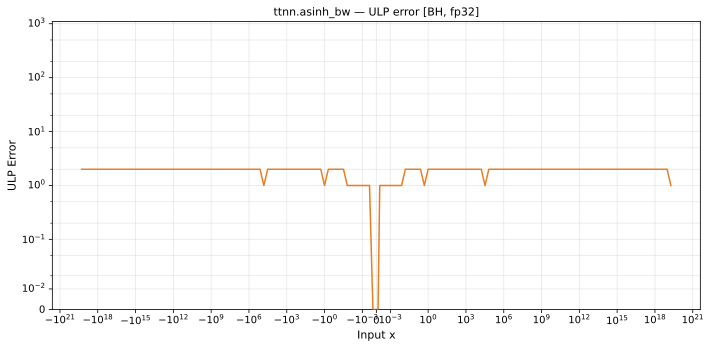

# asinh_bw — Blackhole (BH), float32
_This page is auto-generated by `ttnn-accuracy report`. Do not edit manually._

**Architecture:** Blackhole (BH)  
**Data type:** float32  

---

[← Blackhole (BH) float32 ops](README.md) | [All archs for asinh_bw](../../../by_op/asinh_bw/README.md) | [Top](../../../README.md)

**Measured input range:** x ∈ [-8.507e+37, 8.507e+37]  

|  | `default` |
|---|---|
| Max ULP | 1.98 |
| Min ULP | 0 |
| Mean ULP | 1.06 |
| Signed bias (ULP) | 0.0029 |
| p50 ULP | 0 |
| p95 ULP | 1.38 |
| p99 ULP | 1.5 |
| Exact fraction | 0.616 |
| Correctly rounded | 0.927 |
| Accurate to \|x\| | 1.84e+19 |
| Max abs error | 9.48e-08 |
| Max rel error | 1.2e-07 |
| Median rel error | 8.93e-08 |
| Bits of precision (worst) | 23 |
| Bits of precision (median) | 23.4 |

**default** — 15874 of 64514 points returned inf or zero where a value exists; the rest reach 1.98 ULP  

**Outcomes**

| Parameters | exact | faithful | inexact | zeroed |
|---|---|---|---|---|
| `default` | 29,956 | 8,676 | 10,008 | 15,874 |

**Worst points**

| Parameters | x | golden | device | ULP |
|---|---|---|---|---|
| `default` | 4114.026 | 0.0002430709 | 0.00024307093 | 1.98 |
| `default` | -4114.026 | 0.0002430709 | 0.00024307093 | 1.98 |
| `default` | 4189.4297 | 0.00023869597 | 0.00023869594 | 1.97 |
| `default` | -4189.4297 | 0.00023869597 | 0.00023869594 | 1.97 |
| `default` | 4150.708 | 0.00024092275 | 0.00024092277 | 1.96 |
| `default` | -4150.708 | 0.00024092275 | 0.00024092277 | 1.96 |
| `default` | 4208.3076 | 0.00023762521 | 0.00023762518 | 1.94 |
| `default` | -4208.3076 | 0.00023762521 | 0.00023762518 | 1.94 |
| `default` | 4285.127 | 0.00023336531 | 0.00023336528 | 1.88 |
| `default` | -4285.127 | 0.00023336531 | 0.00023336528 | 1.88 |

**Monotonicity**

_Checked only where the reference is itself ordered, and never across a discontinuity._

| Parameters | Pairs | Violations | Rate | Worst \|Δy\| |
|---|---|---|---|---|
| `default` | 48,638 | 0 | 0 | 0 |

### Special values

| Variant | x | device | golden |  |
|---|---|---|---|---|
| `default` | 0 | 1 | 1 | agree |
| `default` | -0 | 1 | 1 | agree |
| `default` | inf | 0 | 0 | agree |
| `default` | -inf | 0 | 0 | agree |
| `default` | nan | nan | nan | agree |
| `default` | 1.1754944e-38 | 1 | 1 | agree |
| `default` | -1.1754944e-38 | 1 | 1 | agree |

_Measured on BLACKHOLE · tt-metal `a3a9fb4229a` · ttnn `0.78.0` · run `20260929T111553`_

