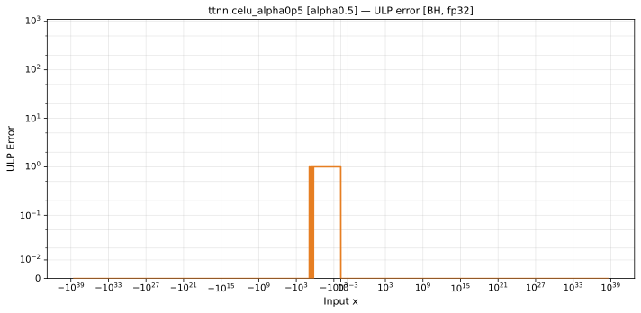
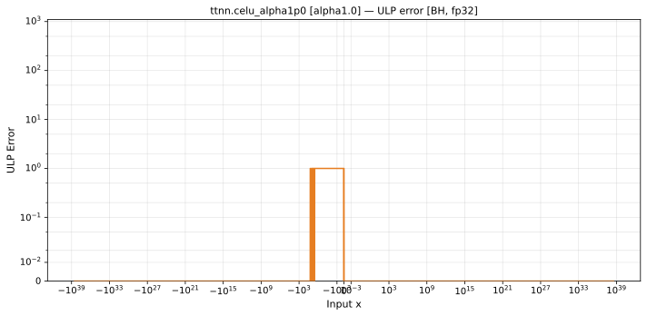
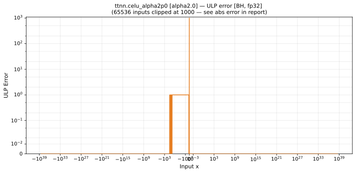

# celu — Blackhole (BH), float32
_This page is auto-generated by `ttnn-accuracy report`. Do not edit manually._

_Generated: 2026-08-26 07:39_

**Architecture:** Blackhole (BH)  
**Data type:** float32  

---

[← Blackhole (BH) float32 ops](README.md) | [All archs for celu](../../../by_op/celu/README.md) | [Top](../../../README.md)

**Measured input range:** all normal values  

| Parameters | Max ULP | Mean ULP | Max abs error |
|------------|---------|----------|---------------|
| `alpha=0.5` | 1 | 0.0264 | 2.98e-08 |
| `alpha=1.0` | 1 | 0.0264 | 5.96e-08 |
| `alpha=2.0` | 1.68e+07 ⚠ | 2.48e+04 | 1.19e-07 |

> **Note (`alpha=2.0`):** ULP is not a useful metric near x ≈ 0 because the output itself is near zero. In x ∈ [-2.35e-38, -1.18e-38] (65536 inputs): max absolute error = **2.35e-38**.

### `alpha=0.5`

### `alpha=1.0`

### `alpha=2.0`

