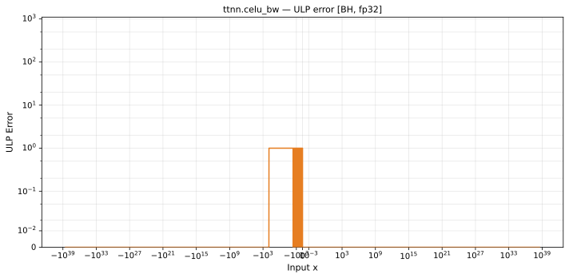

# celu_bw — Blackhole (BH), float32
_This page is auto-generated by `ttnn-accuracy report`. Do not edit manually._

**Architecture:** Blackhole (BH)  
**Data type:** float32  

---

[← Blackhole (BH) float32 ops](README.md) | [All archs for celu_bw](../../../by_op/celu_bw/README.md) | [Top](../../../README.md)

**Measured input range:** x ∈ [-3.403e+38, 3.403e+38]  

|  | `default` |
|---|---|
| Max ULP | 0.866 |
| Min ULP | 0 |
| Mean ULP | 0.578 |
| Signed bias (ULP) | 0.0498 |
| p50 ULP | 0 |
| p95 ULP | 0.5 |
| p99 ULP | 0.655 |
| Exact fraction | 0.958 |
| Correctly rounded | 0.999 |
| Accurate to \|x\| | 3.39e+38 |
| Max abs error | 4.31e-08 |
| Max rel error | 7.6e-08 |
| Median rel error | 3.29e-08 |
| Bits of precision (worst) | 23.6 |
| Bits of precision (median) | 24.9 |

**default** — faithful; 2706/65024 tie-breaks  

**Outcomes**

| Parameters | exact | faithful | flushed |
|---|---|---|---|
| `default` | 61,923 | 2,706 | 395 |

**Worst points**

| Parameters | x | golden | device | ULP |
|---|---|---|---|---|
| `default` | -5.878474 | 0.0027990527 | 0.0027990525 | 0.866 |
| `default` | -5.871701 | 0.0028180764 | 0.0028180762 | 0.864 |
| `default` | -16.959711 | 4.310137e-08 | 4.3101366e-08 | 0.862 |
| `default` | -71.03538 | 1.4116516e-31 | 1.4116515e-31 | 0.861 |
| `default` | -5.1991982 | 0.005520989 | 0.0055209887 | 0.86 |
| `default` | -37.77702 | 3.9232763e-17 | 3.923276e-17 | 0.859 |
| `default` | -15.609532 | 1.6629004e-07 | 1.6629005e-07 | 0.856 |
| `default` | -27.285587 | 1.4126026e-12 | 1.4126027e-12 | 0.855 |
| `default` | -82.113884 | 2.1796829e-36 | 2.1796827e-36 | 0.854 |
| `default` | -38.461544 | 1.9786258e-17 | 1.9786256e-17 | 0.854 |

**Monotonicity**

_Checked only where the reference is itself ordered, and never across a discontinuity._

| Parameters | Pairs | Violations | Rate | Worst \|Δy\| |
|---|---|---|---|---|
| `default` | 64,626 | 0 | 0 | 0 |

### Special values

| Variant | x | device | golden |  |
|---|---|---|---|---|
| `default` | 0 | 1 | 1 | agree |
| `default` | -0 | 1 | 1 | agree |
| `default` | inf | 1 | 1 | agree |
| `default` | -inf | 0 | 0 | agree |
| `default` | nan | nan | nan | agree |
| `default` | 1.1754944e-38 | 1 | 1 | agree |
| `default` | -1.1754944e-38 | 1 | 1 | agree |

_Measured on BLACKHOLE · tt-metal `de546d3b146` · ttnn `0.79.0` · run `20261003T030219`_

