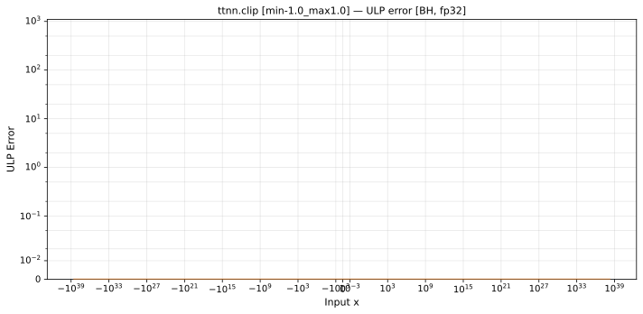
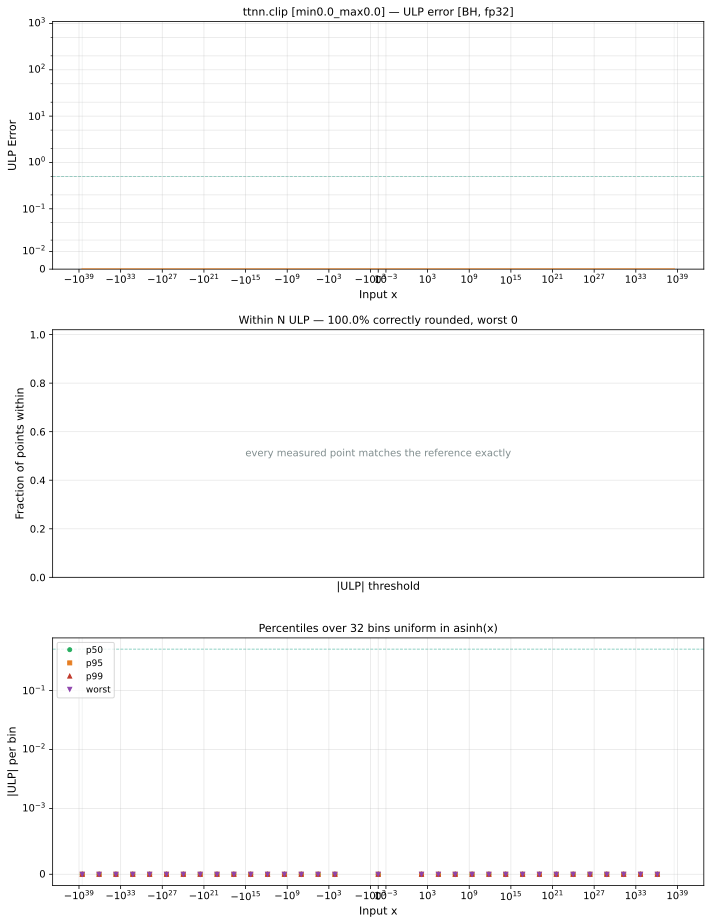

# clip — Blackhole (BH), float32
_This page is auto-generated by `ttnn-accuracy report`. Do not edit manually._

**Architecture:** Blackhole (BH)  
**Data type:** float32  

---

[← Blackhole (BH) float32 ops](README.md) | [All archs for clip](../../../by_op/clip/README.md) | [Top](../../../README.md)

**Measured input range:** x ∈ [-3.403e+38, 3.403e+38]  

|  | `min=-1.0,max=1.0` | `min=0.0,max=0.0` | `min=1.0,max=-1.0` |
|---|---|---|---|
| Max ULP | 0 | 0 | 0 |
| Min ULP | 0 | 0 | 0 |
| Mean ULP | 0 | 0 | 0 |
| Signed bias (ULP) | 0 | 0 | 0 |
| p50 ULP | 0 | 0 | 0 |
| p95 ULP | 0 | 0 | 0 |
| p99 ULP | 0 | 0 | 0 |
| Exact fraction | 1 | 1 | 1 |
| Correctly rounded | 1 | 1 | 1 |
| Accurate to \|x\| | 3.39e+38 | 3.39e+38 | 3.39e+38 |
| Max abs error | 0 | 0 | 0 |
| Max rel error | 0 | — | 0 |
| Median rel error | 0 | — | 0 |
| Bits of precision (worst) | — | — | — |
| Bits of precision (median) | — | — | — |

**min=-1.0,max=1.0** — bit-exact · _the symmetric unit interval_  
**min=0.0,max=0.0** — bit-exact · _collapsed interval — every output is 0_  
**min=1.0,max=-1.0** — bit-exact · _empty interval, min above max_  

**Outcomes**

| Parameters | exact |
|---|---|
| `min=-1.0,max=1.0` | 65,024 |
| `min=0.0,max=0.0` | 65,024 |
| `min=1.0,max=-1.0` | 65,024 |

**Monotonicity**

_Checked only where the reference is itself ordered, and never across a discontinuity._

| Parameters | Pairs | Violations | Rate | Worst \|Δy\| |
|---|---|---|---|---|
| `min=-1.0,max=1.0` | 65,022 | 0 | 0 | 0 |
| `min=0.0,max=0.0` | 65,022 | 0 | 0 | 0 |
| `min=1.0,max=-1.0` | 65,022 | 0 | 0 | 0 |

### Special values

| Variant | x | device | golden |  |
|---|---|---|---|---|
| `min=-1.0,max=1.0` | 0 | 0 | 0 | agree |
| `min=-1.0,max=1.0` | -0 | -0 | -0 | agree |
| `min=-1.0,max=1.0` | inf | 1 | 1 | agree |
| `min=-1.0,max=1.0` | -inf | -1 | -1 | agree |
| `min=-1.0,max=1.0` | nan | 1 | nan | **differ** |
| `min=-1.0,max=1.0` | 1.1754944e-38 | 1.1754944e-38 | 1.1754944e-38 | agree |
| `min=-1.0,max=1.0` | -1.1754944e-38 | -1.1754944e-38 | -1.1754944e-38 | agree |
| `min=0.0,max=0.0` | 0 | 0 | 0 | agree |
| `min=0.0,max=0.0` | -0 | 0 | -0 | **differ** |
| `min=0.0,max=0.0` | inf | 0 | 0 | agree |
| `min=0.0,max=0.0` | -inf | 0 | 0 | agree |
| `min=0.0,max=0.0` | nan | 0 | nan | **differ** |
| `min=0.0,max=0.0` | 1.1754944e-38 | 0 | 0 | agree |
| `min=0.0,max=0.0` | -1.1754944e-38 | 0 | 0 | agree |
| `min=1.0,max=-1.0` | 0 | -1 | -1 | agree |
| `min=1.0,max=-1.0` | -0 | -1 | -1 | agree |
| `min=1.0,max=-1.0` | inf | -1 | -1 | agree |
| `min=1.0,max=-1.0` | -inf | -1 | -1 | agree |
| `min=1.0,max=-1.0` | nan | -1 | nan | **differ** |
| `min=1.0,max=-1.0` | 1.1754944e-38 | -1 | -1 | agree |
| `min=1.0,max=-1.0` | -1.1754944e-38 | -1 | -1 | agree |

_Measured on BLACKHOLE · tt-metal `de546d3b146` · ttnn `0.79.0` · run `20261010T030214`_

### `min=-1.0,max=1.0`

### `min=0.0,max=0.0`

### `min=1.0,max=-1.0`

