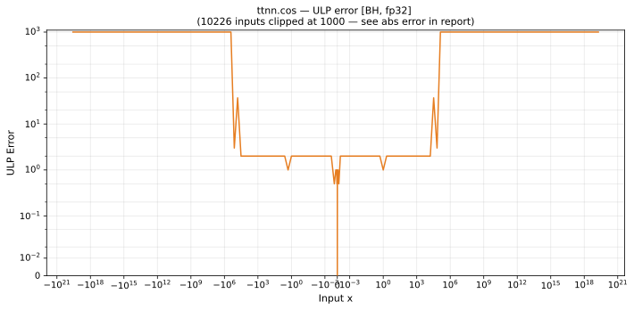

# cos — Blackhole (BH), float32
_This page is auto-generated by `ttnn-accuracy report`. Do not edit manually._

**Architecture:** Blackhole (BH)  
**Data type:** float32  

---

[← Blackhole (BH) float32 ops](README.md) | [All archs for cos](../../../by_op/cos/README.md) | [Top](../../../README.md)

**Measured input range:** x ∈ [-1e+06, 1e+06]  

|  | `default` |
|---|---|
| Max ULP | 3.3e+12 ⚠ |
| Min ULP | 0 |
| Mean ULP | 3.33e+09 |
| Signed bias (ULP) | 6.72e+08 |
| p50 ULP | 0 |
| p95 ULP | 2 |
| p99 ULP | 8.59e+09 |
| Exact fraction | 0.764 |
| Correctly rounded | 0.919 |
| Accurate to \|x\| | 92.4 |
| Max abs error | 0.0234 |
| Max rel error | 2.27e+05 |
| Median rel error | 9.15e-08 |
| Bits of precision (worst) | -17.8 |
| Bits of precision (median) | 23.4 |

**default** — accurate to |x| <= 92.4; up to 3.3e+12 ULP beyond · _the kernel's argument reduction holds to about 1e6_  

**Outcomes**

| Parameters | exact | faithful | inexact |
|---|---|---|---|
| `default` | 28,542 | 1,836 | 6,976 |

**Worst points**

| Parameters | x | golden | device | ULP |
|---|---|---|---|---|
| `default` | 801176.8 | 1.03046155e-07 | 0.023434505 | 3.3e+12 |
| `default` | -801176.8 | 1.03046155e-07 | 0.023434505 | 3.3e+12 |
| `default` | 267058.94 | -3.434872e-08 | -0.007812455 | 2.2e+12 |
| `default` | -267058.94 | -3.434872e-08 | -0.007812455 | 2.2e+12 |
| `default` | 153072.53 | -1.6411936e-07 | -0.007812585 | 5.5e+11 |
| `default` | -153072.53 | -1.6411936e-07 | -0.007812585 | 5.5e+11 |
| `default` | 381045.34 | 2.3281679e-07 | -0.0078121875 | 5.5e+11 |
| `default` | -381045.34 | 2.3281679e-07 | -0.0078121875 | 5.5e+11 |
| `default` | 879349.06 | 6.221287e-07 | 0.023433117 | 4.12e+11 |
| `default` | -879349.06 | 6.221287e-07 | 0.023433117 | 4.12e+11 |

### Special values

| Variant | x | device | golden |  |
|---|---|---|---|---|
| `default` | 0 | 1 | 1 | agree |
| `default` | -0 | 1 | 1 | agree |
| `default` | inf | nan | nan | agree |
| `default` | -inf | nan | nan | agree |
| `default` | nan | nan | nan | agree |
| `default` | 1.1754944e-38 | 1 | 1 | agree |
| `default` | -1.1754944e-38 | 1 | 1 | agree |

> **Provenance unknown.** These figures predate run tracking. Re-measure to attribute them.

