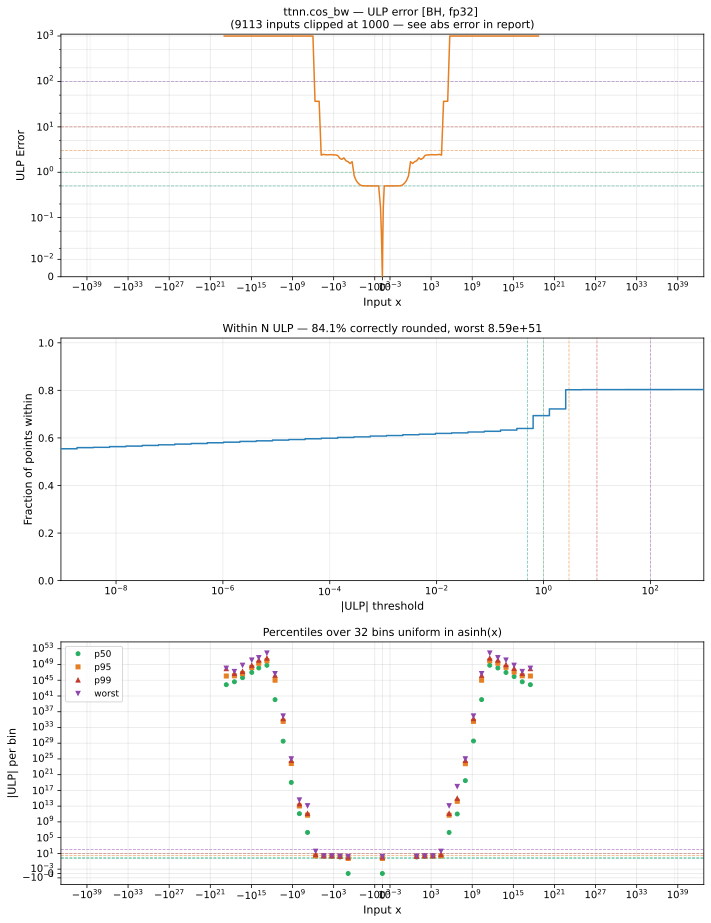

# cos_bw — Blackhole (BH), float32
_This page is auto-generated by `ttnn-accuracy report`. Do not edit manually._

**Architecture:** Blackhole (BH)  
**Data type:** float32  

---

[← Blackhole (BH) float32 ops](README.md) | [All archs for cos_bw](../../../by_op/cos_bw/README.md) | [Top](../../../README.md)

**Measured input range:** x ∈ [-3.403e+38, 3.403e+38]  

|  | `default` |
|---|---|
| Max ULP | 3.32e+38 ⚠ |
| Mean ULP | 1.86e+36 |
| Accurate to \|x\| | 1.04e+05 |
| Max abs error | 3.4e+38 |

**default** — 18190 of 65024 points returned inf or zero where a value exists  

**Outcomes**

| Parameters | exact | inexact | mismatch |
|---|---|---|---|
| `default` | 30,132 | 16,702 | 18,190 |

### Special values

| Variant | x | device | golden |  |
|---|---|---|---|---|
| `default` | 0 | 0 | -0 | **differ** |
| `default` | -0 | 0 | 0 | agree |
| `default` | inf | nan | nan | agree |
| `default` | -inf | nan | nan | agree |
| `default` | nan | nan | nan | agree |
| `default` | 1.175e-38 | -1.175e-38 | -1.175e-38 | agree |
| `default` | -1.175e-38 | 1.175e-38 | 1.175e-38 | agree |

_Measured on BLACKHOLE · tt-metal `fbf7d27db93` · ttnn `0.75.0rc10.dev916+ga5cd86212e1` · run `20260903T150812`_

