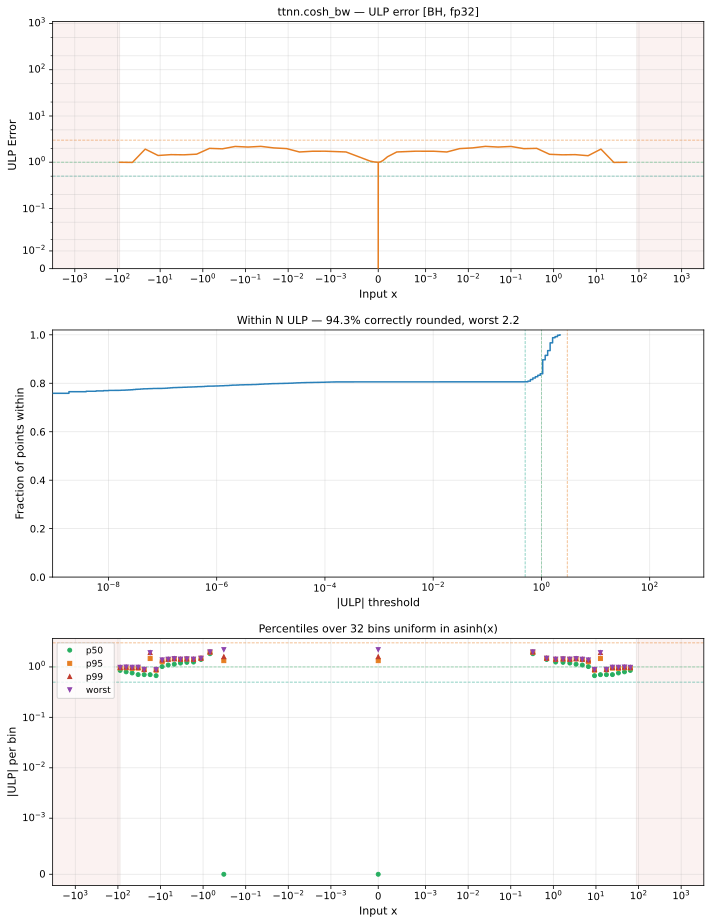

# cosh_bw — Blackhole (BH), float32
_This page is auto-generated by `ttnn-accuracy report`. Do not edit manually._

**Architecture:** Blackhole (BH)  
**Data type:** float32  

---

[← Blackhole (BH) float32 ops](README.md) | [All archs for cosh_bw](../../../by_op/cosh_bw/README.md) | [Top](../../../README.md)

**Measured input range:** x ∈ [-89.3, 89.3]  

|  | `default` |
|---|---|
| Max ULP | 2.2 |
| Min ULP | 0 |
| Mean ULP | 1.16 |
| Signed bias (ULP) | 0 |
| p50 ULP | 0 |
| p95 ULP | 1.37 |
| p99 ULP | 1.65 |
| Exact fraction | 0.806 |
| Correctly rounded | 0.943 |
| Accurate to \|x\| | 0.0155 |
| Max abs error | 8.81e+30 |
| Max rel error | 1.61e-07 |
| Median rel error | 9.7e-08 |
| Bits of precision (worst) | 22.6 |
| Bits of precision (median) | 23.3 |

**default** — 2 of 33894 points returned inf or zero where a value exists  

**Outcomes**

| Parameters | exact | faithful | inexact | mismatch |
|---|---|---|---|---|
| `default` | 27,318 | 1,540 | 5,034 | 2 |

**Worst points**

| Parameters | x | golden | device | ULP |
|---|---|---|---|---|
| `default` | 0.031098226 | 0.031103238 | 0.031103235 | 2.2 |
| `default` | -0.031098226 | -0.031103238 | -0.031103235 | 2.2 |
| `default` | 0.12329421 | 0.12360682 | 0.12360681 | 2.19 |
| `default` | -0.12329421 | -0.12360682 | -0.12360681 | 2.19 |
| `default` | 0.030970529 | 0.03097548 | 0.030975476 | 2.19 |
| `default` | -0.030970529 | -0.03097548 | -0.030975476 | 2.19 |
| `default` | 0.061241806 | 0.061280094 | 0.061280087 | 2.13 |
| `default` | -0.061241806 | -0.061280094 | -0.061280087 | 2.13 |
| `default` | 0.031193905 | 0.031198964 | 0.03119896 | 2.12 |
| `default` | -0.031193905 | -0.031198964 | -0.03119896 | 2.12 |

**Monotonicity**

_Checked only where the reference is itself ordered, and never across a discontinuity._

| Parameters | Pairs | Violations | Rate | Worst \|Δy\| |
|---|---|---|---|---|
| `default` | 33,890 | 0 | 0 | 0 |

**Non-finite outputs**

| Parameters | Points | Both | Device only | Golden only | Device inf | Device nan | Golden inf | Golden nan |
|---|---|---|---|---|---|---|---|---|
| `default` | 2 | 0 | 2 | 0 | 2 | 0 | 0 | 0 |

| Parameters | x | golden | device |
|---|---|---|---|
| `default` | 89 | 2.2448064e+38 | inf |
| `default` | -89 | -2.2448064e+38 | -inf |

### Special values

| Variant | x | device | golden |  |
|---|---|---|---|---|
| `default` | 0 | 0 | 0 | agree |
| `default` | -0 | 0 | -0 | **differ** |
| `default` | inf | inf | inf | agree |
| `default` | -inf | -inf | -inf | agree |
| `default` | nan | nan | nan | agree |
| `default` | 1.1754944e-38 | 1.1754944e-38 | 1.1754944e-38 | agree |
| `default` | -1.1754944e-38 | -1.1754944e-38 | -1.1754944e-38 | agree |

> **Provenance unknown.** These figures predate run tracking. Re-measure to attribute them.

