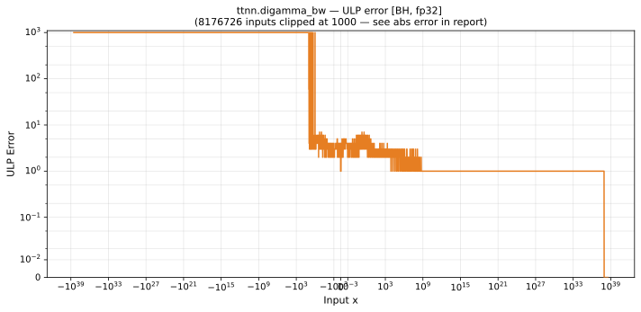

# digamma_bw — Blackhole (BH), float32
_This page is auto-generated by `ttnn-accuracy report`. Do not edit manually._

**Architecture:** Blackhole (BH)  
**Data type:** float32  

---

[← Blackhole (BH) float32 ops](README.md) | [All archs for digamma_bw](../../../by_op/digamma_bw/README.md) | [Top](../../../README.md)

**Measured input range:** x ∈ [-3.403e+38, 8.507e+37]  

|  | `default` |
|---|---|
| Max ULP | 7.91e+33 ⚠ |
| Min ULP | 0.853 |
| Mean ULP | 3.25e+29 |
| Signed bias (ULP) | 5.42e+06 |
| p50 ULP | 3.01 |
| p95 ULP | 1.68e+07 |
| p99 ULP | 1.68e+07 |
| Exact fraction | 0 |
| Correctly rounded | 0.324 |
| Accurate to \|x\| | 5.4e-20 |
| Max abs error | 2.59e+38 |
| Max rel error | 9.43e+26 |
| Median rel error | 2.54e-07 |
| Bits of precision (worst) | -89.6 |
| Bits of precision (median) | 21.9 |

**default** — 257/64769 defects; rest 7.91e+33 ULP  

**Outcomes**

| Parameters | faithful | inexact | overflow | zeroed |
|---|---|---|---|---|
| `default` | 196 | 48,444 | 15,872 | 257 |

**Worst points**

| Parameters | x | golden | device | ULP |
|---|---|---|---|---|
| `default` | -5.999998 | 2.748779e+11 | 2.5926276e+38 | 7.91e+33 |
| `default` | -6.000002 | 2.748779e+11 | -2.5926276e+38 | 7.91e+33 |
| `default` | -6.031298 | 1023.99445 | -808212500 | 1.32e+13 |
| `default` | -5.968702 | 1023.993 | 808213500 | 1.32e+13 |
| `default` | -5.9371104 | 255.99886 | 6086207.5 | 3.99e+11 |
| `default` | -6.06289 | 255.99799 | -6085626 | 3.99e+11 |
| `default` | -6.09375 | 116.974144 | -369621.1 | 4.85e+10 |
| `default` | -5.9062495 | 116.968575 | 369724.44 | 4.84e+10 |
| `default` | -6.128299 | 63.99978 | -40704.766 | 1.07e+10 |
| `default` | -5.871707 | 63.9996 | 40782.48 | 1.07e+10 |

**Monotonicity**

_Checked only where the reference is itself ordered, and never across a discontinuity._

| Parameters | Pairs | Violations | Rate | Worst \|Δy\| |
|---|---|---|---|---|
| `default` | 24,319 | 0 | 0 | 0 |

**Non-finite outputs**

| Parameters | Points | Both | Device only | Golden only | Device inf | Device nan | Golden inf | Golden nan |
|---|---|---|---|---|---|---|---|---|
| `default` | 15,872 | 15,872 | 0 | 0 | 15,872 | 0 | 15,872 | 0 |

| Parameters | x | golden | device |
|---|---|---|---|
| `default` | 1.1754944e-38 | inf | inf |
| `default` | 1.1846779e-38 | inf | inf |
| `default` | 1.1938615e-38 | inf | inf |
| `default` | 1.203045e-38 | inf | inf |
| `default` | 1.2122285e-38 | inf | inf |
| `default` | 1.2214121e-38 | inf | inf |
| `default` | 1.2305956e-38 | inf | inf |
| `default` | 1.2397792e-38 | inf | inf |
| `default` | 1.2489627e-38 | inf | inf |
| `default` | 1.2581463e-38 | inf | inf |

### Special values

| Variant | x | device | golden |  |
|---|---|---|---|---|
| `default` | 0 | inf | inf | agree |
| `default` | -0 | inf | inf | agree |
| `default` | inf | 0 | 0 | agree |
| `default` | -inf | 0 | nan | **differ** |
| `default` | nan | 0 | nan | **differ** |
| `default` | 1.1754944e-38 | inf | inf | agree |
| `default` | -1.1754944e-38 | inf | inf | agree |

_Measured on BLACKHOLE · tt-metal `de546d3b146` · ttnn `0.79.0` · run `20261010T030105`_

