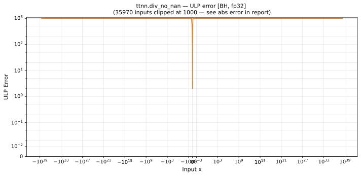

# div_no_nan — Blackhole (BH), float32
_This page is auto-generated by `ttnn-accuracy report`. Do not edit manually._

**Architecture:** Blackhole (BH)  
**Data type:** float32  

---

[← Blackhole (BH) float32 ops](README.md) | [All archs for div_no_nan](../../../by_op/div_no_nan/README.md) | [Top](../../../README.md)

**Measured input range:** all normal values  

|  | `default` |
|---|---|
| Max ULP | 9.24e+04 ⚠ |
| Min ULP | 1.13 |
| Mean ULP | 4.51e+04 |
| Signed bias (ULP) | 11.1 |
| p50 ULP | 7.83e+04 |
| p95 ULP | 8.9e+04 |
| p99 ULP | 9.15e+04 |
| Exact fraction | 0 |
| Correctly rounded | 0.702 |
| Max abs error | 1.36e+25 |
| Max rel error | 0.00551 |
| Median rel error | 0.00489 |
| Bits of precision (worst) | 7.5 |
| Bits of precision (median) | 7.68 |

**default** — worst sampled pairing  

**Outcomes**

| Parameters | inexact |
|---|---|
| `default` | 65,024 |

**Worst points**

| Parameters | x | x2 | golden | device | ULP |
|---|---|---|---|---|---|
| `default` | -8028723 | 1.01776814e+37 | -7.888558e-31 | -7.8451035e-31 | 9.24e+04 |
| `default` | -1.2132564e+30 | 1.01776814e+37 | -1.1920754e-07 | -1.18550886e-07 | 9.24e+04 |
| `default` | 513819940 | 1.01776814e+37 | 5.048497e-29 | 5.0206872e-29 | 9.24e+04 |
| `default` | -3.8822573e+31 | 1.01776814e+37 | -3.814481e-06 | -3.7934687e-06 | 9.24e+04 |
| `default` | 3.2884031e+10 | 1.01776814e+37 | 3.2309944e-27 | 3.2131963e-27 | 9.24e+04 |
| `default` | 5.0883898e+36 | 1.01776814e+37 | 0.49995568 | 0.49720165 | 9.24e+04 |
| `default` | 1.5164345e+29 | 1.01776814e+37 | 1.4899607e-08 | 1.4817532e-08 | 9.24e+04 |
| `default` | 2.630558e+11 | 1.01776814e+37 | 2.5846339e-26 | 2.5703963e-26 | 9.24e+04 |
| `default` | 61.246094 | 1.01776814e+37 | 6.0176863e-36 | 5.9845376e-36 | 9.24e+04 |
| `default` | -2.8244573e+20 | 1.01776814e+37 | -2.7751481e-17 | -2.7598611e-17 | 9.24e+04 |

### Special values

| Variant | x | device | golden |  |
|---|---|---|---|---|
| `default` | 0 | 0 | 0 | agree |
| `default` | -0 | 0 | -0 | **differ** |
| `default` | inf | inf | inf | agree |
| `default` | -inf | -inf | -inf | agree |
| `default` | nan | nan | nan | agree |
| `default` | 1.1754944e-38 | 1.1754944e-38 | 1.1754944e-38 | agree |
| `default` | -1.1754944e-38 | -1.1754944e-38 | -1.1754944e-38 | agree |

> **Sampled, not exhaustive.** For this op both operands take 65,536 of the 2³² fp32 values, drawn once from a fixed seed. The figures above are a lower bound on the error, and comparable between releases, but they are not a bound over the dtype.

> **Provenance unknown.** These figures predate run tracking. Re-measure to attribute them.

