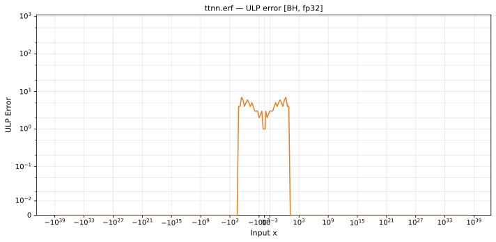

# erf — Blackhole (BH), float32
_This page is auto-generated by `ttnn-accuracy report`. Do not edit manually._

**Architecture:** Blackhole (BH)  
**Data type:** float32  

---

[← Blackhole (BH) float32 ops](README.md) | [All archs for erf](../../../by_op/erf/README.md) | [Top](../../../README.md)

**Measured input range:** x ∈ [-3.403e+38, 3.403e+38]  

|  | `default` |
|---|---|
| Max ULP | 7.38 |
| Min ULP | 0 |
| Mean ULP | 1.36 |
| Signed bias (ULP) | 0 |
| p50 ULP | 0.952 |
| p95 ULP | 1.59 |
| p99 ULP | 4.14 |
| Exact fraction | 0.491 |
| Correctly rounded | 0.672 |
| Accurate to \|x\| | 0.000334 |
| Max abs error | 4.77e-07 |
| Max rel error | 4.77e-07 |
| Median rel error | 9.68e-08 |
| Bits of precision (worst) | 21 |
| Bits of precision (median) | 23.3 |

**default** — accurate to |x| <= 0.000334  

**Outcomes**

| Parameters | exact | faithful | inexact |
|---|---|---|---|
| `default` | 31,936 | 6,030 | 27,058 |

**Worst points**

| Parameters | x | golden | device | ULP |
|---|---|---|---|---|
| `default` | 3.8932433 | 0.99999994 | 0.9999995 | 7.38 |
| `default` | -3.8932433 | -0.99999994 | -0.9999995 | 7.38 |
| `default` | 3.4733598 | 0.9999991 | 0.9999995 | 7.12 |
| `default` | -3.4733598 | -0.9999991 | -0.9999995 | 7.12 |
| `default` | 2.8814106 | 0.999954 | 0.99995357 | 6.77 |
| `default` | -2.8814106 | -0.999954 | -0.99995357 | 6.77 |
| `default` | 3.459194 | 0.999999 | 0.9999994 | 6.74 |
| `default` | -3.459194 | -0.999999 | -0.9999994 | 6.74 |
| `default` | 3.4363508 | 0.9999988 | 0.9999992 | 6.72 |
| `default` | -3.4363508 | -0.9999988 | -0.9999992 | 6.72 |

**Monotonicity**

_Checked only where the reference is itself ordered, and never across a discontinuity._

| Parameters | Pairs | Violations | Rate | Worst \|Δy\| |
|---|---|---|---|---|
| `default` | 65,022 | 86 | 0.00132 | 6.6e-07 |

_Worst violations — the device output moved against the reference's own direction between these neighbouring inputs._

| Parameters | x | device | \|Δy\| |
|---|---|---|---|
| `default` | -3.630869 → -3.6096969 | -0.99999934 → -1 | 6.6e-07 |
| `default` | 3.6096969 → 3.630869 | 1 → 0.99999934 | 6.6e-07 |
| `default` | -3.2892323 → -3.280071 | -0.99999636 → -0.99999684 | 4.8e-07 |
| `default` | 3.280071 → 3.2892323 | 0.99999684 → 0.99999636 | 4.8e-07 |
| `default` | -3.3518806 → -3.3319354 | -0.9999975 → -0.9999979 | 4e-07 |

### Special values

| Variant | x | device | golden |  |
|---|---|---|---|---|
| `default` | 0 | 0 | 0 | agree |
| `default` | -0 | 0 | -0 | **differ** |
| `default` | inf | 1 | 1 | agree |
| `default` | -inf | -1 | -1 | agree |
| `default` | nan | 1 | nan | **differ** |
| `default` | 1.1754944e-38 | 1.3264033e-38 | 1.3264034e-38 | **differ** |
| `default` | -1.1754944e-38 | -1.3264033e-38 | -1.3264034e-38 | **differ** |

_Measured on BLACKHOLE · tt-metal `de546d3b146` · ttnn `0.79.0` · run `20261010T030214`_

