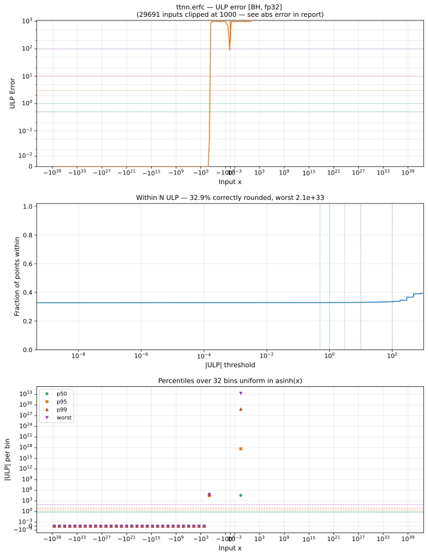

# erfc — Blackhole (BH), float32
_This page is auto-generated by `ttnn-accuracy report`. Do not edit manually._

**Architecture:** Blackhole (BH)  
**Data type:** float32  

---

[← Blackhole (BH) float32 ops](README.md) | [All archs for erfc](../../../by_op/erfc/README.md) | [Top](../../../README.md)

**Measured input range:** x ∈ [-3.403e+38, 3.403e+38]  

|  | `default` |
|---|---|
| Max ULP | 2.1e+33 ⚠ |
| Min ULP | 0 |
| Mean ULP | 1.71e+29 |
| Signed bias (ULP) | -1.71e+29 |
| p50 ULP | 3.26e+04 |
| p95 ULP | 3.26e+04 |
| p99 ULP | 6.51e+04 |
| Exact fraction | 0.329 |
| Correctly rounded | 0.329 |
| Accurate to \|x\| | nowhere |
| Max abs error | 0.00388 |
| Max rel error | 2.2e+26 |
| Median rel error | 0.00388 |
| Bits of precision (worst) | -87.5 |
| Bits of precision (median) | 8.01 |

**default** — 198 of 65024 points returned a value where the reference is zero  

**Outcomes**

| Parameters | exact | faithful | inexact | unflushed |
|---|---|---|---|---|
| `default` | 16,147 | 8 | 48,671 | 198 |

**Worst points**

| Parameters | x | golden | device | ULP |
|---|---|---|---|---|
| `default` | 9.157 | 2.3509793e-38 | 2.941647e-12 | 2.1e+33 |
| `default` | 9.1875 | 1.3391436e-38 | 2.941647e-12 | 2.1e+33 |
| `default` | 9.119297 | 4.7019298e-38 | 2.941647e-12 | 1.05e+33 |
| `default` | 9.043426 | 1.8807613e-37 | 2.941647e-12 | 2.62e+32 |
| `default` | 8.966919 | 7.523123e-37 | 2.941647e-12 | 6.56e+31 |
| `default` | 8.928423 | 1.5046283e-36 | 2.941647e-12 | 3.28e+31 |
| `default` | 8.850935 | 6.0185207e-36 | 2.941647e-12 | 8.2e+30 |
| `default` | 8.811939 | 1.2036926e-35 | 2.941647e-12 | 4.1e+30 |
| `default` | 8.733431 | 4.8147738e-35 | 2.941647e-12 | 1.03e+30 |
| `default` | 8.65422 | 1.9259046e-34 | 2.941647e-12 | 2.56e+29 |

**Monotonicity**

_Checked only where the reference is itself ordered, and never across a discontinuity._

| Parameters | Pairs | Violations | Rate | Worst \|Δy\| |
|---|---|---|---|---|
| `default` | 64,823 | 10 | 0.000154 | 0.00752 |

_Worst violations — the device output moved against the reference's own direction between these neighbouring inputs._

| Parameters | x | device | \|Δy\| |
|---|---|---|---|
| `default` | 0.01958379 → 0.01965335 | 0.974089 → 0.98160726 | 0.00752 |
| `default` | -0.019653441 → -0.019583654 | 1.0183928 → 1.0259109 | 0.00752 |
| `default` | 0.065279566 → 0.06542971 | 0.9227227 → 0.92968494 | 0.00696 |
| `default` | -0.06542981 → -0.065279424 | 1.0703151 → 1.0772772 | 0.00696 |
| `default` | 0.12862806 → 0.12890625 | 0.85203403 → 0.8582552 | 0.00622 |

### Special values

| Variant | x | device | golden |  |
|---|---|---|---|---|
| `default` | 0 | 0.996117 | 1 | **differ** |
| `default` | -0 | 1.003883 | 1 | **differ** |
| `default` | inf | 2.941647e-12 | 0 | **differ** |
| `default` | -inf | 2 | 2 | agree |
| `default` | nan | 2.941647e-12 | nan | **differ** |
| `default` | 1.1754944e-38 | 0.996117 | 1 | **differ** |
| `default` | -1.1754944e-38 | 1.003883 | 1 | **differ** |

> **Provenance unknown.** These figures predate run tracking. Re-measure to attribute them.

