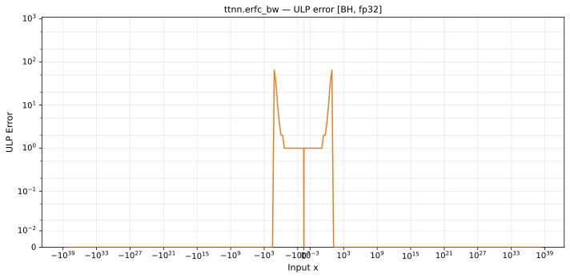

# erfc_bw — Blackhole (BH), float32
_This page is auto-generated by `ttnn-accuracy report`. Do not edit manually._

**Architecture:** Blackhole (BH)  
**Data type:** float32  

---

[← Blackhole (BH) float32 ops](README.md) | [All archs for erfc_bw](../../../by_op/erfc_bw/README.md) | [Top](../../../README.md)

**Measured input range:** x ∈ [-3.403e+38, 3.403e+38]  

|  | `default` |
|---|---|
| Max ULP | 65.5 |
| Min ULP | 0 |
| Mean ULP | 3.73 |
| Signed bias (ULP) | 3.73 |
| p50 ULP | 0.492 |
| p95 ULP | 0.82 |
| p99 ULP | 2.92 |
| Exact fraction | 0.936 |
| Correctly rounded | 0.956 |
| Accurate to \|x\| | 0.348 |
| Max abs error | 1.53e-07 |
| Max rel error | 3.93e-06 |
| Median rel error | 1.34e-07 |
| Bits of precision (worst) | 18 |
| Bits of precision (median) | 22.8 |

**default** — accurate to |x| <= 0.348; up to 65.5 ULP beyond  

**Outcomes**

| Parameters | exact | faithful | flushed | inexact |
|---|---|---|---|---|
| `default` | 60,466 | 1,132 | 392 | 3,034 |

**Worst points**

| Parameters | x | golden | device | ULP |
|---|---|---|---|---|
| `default` | 8.538223 | -2.4651402e-32 | -2.4651498e-32 | 65.5 |
| `default` | -8.538223 | -2.4651402e-32 | -2.4651498e-32 | 65.5 |
| `default` | 8.619141 | -6.1503268e-33 | -6.1503506e-33 | 65.3 |
| `default` | -8.619141 | -6.1503268e-33 | -6.1503506e-33 | 65.3 |
| `default` | 8.079935 | -5.0048085e-29 | -5.004828e-29 | 65.3 |
| `default` | -8.079935 | -5.0048085e-29 | -5.004828e-29 | 65.3 |
| `default` | 8.857422 | -9.557615e-35 | -9.5576524e-35 | 65.2 |
| `default` | -8.857422 | -9.557615e-35 | -9.5576524e-35 | 65.2 |
| `default` | 8.24932 | -3.1489028e-30 | -3.148915e-30 | 65.1 |
| `default` | -8.24932 | -3.1489028e-30 | -3.148915e-30 | 65.1 |

**Monotonicity**

_Checked only where the reference is itself ordered, and never across a discontinuity._

| Parameters | Pairs | Violations | Rate | Worst \|Δy\| |
|---|---|---|---|---|
| `default` | 64,628 | 0 | 0 | 0 |

### Special values

| Variant | x | device | golden |  |
|---|---|---|---|---|
| `default` | 0 | -1.1283792 | -1.1283792 | agree |
| `default` | -0 | -1.1283792 | -1.1283792 | agree |
| `default` | inf | 0 | -0 | **differ** |
| `default` | -inf | 0 | -0 | **differ** |
| `default` | nan | nan | nan | agree |
| `default` | 1.1754944e-38 | -1.1283792 | -1.1283792 | agree |
| `default` | -1.1754944e-38 | -1.1283792 | -1.1283792 | agree |

_Measured on BLACKHOLE · tt-metal `a3a9fb4229a` · ttnn `0.78.0` · run `20260929T111553`_

