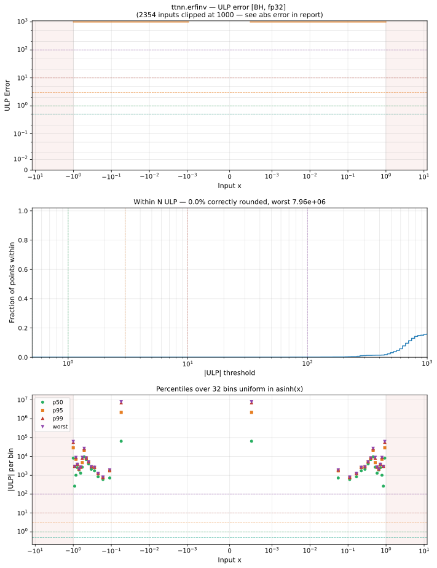

# erfinv — Blackhole (BH), float32
_This page is auto-generated by `ttnn-accuracy report`. Do not edit manually._

_Generated: 2026-09-03 10:37_

**Architecture:** Blackhole (BH)  
**Data type:** float32  

---

[← Blackhole (BH) float32 ops](README.md) | [All archs for erfinv](../../../by_op/erfinv/README.md) | [Top](../../../README.md)

**Measured input range:** x ∈ [-1, 1]  

| Parameters | Max ULP | Mean ULP | Accurate to \|x\| | Max abs error |
|---|---|---|---|---------------|
| `default` | 7.96e+06 ⚠ | 2.62e+05 | 1.32e-38 | 0.0149 |

**default** — 29420 of 32256 points returned inf or zero where a value exists  

**Outcomes**

| Parameters | flushed | inexact | zeroed |
|------------|------|------|------|
| `default` | 34 | 2,802 | 29,420 |

### Special values

| Variant | x | device | golden | |
|---|---|---|---|---|
| `default` | 0 | 0 | 0 | agree |
| `default` | -0 | -0 | -0 | agree |
| `default` | inf | nan | nan | agree |
| `default` | -inf | nan | nan | agree |
| `default` | nan | nan | nan | agree |
| `default` | 1.175e-38 | 0 | 1.042e-38 | **differ** |
| `default` | -1.175e-38 | -0 | -1.042e-38 | **differ** |

_Measured on BLACKHOLE · tt-metal `72023534b03` · ttnn `0.75.0rc10.dev916+ga5cd86212e1` · run `20260903T103548`_

