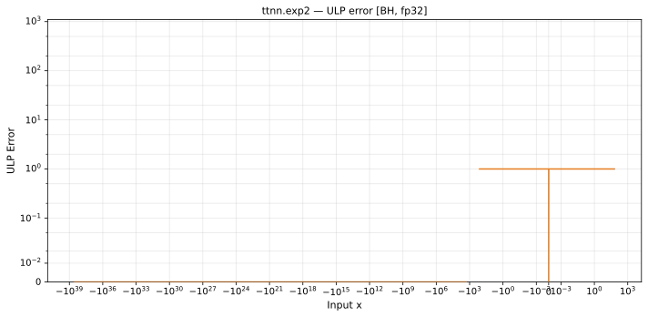

# exp2 — Blackhole (BH), float32
_This page is auto-generated by `scripts/generate_reports.py`. Do not edit manually._

_Generated: 2026-06-25 19:04 UTC_

**Architecture:** Blackhole (BH)  
**Data type:** float32  

---

[← Blackhole (BH) float32 ops](README.md) | [All archs for exp2](../../../by_op/exp2/README.md) | [Top](../../../README.md)

**Measured input range:** all normal values  

| Parameters | Max ULP | Mean ULP | Max abs error |
|------------|---------|----------|---------------|
| `default` | 1 | 0.0743 | 2.03e+31 |

