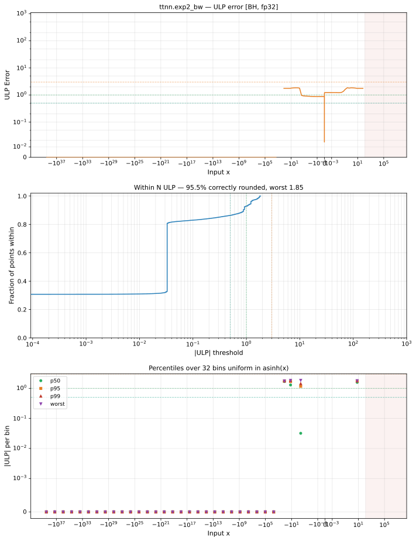

# exp2_bw — Blackhole (BH), float32
_This page is auto-generated by `ttnn-accuracy report`. Do not edit manually._

**Architecture:** Blackhole (BH)  
**Data type:** float32  

---

[← Blackhole (BH) float32 ops](README.md) | [All archs for exp2_bw](../../../by_op/exp2_bw/README.md) | [Top](../../../README.md)

**Measured input range:** x ∈ [-3.403e+38, 128.5]  

|  | `default` |
|---|---|
| Max ULP | 1.85 |
| Min ULP | 0 |
| Mean ULP | 1.09 |
| Signed bias (ULP) | -0.229 |
| p50 ULP | 0.032 |
| p95 ULP | 1.2 |
| p99 ULP | 1.69 |
| Exact fraction | 0.864 |
| Correctly rounded | 0.955 |
| Accurate to \|x\| | 128 |
| Max abs error | 1.78e+31 |
| Max rel error | 1.26e-07 |
| Median rel error | 9.45e-08 |
| Bits of precision (worst) | 22.9 |
| Bits of precision (median) | 23.3 |

**default** — 1 of 49537 points returned inf or zero where a value exists; the rest reach 1.85 ULP  

**Outcomes**

| Parameters | exact | faithful | flushed | inexact | mismatch |
|---|---|---|---|---|---|
| `default` | 42,461 | 3,206 | 395 | 3,474 | 1 |

**Worst points**

| Parameters | x | golden | device | ULP |
|---|---|---|---|---|
| `default` | 0.4970266 | 0.9782399 | 0.97824 | 1.85 |
| `default` | 0.49541652 | 0.9771488 | 0.9771489 | 1.84 |
| `default` | 1.4954165 | 1.9542975 | 1.9542978 | 1.84 |
| `default` | -0.5045835 | 0.4885744 | 0.48857445 | 1.84 |
| `default` | -1.5045835 | 0.2442872 | 0.24428722 | 1.84 |
| `default` | 0.4993648 | 0.9798266 | 0.97982675 | 1.84 |
| `default` | -0.5006352 | 0.4899133 | 0.48991337 | 1.84 |
| `default` | 2.4996526 | 3.9200885 | 3.920089 | 1.83 |
| `default` | 3.4996526 | 7.840177 | 7.840178 | 1.83 |
| `default` | -2.5003474 | 0.12250277 | 0.12250278 | 1.83 |

**Monotonicity**

_Checked only where the reference is itself ordered, and never across a discontinuity._

| Parameters | Pairs | Violations | Rate | Worst \|Δy\| |
|---|---|---|---|---|
| `default` | 49,138 | 0 | 0 | 0 |

**Non-finite outputs**

| Parameters | Points | Both | Device only | Golden only | Device inf | Device nan | Golden inf | Golden nan |
|---|---|---|---|---|---|---|---|---|
| `default` | 1 | 0 | 1 | 0 | 1 | 0 | 0 | 0 |

| Parameters | x | golden | device |
|---|---|---|---|
| `default` | 128 | 2.3586576e+38 | inf |

### Special values

| Variant | x | device | golden |  |
|---|---|---|---|---|
| `default` | 0 | 0.6931472 | 0.6931472 | agree |
| `default` | -0 | 0.6931472 | 0.6931472 | agree |
| `default` | inf | inf | inf | agree |
| `default` | -inf | 0 | 0 | agree |
| `default` | nan | nan | nan | agree |
| `default` | 1.1754944e-38 | 0.6931472 | 0.6931472 | agree |
| `default` | -1.1754944e-38 | 0.6931472 | 0.6931472 | agree |

_Measured on BLACKHOLE · tt-metal `a3a9fb4229a` · ttnn `0.78.0` · run `20260929T111553`_

