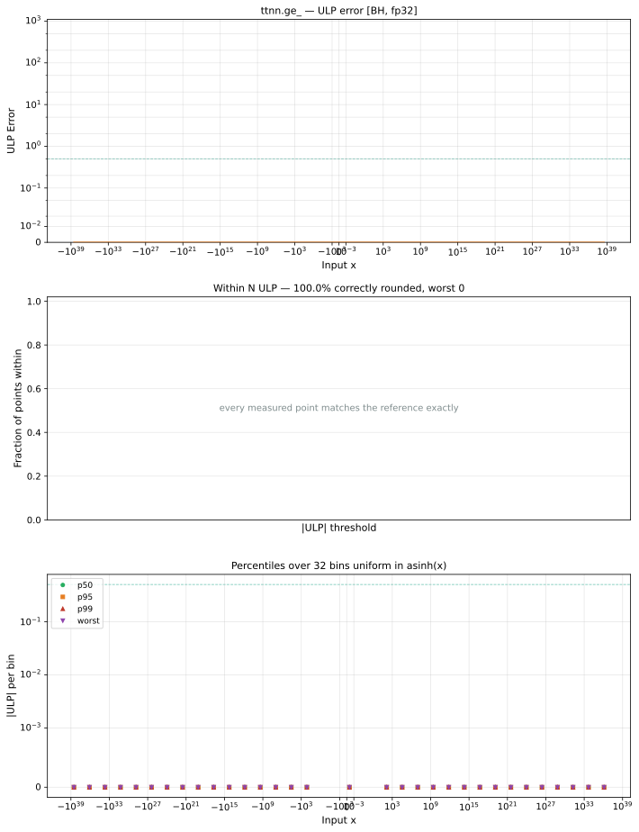

# ge_ — Blackhole (BH), float32
_This page is auto-generated by `ttnn-accuracy report`. Do not edit manually._

**Architecture:** Blackhole (BH)  
**Data type:** float32  

---

[← Blackhole (BH) float32 ops](README.md) | [All archs for ge_](../../../by_op/ge_/README.md) | [Top](../../../README.md)

**Measured input range:** all normal values  

|  | `default` |
|---|---|
| Max ULP | 0 |
| Min ULP | 0 |
| Mean ULP | 0 |
| Signed bias (ULP) | 0 |
| p50 ULP | 0 |
| p95 ULP | 0 |
| p99 ULP | 0 |
| Exact fraction | 1 |
| Correctly rounded | 1 |
| Max abs error | 0 |
| Max rel error | 0 |
| Median rel error | 0 |
| Bits of precision (worst) | — |
| Bits of precision (median) | — |

**default** — bit-exact  

**Outcomes**

| Parameters | exact |
|---|---|
| `default` | 65,024 |

### Special values

| Variant | x | device | golden |  |
|---|---|---|---|---|
| `default` | 0 | 0 | 0 | agree |
| `default` | -0 | 0 | 0 | agree |
| `default` | inf | 1 | 1 | agree |
| `default` | -inf | 0 | 0 | agree |
| `default` | nan | 0 | 0 | agree |
| `default` | 1.1754944e-38 | 0 | 0 | agree |
| `default` | -1.1754944e-38 | 0 | 0 | agree |

> **Sampled, not exhaustive.** For this op both operands take 65,536 of the 2³² fp32 values, drawn once from a fixed seed. The figures above are a lower bound on the error, and comparable between releases, but they are not a bound over the dtype.

_Measured on BLACKHOLE · tt-metal `a3a9fb4229a` · ttnn `0.78.0` · run `20260918T102923`_

