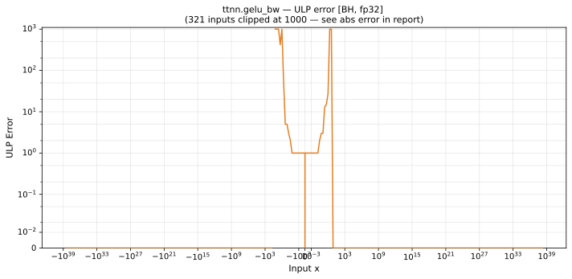

# gelu_bw — Blackhole (BH), float32
_This page is auto-generated by `ttnn-accuracy report`. Do not edit manually._

**Architecture:** Blackhole (BH)  
**Data type:** float32  

---

[← Blackhole (BH) float32 ops](README.md) | [All archs for gelu_bw](../../../by_op/gelu_bw/README.md) | [Top](../../../README.md)

**Measured input range:** x ∈ [-3.403e+38, 3.403e+38]  

|  | `default` |
|---|---|
| Max ULP | 1.47e+08 ⚠ |
| Min ULP | 0 |
| Mean ULP | 2.3e+04 |
| Signed bias (ULP) | 2.3e+04 |
| p50 ULP | 0 |
| p95 ULP | 1 |
| p99 ULP | 47.9 |
| Exact fraction | 0.9 |
| Correctly rounded | 0.929 |
| Accurate to \|x\| | 0.0298 |
| Max abs error | 0.00751 |
| Max rel error | 17.5 |
| Median rel error | 1.19e-07 |
| Bits of precision (worst) | -4.13 |
| Bits of precision (median) | 23 |

**default** — accurate to |x| <= 0.0298  

**Outcomes**

| Parameters | exact | flushed | inexact |
|---|---|---|---|
| `default` | 58,500 | 16 | 6,508 |

**Worst points**

| Parameters | x | golden | device | ULP |
|---|---|---|---|---|
| `default` | -0.75179154 | -1.4901161e-08 | -2.7567148e-07 | 1.47e+08 |
| `default` | 3.1719 | 1.007513 | 1 | 6.3e+04 |
| `default` | 3.1875 | 1.0071913 | 1 | 6.03e+04 |
| `default` | 3.203125 | 1.0068808 | 1 | 5.77e+04 |
| `default` | 3.21875 | 1.0065819 | 1 | 5.52e+04 |
| `default` | 3.234375 | 1.0062943 | 1 | 5.28e+04 |
| `default` | 3.25 | 1.0060173 | 1 | 5.05e+04 |
| `default` | 3.265625 | 1.0057511 | 1 | 4.82e+04 |
| `default` | 3.28125 | 1.0054951 | 1 | 4.61e+04 |
| `default` | 3.2968767 | 1.0052491 | 1 | 4.4e+04 |

### Special values

| Variant | x | device | golden |  |
|---|---|---|---|---|
| `default` | 0 | 0.5 | 0.5 | agree |
| `default` | -0 | 0.5 | 0.5 | agree |
| `default` | inf | 1 | 1 | agree |
| `default` | -inf | 0 | 0 | agree |
| `default` | nan | 1 | nan | **differ** |
| `default` | 1.1754944e-38 | 0.5 | 0.5 | agree |
| `default` | -1.1754944e-38 | 0.5 | 0.5 | agree |

_Measured on BLACKHOLE · tt-metal `de546d3b146` · ttnn `0.79.0` · run `20261003T030219`_

