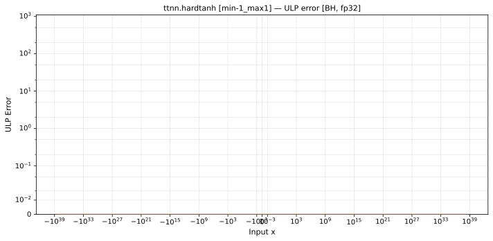
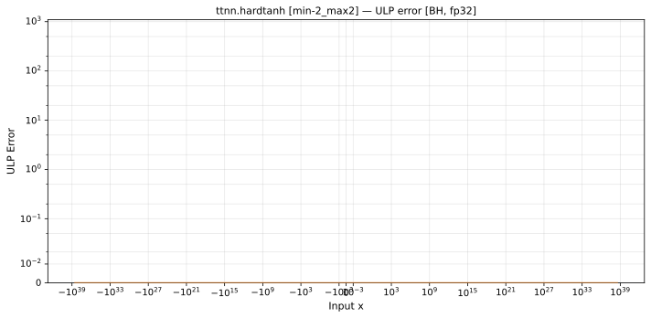

# hardtanh — Blackhole (BH), float32
_This page is auto-generated by `ttnn-accuracy report`. Do not edit manually._

_Generated: 2026-08-26 07:39_

**Architecture:** Blackhole (BH)  
**Data type:** float32  

---

[← Blackhole (BH) float32 ops](README.md) | [All archs for hardtanh](../../../by_op/hardtanh/README.md) | [Top](../../../README.md)

**Measured input range:** all normal values  

| Parameters | Max ULP | Mean ULP | Max abs error |
|------------|---------|----------|---------------|
| `min=-1,max=1` | 0 | 0 | 0 |
| `min=-2,max=2` | 0 | 0 | 0 |

### `min=-1,max=1`

### `min=-2,max=2`

