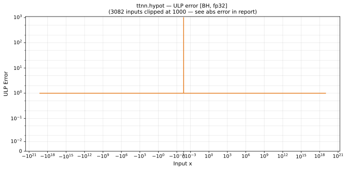

# hypot — Blackhole (BH), float32
_This page is auto-generated by `ttnn-accuracy report`. Do not edit manually._

**Architecture:** Blackhole (BH)  
**Data type:** float32  

---

[← Blackhole (BH) float32 ops](README.md) | [All archs for hypot](../../../by_op/hypot/README.md) | [Top](../../../README.md)

**Measured input range:** all normal values  

|  | `default` |
|---|---|
| Max ULP | 3.44e+06 ⚠ |
| Min ULP | 0.936 |
| Mean ULP | 3.28e+04 |
| Signed bias (ULP) | 3.28e+04 |
| p50 ULP | 1.22 |
| p95 ULP | 8.4e+03 |
| p99 ULP | 1.02e+06 |
| Exact fraction | 0 |
| Correctly rounded | 0.965 |
| Max abs error | 1.56e+12 |
| Max rel error | 0.29 |
| Median rel error | 9.04e-08 |
| Bits of precision (worst) | 1.79 |
| Bits of precision (median) | 23.4 |

**default** — 16384/65024 defects; rest 3.44e+06 ULP  

**Outcomes**

| Parameters | faithful | inexact | mismatch |
|---|---|---|---|
| `default` | 34 | 48,606 | 16,384 |

**Worst points**

| Parameters | x | x2 | golden | device | ULP |
|---|---|---|---|---|---|
| `default` | 1.0813723e-19 | 1.091165e-19 | 1.5362314e-19 | 1.091165e-19 | 3.44e+06 |
| `default` | 1.091165e-19 | 1.0813723e-19 | 1.5362314e-19 | 1.091165e-19 | 3.44e+06 |
| `default` | -1.0917448e-19 | 1.0813723e-19 | 1.5366433e-19 | 1.0917448e-19 | 3.44e+06 |
| `default` | -1.0808487e-19 | 1.091165e-19 | 1.535863e-19 | 1.091165e-19 | 3.44e+06 |
| `default` | 1.0941835e-19 | 1.0813723e-19 | 1.5383769e-19 | 1.0941835e-19 | 3.44e+06 |
| `default` | 1.07817216e-19 | 1.091165e-19 | 1.5339805e-19 | 1.091165e-19 | 3.43e+06 |
| `default` | -1.0991701e-19 | 1.0813723e-19 | 1.5419277e-19 | 1.0991701e-19 | 3.43e+06 |
| `default` | -1.07658985e-19 | 1.091165e-19 | 1.5328688e-19 | 1.091165e-19 | 3.42e+06 |
| `default` | 1.1040046e-19 | 1.0813723e-19 | 1.5453777e-19 | 1.1040046e-19 | 3.41e+06 |
| `default` | -1.07511456e-19 | 1.091165e-19 | 1.531833e-19 | 1.091165e-19 | 3.41e+06 |

**Non-finite outputs**

| Parameters | Points | Both | Device only | Golden only | Device inf | Device nan | Golden inf | Golden nan |
|---|---|---|---|---|---|---|---|---|
| `default` | 16,384 | 0 | 16,384 | 0 | 16,384 | 0 | 0 | 0 |

| Parameters | x | x2 | golden | device |
|---|---|---|---|---|
| `default` | 1.853071e+19 | 1.1837498e-38 | 1.853071e+19 | inf |
| `default` | 1.859387e+19 | 1.1837498e-38 | 1.859387e+19 | inf |
| `default` | 1.878207e+19 | 1.1837498e-38 | 1.878207e+19 | inf |
| `default` | 1.892887e+19 | 1.1837498e-38 | 1.892887e+19 | inf |
| `default` | 1.9111155e+19 | 1.1837498e-38 | 1.9111155e+19 | inf |
| `default` | 1.9235905e+19 | 1.1837498e-38 | 1.9235905e+19 | inf |
| `default` | 1.9448181e+19 | 1.1837498e-38 | 1.9448181e+19 | inf |
| `default` | 1.9598397e+19 | 1.1837498e-38 | 1.9598397e+19 | inf |
| `default` | 1.9672284e+19 | 1.1837498e-38 | 1.9672284e+19 | inf |
| `default` | 1.9862669e+19 | 1.1837498e-38 | 1.9862669e+19 | inf |

### Special values

| Variant | x | device | golden |  |
|---|---|---|---|---|
| `default` | 0 | 1 | 1 | agree |
| `default` | -0 | 1 | 1 | agree |
| `default` | inf | inf | inf | agree |
| `default` | -inf | inf | inf | agree |
| `default` | nan | nan | nan | agree |
| `default` | 1.1754944e-38 | 1 | 1 | agree |
| `default` | -1.1754944e-38 | 1 | 1 | agree |

> **Sampled, not exhaustive.** For this op both operands take 65,536 of the 2³² fp32 values, drawn once from a fixed seed. The figures above are a lower bound on the error, and comparable between releases, but they are not a bound over the dtype.

_Measured on BLACKHOLE · tt-metal `de546d3b146` · ttnn `0.79.0` · run `20261010T025951`_

