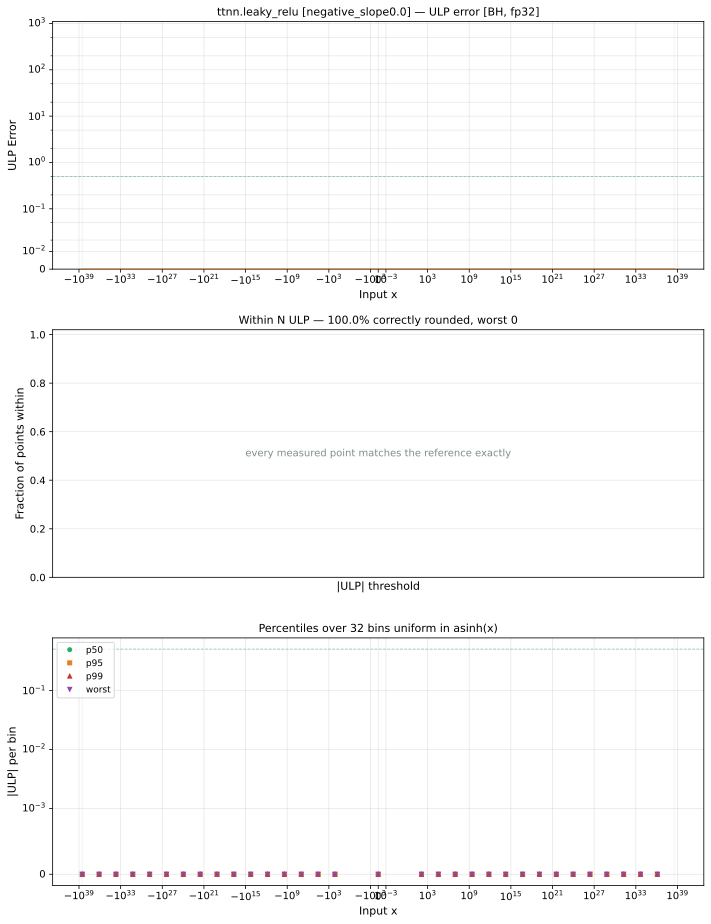

# leaky_relu — Blackhole (BH), float32
_This page is auto-generated by `ttnn-accuracy report`. Do not edit manually._

**Architecture:** Blackhole (BH)  
**Data type:** float32  

---

[← Blackhole (BH) float32 ops](README.md) | [All archs for leaky_relu](../../../by_op/leaky_relu/README.md) | [Top](../../../README.md)

**Measured input range:** x ∈ [-3.403e+38, 3.403e+38]  

|  | `negative_slope=0.0` | `negative_slope=0.01` | `negative_slope=1.0` |
|---|---|---|---|
| Max ULP | 0 | 0.84 | 0 |
| Min ULP | 0 | 0 | 0 |
| Mean ULP | 0 | 0.747 | 0 |
| Signed bias (ULP) | 0 | -0.747 | 0 |
| p50 ULP | 0 | 0 | 0 |
| p95 ULP | 0 | 0.84 | 0 |
| p99 ULP | 0 | 0.84 | 0 |
| Exact fraction | 1 | 0.507 | 1 |
| Correctly rounded | 1 | 0.868 | 1 |
| Accurate to \|x\| | 3.39e+38 | 3.39e+38 | 3.39e+38 |
| Max abs error | 0 | 2.28e+29 | 0 |
| Max rel error | 0 | 8.11e-08 | 0 |
| Median rel error | 0 | 6.47e-08 | 0 |
| Bits of precision (worst) | — | 23.6 | — |
| Bits of precision (median) | — | 23.9 | — |

**negative_slope=0.0** — bit-exact · _degenerates to relu_  
**negative_slope=0.01** — faithfully rounded; 31672 of 65024 points took the other neighbour · _torch's default slope_  
**negative_slope=1.0** — bit-exact · _degenerates to identity_  

**Outcomes**

| Parameters | exact | faithful | flushed |
|---|---|---|---|
| `negative_slope=0.0` | 65,024 | 0 | 0 |
| `negative_slope=0.01` | 32,512 | 31,672 | 840 |
| `negative_slope=1.0` | 65,024 | 0 | 0 |

**Worst points**

| Parameters | x | golden | device | ULP |
|---|---|---|---|---|
| `negative_slope=0.01` | -2.131566e-36 | -2.1315661e-38 | -2.131566e-38 | 0.84 |
| `negative_slope=0.01` | -2.1393999e-36 | -2.1393999e-38 | -2.1393998e-38 | 0.84 |
| `negative_slope=0.01` | -2.1511574e-36 | -2.1511574e-38 | -2.1511572e-38 | 0.84 |
| `negative_slope=0.01` | -2.1629103e-36 | -2.1629103e-38 | -2.1629102e-38 | 0.84 |
| `negative_slope=0.01` | -2.1746678e-36 | -2.1746678e-38 | -2.1746677e-38 | 0.84 |
| `negative_slope=0.01` | -2.1864207e-36 | -2.1864208e-38 | -2.1864206e-38 | 0.84 |
| `negative_slope=0.01` | -2.1981782e-36 | -2.1981782e-38 | -2.1981781e-38 | 0.84 |
| `negative_slope=0.01` | -2.2099312e-36 | -2.2099312e-38 | -2.209931e-38 | 0.84 |
| `negative_slope=0.01` | -2.2216886e-36 | -2.2216887e-38 | -2.2216885e-38 | 0.84 |
| `negative_slope=0.01` | -2.2334416e-36 | -2.2334416e-38 | -2.2334415e-38 | 0.84 |

**Monotonicity**

_Checked only where the reference is itself ordered, and never across a discontinuity._

| Parameters | Pairs | Violations | Rate | Worst \|Δy\| |
|---|---|---|---|---|
| `negative_slope=0.0` | 65,022 | 0 | 0 | 0 |
| `negative_slope=0.01` | 64,182 | 0 | 0 | 0 |
| `negative_slope=1.0` | 65,022 | 0 | 0 | 0 |

### Special values

| Variant | x | device | golden |  |
|---|---|---|---|---|
| `negative_slope=0.0` | 0 | 0 | 0 | agree |
| `negative_slope=0.0` | -0 | 0 | -0 | **differ** |
| `negative_slope=0.0` | inf | inf | inf | agree |
| `negative_slope=0.0` | -inf | nan | nan | agree |
| `negative_slope=0.0` | nan | nan | nan | agree |
| `negative_slope=0.0` | 1.1754944e-38 | 1.1754944e-38 | 1.1754944e-38 | agree |
| `negative_slope=0.0` | -1.1754944e-38 | 0 | -0 | **differ** |
| `negative_slope=0.01` | 0 | 0 | 0 | agree |
| `negative_slope=0.01` | -0 | 0 | -0 | **differ** |
| `negative_slope=0.01` | inf | inf | inf | agree |
| `negative_slope=0.01` | -inf | -inf | -inf | agree |
| `negative_slope=0.01` | nan | nan | nan | agree |
| `negative_slope=0.01` | 1.1754944e-38 | 1.1754944e-38 | 1.1754944e-38 | agree |
| `negative_slope=0.01` | -1.1754944e-38 | 0 | -1.1755e-40 | **differ** |
| `negative_slope=1.0` | 0 | 0 | 0 | agree |
| `negative_slope=1.0` | -0 | -0 | -0 | agree |
| `negative_slope=1.0` | inf | inf | inf | agree |
| `negative_slope=1.0` | -inf | -inf | -inf | agree |
| `negative_slope=1.0` | nan | nan | nan | agree |
| `negative_slope=1.0` | 1.1754944e-38 | 1.1754944e-38 | 1.1754944e-38 | agree |
| `negative_slope=1.0` | -1.1754944e-38 | -1.1754944e-38 | -1.1754944e-38 | agree |

> **Provenance unknown.** These figures predate run tracking. Re-measure to attribute them.

### `negative_slope=0.0`

### `negative_slope=0.01`

### `negative_slope=1.0`

