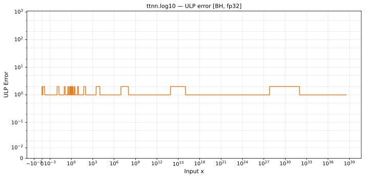

# log10 — Blackhole (BH), float32
_This page is auto-generated by `ttnn-accuracy report`. Do not edit manually._

**Architecture:** Blackhole (BH)  
**Data type:** float32  

---

[← Blackhole (BH) float32 ops](README.md) | [All archs for log10](../../../by_op/log10/README.md) | [Top](../../../README.md)

**Measured input range:** x ∈ [min\_normal, 3.403e+38]  

|  | `default` |
|---|---|
| Max ULP | 2.13 |
| Min ULP | 1.12 |
| Mean ULP | 1.36 |
| Signed bias (ULP) | -0.00909 |
| p50 ULP | 1.26 |
| p95 ULP | 1.85 |
| p99 ULP | 1.89 |
| Exact fraction | 0 |
| Correctly rounded | 0.641 |
| Accurate to \|x\| | 0.336 |
| Max abs error | 4.76e-06 |
| Max rel error | 1.53e-07 |
| Median rel error | 1.15e-07 |
| Bits of precision (worst) | 22.6 |
| Bits of precision (median) | 23 |

**default** — accurate to |x| <= 0.336  

**Outcomes**

| Parameters | inexact |
|---|---|
| `default` | 32,512 |

**Worst points**

| Parameters | x | golden | device | ULP |
|---|---|---|---|---|
| `default` | 2.9604023 | 0.47135073 | 0.4713508 | 2.13 |
| `default` | 0.35374853 | -0.45130536 | -0.45130542 | 2.12 |
| `default` | 0.35265338 | -0.45265195 | -0.452652 | 2.12 |
| `default` | 2.9503593 | 0.46987492 | 0.46987498 | 2.12 |
| `default` | 0.35108963 | -0.454582 | -0.45458207 | 2.12 |
| `default` | 1.312999 | 0.1182644 | 0.118264414 | 2.11 |
| `default` | 0.34897757 | -0.4572025 | -0.45720255 | 2.1 |
| `default` | 0.34685886 | -0.4598472 | -0.45984727 | 2.1 |
| `default` | 2.9748735 | 0.4734685 | 0.47346857 | 2.1 |
| `default` | 0.749949 | -0.12496828 | -0.1249683 | 2.1 |

**Monotonicity**

_Checked only where the reference is itself ordered, and never across a discontinuity._

| Parameters | Pairs | Violations | Rate | Worst \|Δy\| |
|---|---|---|---|---|
| `default` | 32,511 | 0 | 0 | 0 |

### Special values

| Variant | x | device | golden |  |
|---|---|---|---|---|
| `default` | 0 | -inf | -inf | agree |
| `default` | -0 | -inf | -inf | agree |
| `default` | inf | inf | inf | agree |
| `default` | -inf | nan | nan | agree |
| `default` | nan | nan | nan | agree |
| `default` | 1.1754944e-38 | -37.929783 | -37.92978 | **differ** |
| `default` | -1.1754944e-38 | nan | nan | agree |

> **Provenance unknown.** These figures predate run tracking. Re-measure to attribute them.

