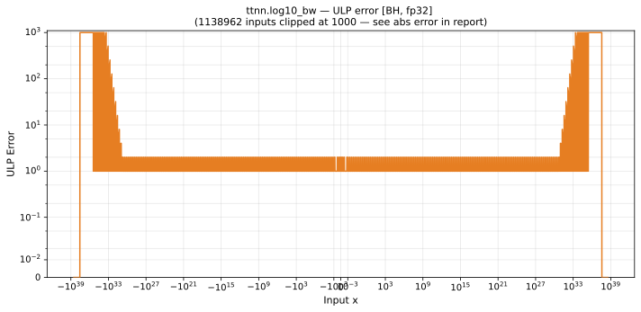

# log10_bw — Blackhole (BH), float32
_This page is auto-generated by `ttnn-accuracy report`. Do not edit manually._

_Generated: 2026-09-03 10:37_

**Architecture:** Blackhole (BH)  
**Data type:** float32  

---

[← Blackhole (BH) float32 ops](README.md) | [All archs for log10_bw](../../../by_op/log10_bw/README.md) | [Top](../../../README.md)

**Measured input range:** x ∈ [-3.692e+37, 3.692e+37]  

| Parameters | Max ULP | Mean ULP | Accurate to \|x\| | Max abs error |
|---|---|---|---|---------------|
| `default` | 9.02e+04 ⚠ | 1.73e+03 | 8.81e+30 | 5.07e+30 |

**default** — accurate to |x| <= 8.81e+30; up to 9.02e+04 ULP beyond  

**Outcomes**

| Parameters | inexact |
|------------|------|
| `default` | 64,190 |

### Special values

| Variant | x | device | golden | |
|---|---|---|---|---|
| `default` | 0 | inf | inf | agree |
| `default` | -0 | inf | -inf | **differ** |
| `default` | inf | 0 | 0 | agree |
| `default` | -inf | 0 | -0 | **differ** |
| `default` | nan | 0 | nan | **differ** |
| `default` | 1.175e-38 | 3.695e+37 | 3.695e+37 | agree |
| `default` | -1.175e-38 | -3.695e+37 | -3.695e+37 | agree |

_Measured on BLACKHOLE · tt-metal `72023534b03` · ttnn `0.75.0rc10.dev916+ga5cd86212e1` · run `20260903T103548`_

